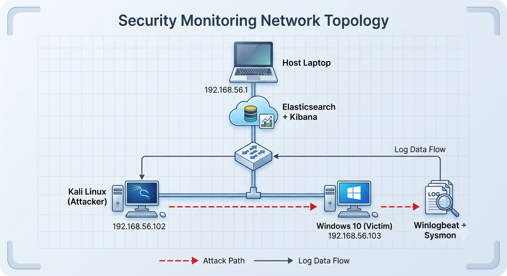
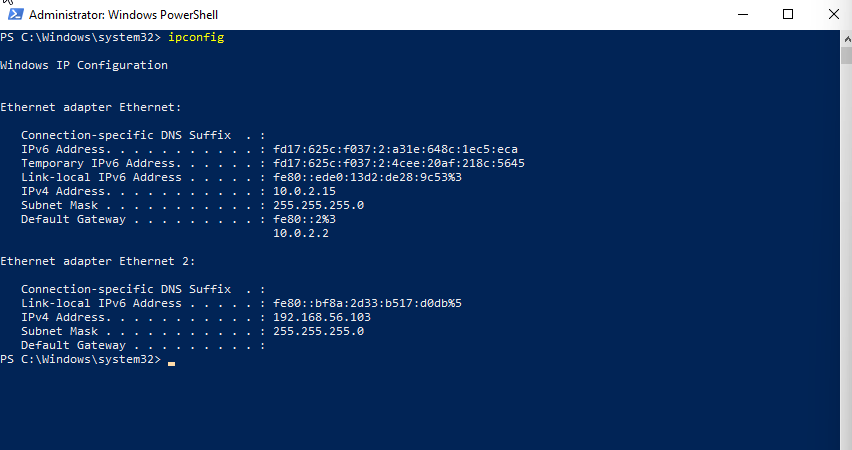
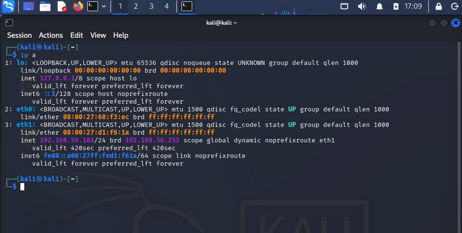
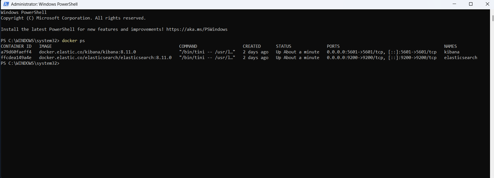
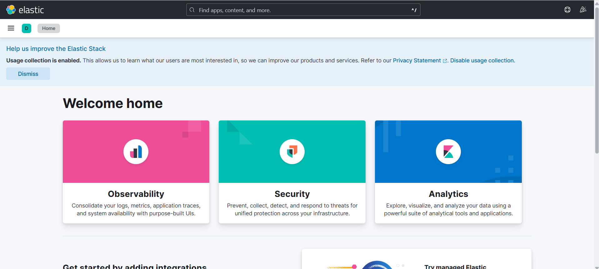
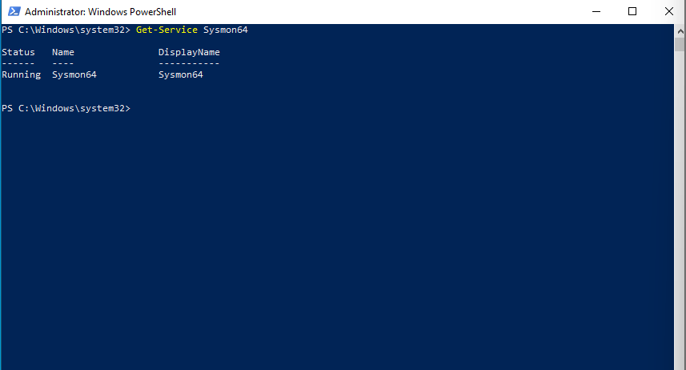
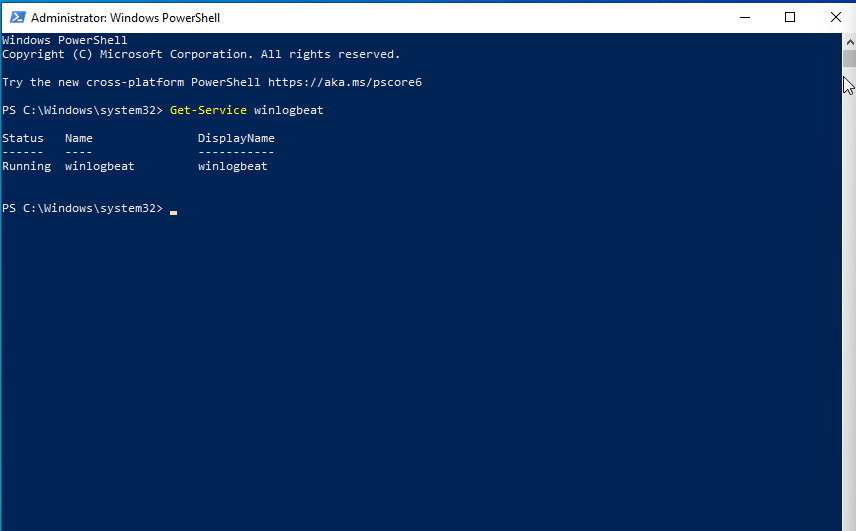
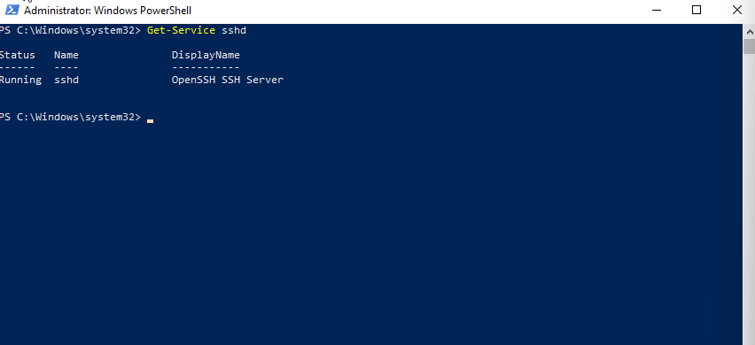
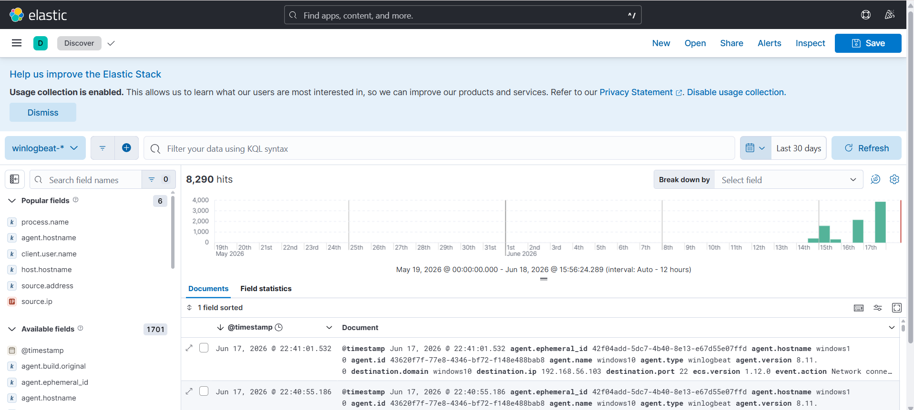

# Lab Setup: Security Operations Center (SOC) Home Lab

## 📌 Objective
Build a SOC home lab to collect, ship, and analyze security events using the Elastic Stack (Elasticsearch & Kibana), Winlogbeat, and Sysmon. This environment is designed to monitor system activities and detect potential security threats simulated from an attacker machine.

---

## 🗺️ Network Topology & Environment

### Network Topology
The following diagram illustrates the interconnection between all nodes within this virtual laboratory environment:

### Machine Configuration

| Machine | Purpose | Operating System | IP Address |
| :--- | :--- | :--- | :--- |
| **Host Laptop** | SIEM Core (Elasticsearch + Kibana) | Windows/Linux Host | `192.168.56.1` |
| **Windows 10 VM** | Victim (Telemetry Source) | Windows 10 | `192.168.56.103` |
| **Kali Linux VM** | Attacker (Simulated Threats) | Kali Linux | `192.168.56.102` |

---

## 🛠️ Components & Tech Stack
- **Elasticsearch 8.11:** Serves as the back-end database and analytics engine to store all security logs.
- **Kibana 8.11:** The visualization dashboard used for log analysis, querying, and SIEM management.
- **Sysmon (System Monitor):** A Windows system service that provides deep telemetry monitoring (process creations, network connections, etc.).
- **Winlogbeat:** A lightweight log shipper that forwards Windows Event Logs and Sysmon data directly to Elasticsearch.
- **OpenSSH Server:** Enabled on the target monitoring machine to simulate remote access activities, such as brute-force detection.

---

## 🚀 Lab Verification & Execution

### 1. IP Address Verification
Ensuring the network configuration (Host-Only Adapter) on each virtual machine is correctly configured to allow mutual communication.

* **Windows 10 IP Configuration:**
  

* **Kali Linux IP Configuration:**
  

### 2. Elastic Stack Deployment (Docker)
The entire core stack of the Elastic Suite is deployed using Docker Containers on the Host machine for optimal resource efficiency and centralized management.

Once the containers are up and running, the SIEM dashboard can be accessed through a web browser via the default Kibana port.

### 3. Endpoint Monitoring Setup (Victim Machine)
On the Windows 10 VM, telemetry and monitoring services are verified to ensure no malicious activities pass undetected.

* **Sysmon Service:** Running in the background to record crucial system telemetry.
  

* **Winlogbeat Service:** Actively collecting logs from Windows Event Viewer & Sysmon, shipping them in real-time to Elasticsearch.
  

* **SSH Server Service:** Activated as one of the exposure vectors (attack surface) to be monitored.
  

### 4. Security Events Discovery
Once Winlogbeat successfully ships the telemetry data, we can search, filter, and analyze the raw ingested logs through the **Discover** tab in Kibana.

