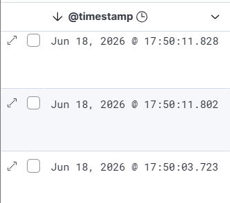
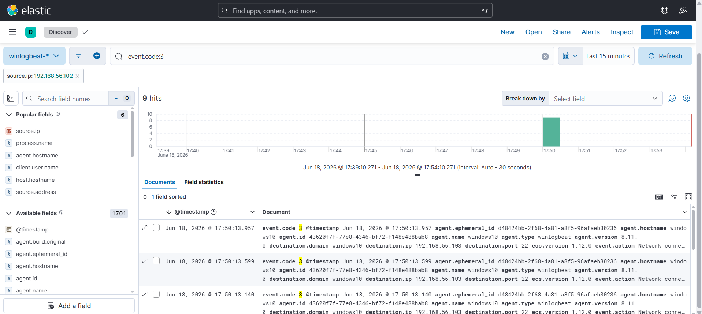
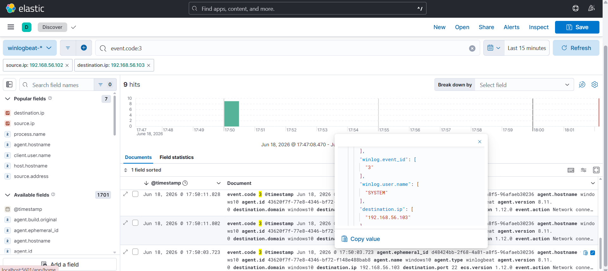

# Investigation Report

## Summary
Network reconnaissance activity was detected against the Windows 10 host. The activity originated from the Kali Linux machine and was observed through Sysmon network connection events within the Elastic Stack.

## Timeline & Ingestion Analysis
1. **Log Spike Detection:** Monitoring dashboards indicated a sudden surge of network connections in a very short period. Kibana's timeline tool visualized this traffic spike clearly.

   

3. **Telemetry Verification:** Filtering the incoming logs through the Kibana Discover tab confirmed a massive influx of `Event ID 3` (Network Connection) sourced from the attacker IP.
   

## Network Indicators

| Indicator | Value |
| :--- | :--- |
| **Source IP (Attacker)** | `192.168.56.102` |
| **Destination IP (Victim)** | `192.168.56.103` |
| **Target Hostname** | `WINDOWS10` |

## Evidence & Deep Dive
The primary telemetry evidence relies on **Sysmon Event ID 3**. By expanding the granular log details, we identified the destination ports targeted during the scan, alongside the process responsible for managing the connection traffic on the endpoint.

## Findings
The high-frequency, sequential connection attempts targeted at multiple destination ports are consistent with reconnaissance behavior (port scanning). This was executed to identify active services and potential vulnerabilities on the Windows 10 target.

## MITRE ATT&CK
* **Technique:** T1046 - Network Service Discovery

## Severity
🟢 **Low** (Limited to reconnaissance; no successful exploit payload or data exfiltration was detected during this phase).

## Recommendations
* Deploy threshold-based alerting in Kibana to trigger high-priority alerts when a single source IP generates massive network connections within a few seconds.
* Enforce strict firewall rules to restrict internal network scanning across segmented subnets.
* Disable or restrict unnecessary network services exposed on the Windows 10 endpoint.
