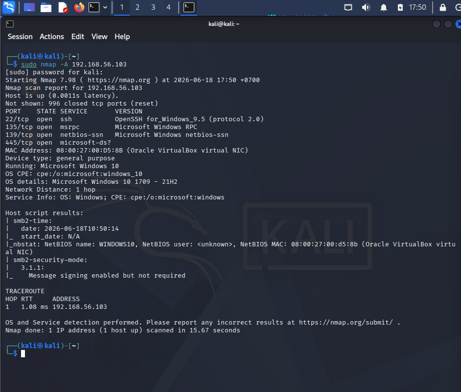

# Case 01 - Nmap Detection

## 📌 Objective
Detect and investigate network reconnaissance activity performed against a Windows 10 host using Nmap within the Elastic SIEM environment.

## 💻 Lab Environment

| Machine | Role | IP Address |
| :--- | :--- | :--- |
| **Kali Linux** | Attacker | `192.168.56.102` |
| **Windows 10** | Victim | `192.168.56.103` |
| **Host Laptop** | Elastic + Kibana | `192.168.56.1` |

---

## ⚔️ Attack Scenario & Command Used
The attacker machine performed an aggressive Nmap scan against the Windows host to identify open ports, OS detection, and running services.
```bash
sudo nmap -A 192.168.56.103 ```
```


