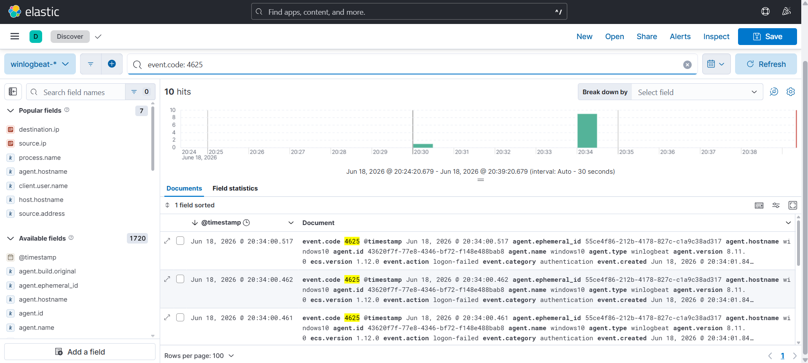
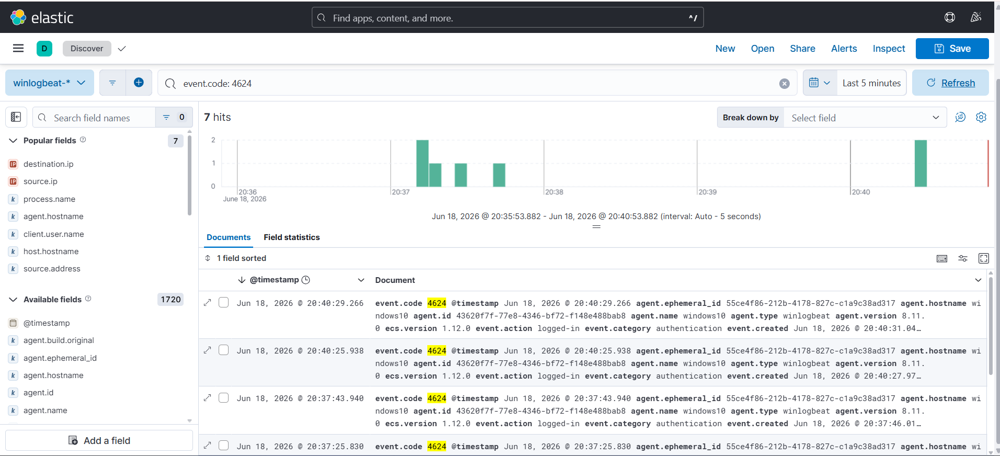
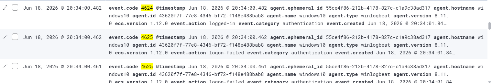

# Investigation Report

## Summary
Multiple failed SSH authentication attempts followed by a single successful login were detected against the Windows 10 host. The activity originated from the Kali Linux machine and was identified via Windows Security telemetry inside Kibana.

## Timeline & Log Analysis
1. **The Brute-Force Phase:** The attacker initiated rapid connection attempts, generating an enormous spike of **Event ID 4625 (Failed Logon)** within a tight window.
   

2. **The Compromise:** Once Hydra found the correct password, a single **Event ID 4624 (Successful Logon)** was recorded, signaling a successful system intrusion.
   

4. **Correlated View:** Reviewing the SIEM visualization timeline clearly aligns the transition from high-frequency anomalies to the final compromise instance.
   

## Network & Account Indicators

| Indicator | Value |
| :--- | :--- |
| **Source IP (Attacker)** | `192.168.56.102` |
| **Destination IP (Victim)** | `192.168.56.103` |
| **Target Username** | `vboxuser` |
| **Target Hostname** | `WINDOWS10` |

## Telemetry Evidence
- **Windows Security Event ID 4625:** Accounts for the heavy volume of automated authentication failures (Logon Type 10 or 3 depending on OpenSSH configuration).
- **Windows Security Event ID 4624:** Confirms the final state where access was granted to the adversary.

## Findings
The high ratio of failed logins immediately preceding a single success from the exact same source IP is a textbook pattern of an automated brute-force attack.

## MITRE ATT&CK Mapping
- **Technique:** T1110 - Brute Force

## Severity
🔴 **Medium / High** (An attacker has successfully authenticated and gained access to an endpoint account).

## Recommendations
* Enforce a strong password complexity policy across all local accounts.
* Implement **Account Lockout Policies** (e.g., lock account for 30 minutes after 5 failed attempts) to effectively stop automated tools like Hydra.
* Set up a real-time SIEM alert rule to detect when more than 20 authentication failures occur from a single source IP within 1 minute.
