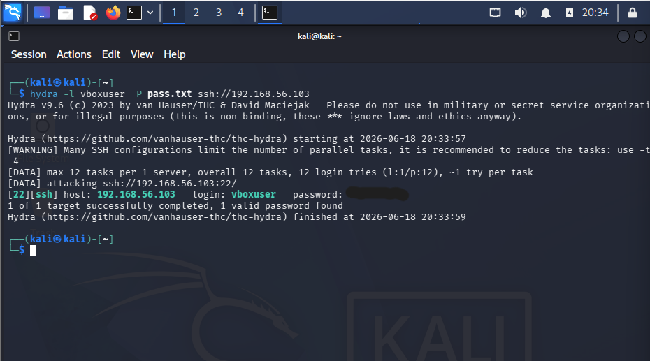

# Case 02 - SSH Brute Force Detection

## 📌 Objective
Detect and investigate SSH brute-force activity against a Windows 10 host using the Elastic Stack and Windows Security Event Logs.

## 💻 Lab Environment

| Machine | Role | IP Address |
| :--- | :--- | :--- |
| **Kali Linux** | Attacker | `192.168.56.102` |
| **Windows 10** | Victim | `192.168.56.103` |
| **Host Laptop** | Elastic + Kibana | `192.168.56.1` |

---

## ⚔️ Attack Scenario & Command Used
An attacker performed automated credential guessing against the target's SSH service using Hydra. The tool attempted multiple passwords from a wordlist until valid credentials were found.

```bash
hydra -l vboxuser -P pass.txt ssh://192.168.56.103```
```

