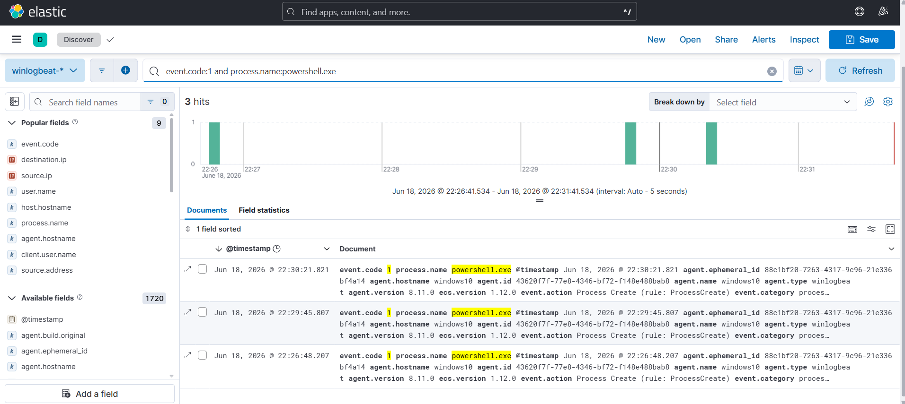
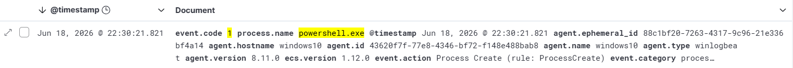
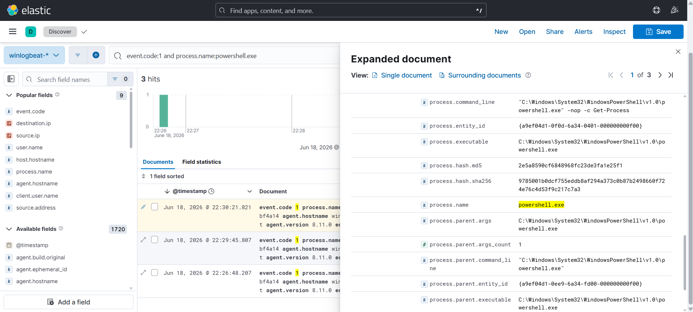

# Investigation Report

## Summary
PowerShell activity was detected on the Windows 10 host. Sysmon recorded the process creation event, granting full visibility into the runtime command-line string arguments and parent-child process relationship genealogy.

## Timeline & Log Analysis
1. **Event Ingestion:** Filtering incoming index patterns for process creation activities inside Kibana Discover successfully returns the target execution payload logs.
   

2. **Execution Pattern Spike:** Correlating the time of discovery shows the exact runtime window when the interactive commands hit the host machine.
   

## Endpoint Indicators

| Indicator | Value |
| :--- | :--- |
| **Target Hostname** | `WINDOWS10` |
| **Executing User** | `vboxuser` |
| **Process Name** | `powershell.exe` |
| **Parent Process** | `explorer.exe` |

## Evidence & Deep Dive
The tracking foundation for this investigation is built entirely on **Sysmon Event ID 1 (Process Creation)**. Inspecting the raw expanded JSON metadata reveals critical telemetry artifacts:

## Findings
PowerShell execution was successfully parsed. The presence of evasion flags such as `-nop` (bypasses local configuration profile scripts) and `-w hidden` (conceals interactive windows) strongly mimics initial access or post-exploitation framework mechanics, marking it highly suspicious for enterprise base baselines.

## MITRE ATT&CK Mapping
- **Technique:** T1059.001 - PowerShell

## Severity
🟡 **Medium** (Standard system execution utilities used with potential evasion-oriented parameter arguments).

## Recommendations
* Ensure Sysmon Process Creation (Event ID 1) logging remains enabled across all critical directory endpoints.
* Implement alerting logic flags inside Elastic Security to capture anomalous combinations of `powershell.exe` containing string sequences like `-nop`, `-w hidden`, or `-enc` (EncodedCommand).
* Monitor parent-child process anomalies (e.g., `w3wp.exe` or `nginx.exe` spawning `powershell.exe`).
