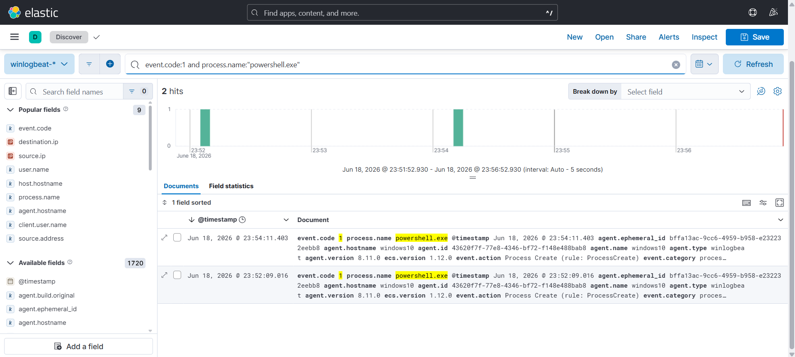
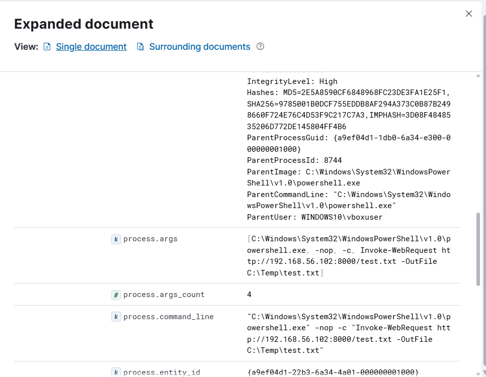
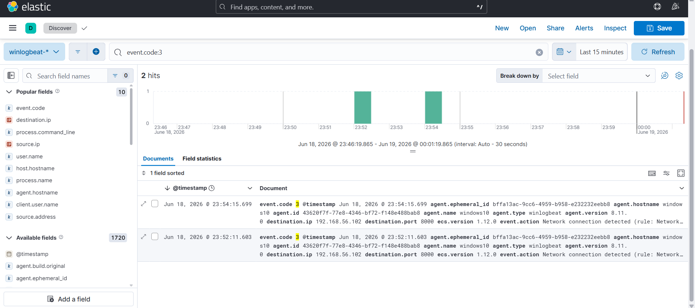

# Investigation Report

## Summary
PowerShell download activity was detected on the Windows 10 host. The victim endpoint initiated an outbound socket connection to an untrusted remote infrastructure (`192.168.56.102`) to retrieve a web asset using the `Invoke-WebRequest` utility command line structure.

## Timeline & Log Analysis
1. **Telemetry Capture:** Ingesting both endpoint and network streams into the Elastic Stack allows for immediate hunting within the Kibana Discover dashboard for suspicious PowerShell indicators.
   

2. **Process Audit Details (Event ID 1):** Looking closer into the individual process creation metadata reveals the full path execution and the transparent, un-encoded script string block.
   

3. **Network Stream Correlation (Event ID 3):** To support the process footprint, Sysmon recorded a corresponding network event mapping the source shell directly out to port 8000 on the attacker host.
   

## Indicator Checklist

| Indicator Type | Value |
| :--- | :--- |
| **Source Host IP** | `192.168.56.103` |
| **Destination Host IP** | `192.168.56.102` |
| **Destination Port** | `8000` |
| **Executing Process** | `powershell.exe` |
| **Dropped Asset Destination** | `C:\Temp\test.txt` |

## Findings
The telemetry correlates perfectly. The runtime process generation logs tied together with remote external web-traffic events indicate a classic file retrieval cradle operation. Adversaries use this baseline mechanic to drag malicious tools, scripts, or command-and-control agents down onto target environments.

## MITRE ATT&CK Mapping
* T1059.001 - PowerShell
* T1105 - Ingress Tool Transfer

## Severity
🟡 **Medium** (Successful remote asset download via administrative command shell tools).

## Recommendations
* Create detection logic inside Elastic Security monitoring for system binary processes (`powershell.exe`, `cmd.exe`, `certutil.exe`) attempting raw web socket requests out to the public internet or non-whitelisted host blocks.
* Restrict explicit user space execution paths like `C:\Temp\` using modern AppLocker or Software Restriction Policies.
* Audit and alert on PowerShell download commands such as `Invoke-WebRequest`, `DownloadFile`, or `WebClient` structures.
