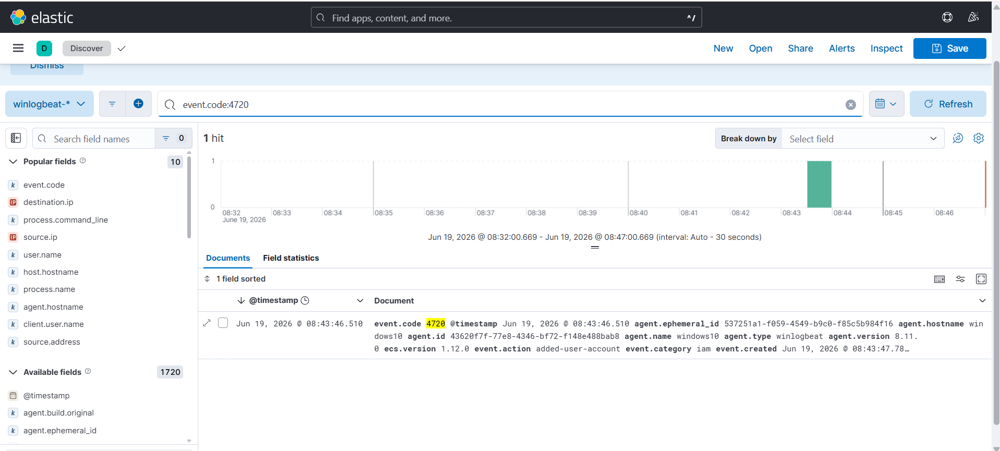
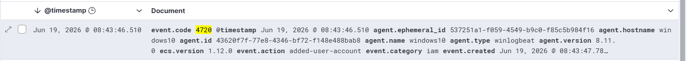
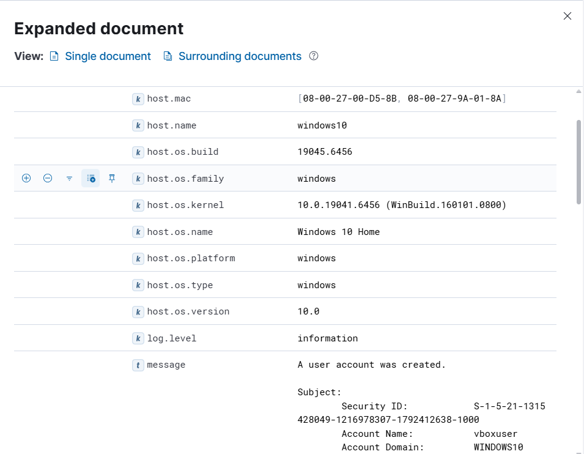

# Investigation Report

## Summary
A new local account was created on the Windows 10 host. User account creation events are highly critical during investigations because threat actors frequently establish secondary local credentials to maintain persistent footholds even if their initial access vectors are mitigated.

## Timeline & Ingestion Analysis
1. **Telemetry Querying:** Filtering the Windows Event Log security indexes inside Kibana Discover for account management actions successfully isolated the suspicious creation event entry.
   

2. **Activity Correlation Timeline:** Reviewing the SIEM time distribution mapping confirms the exact runtime block when the local administrative group modifications occurred.
   

## Endpoint Indicators

| Indicator Type | Value |
| :--- | :--- |
| **Target Hostname** | `WINDOWS10` |
| **Creator / Actor Account** | `vboxuser` |
| **Newly Created Account** | `backupadmin` |

## Evidence & Deep Dive
The core forensic verification for this incident rests on **Windows Security Event ID 4720 (A user account was created)**. Expanding the granular log schema structure maps out the security identifiers (SIDs) and targets involved:

By inspecting the details, we can identify that `vboxuser` was the actor responsible for generating the new `backupadmin` target security structure.

## Findings
The telemetry matches anomalous administrative escalation behavior. In corporate infrastructure baselines, rogue or un-ticketed account creations often point directly toward active persistence or privilege escalation operations.

## MITRE ATT&CK Mapping
- **Technique:** T1136.001 - Create Account: Local Account

## Severity
🟠 **High** (New rogue administrative/local credentials generated on an endpoint asset).

## Recommendations
* Deploy high-priority alerting notifications inside Elastic SIEM tailored to capture any instances of Windows Security Event ID 4720 outside scheduled IT maintenance windows.
* Regularly audit the local `Administrators` and `Users` groups across endpoints using automated configuration management baselines.
* Implement strict least-privilege policies, stripping standard enterprise users of the rights required to run `net user /add` tasks.
