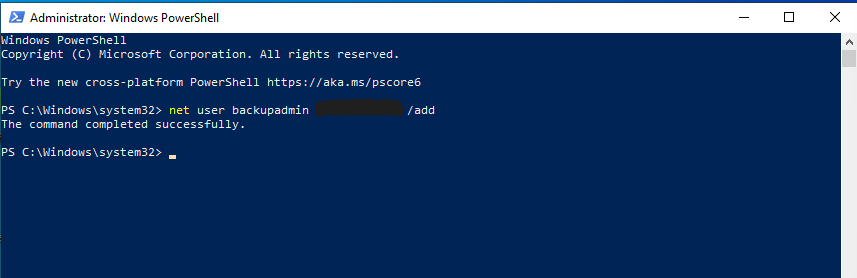

# Case 05 - New User Creation

## 📌 Objective

Detect and investigate the unauthorized creation of a new local user account on a Windows 10 host using the Elastic Stack and Windows Security Event Logs.

---

## 💻 Lab Environment

| Machine | Role | IP Address |
| :--- | :--- | :--- |
| **Windows 10** | Victim (Target Endpoint) | `192.168.56.103` |
| **Host Laptop** | Elastic + Kibana (SIEM) | `192.168.56.1` |

---

## ⚔️ Attack Scenario & Commands Used

An attacker executed a Windows administrative command to create a new local user account named **`backupadmin`**. Creating unauthorized local accounts is a common persistence technique, allowing attackers to maintain access to the compromised system.

```cmd
net user backupadmin "input your password" /add
```

The screenshot below shows the successful execution of the account creation command on the Windows endpoint.



---

## 🔍 Detection & Key Findings

- **Detection Method:** Windows Security Event ID 4720 (A user account was created) collected via Winlogbeat
- **New Created User:** `backupadmin`
- **Creator Account:** `vboxuser`
- **Target Hostname:** `WINDOWS10`
- **Severity:** 🟠 High
- **MITRE ATT&CK Mapping:**
  - `T1136.001` – Create Account: Local Account

---

## 📖 Case Documentation & References

For a detailed analysis of the Windows Security events, investigation workflow, and MITRE ATT&CK mapping, refer to the supporting documentation below:

- 🕵️ **Investigation Report:** [investigation.md](investigation.md)
- 🛡️ **MITRE ATT&CK Mapping:** [mitre-mapping.md](mitre-mapping.md)
