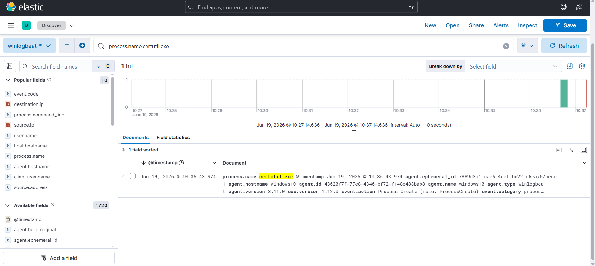
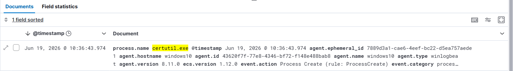
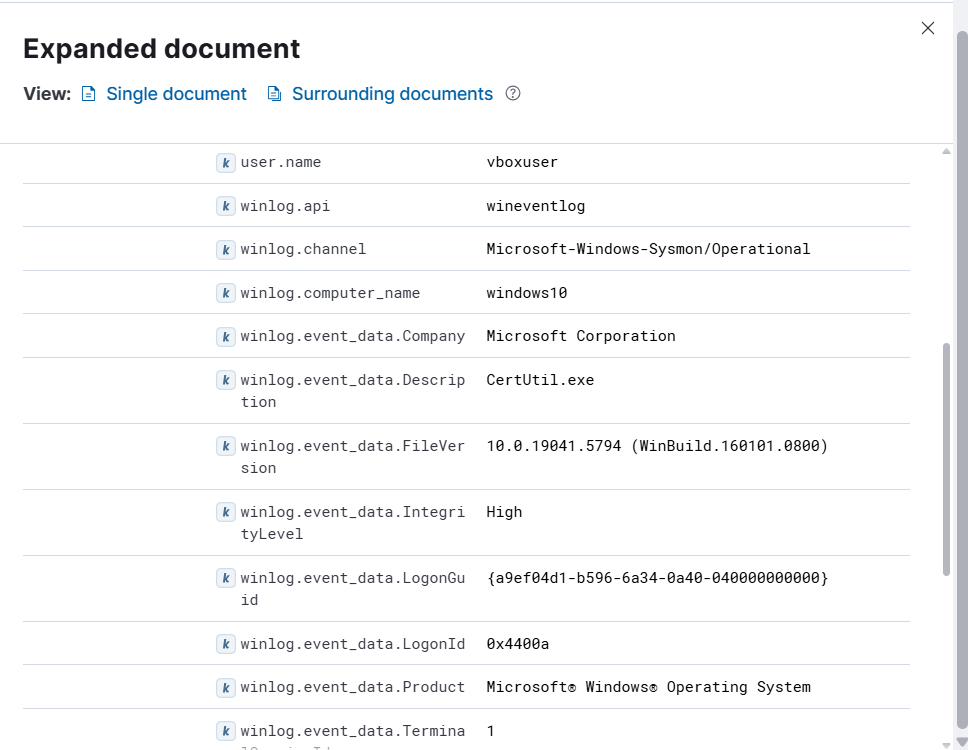

# Investigation Report

## Summary
Execution of the Windows LOLBin tool `certutil.exe` was detected on the Windows 10 host. Sysmon successfully recorded the process creation lifecycle, capturing the exact command-line syntax arguments and parent-child process relationship metadata.

## Timeline & Ingestion Analysis
1. **SIEM Log Discovery:** Running a telemetry search inside the Elastic index pattern within Kibana Discover highlights the execution instances of the binary.
   

2. **Event Spiking Timeline:** Tracking the time distribution across the analytics engine visualizes the precise block window where the process hit active memory.
   

## Endpoint Indicators

| Indicator Type | Value |
| :--- | :--- |
| **Target Hostname** | `WINDOWS10` |
| **Executing Username** | `vboxuser` |
| **Target Process Binary** | `certutil.exe` |
| **Parent Binary Component** | `cmd.exe` |

## Evidence & Deep Dive
The forensic investigation is centered around **Sysmon Event ID 1 (Process Creation)**. Reviewing the expanded fields provides structural context behind the execution parameters:

By investigating the argument string fields (`-hashfile`), analysts can parse the target files targeted by the entity.

## Findings
The telemetry patterns align with standard LOLBin behaviors. Although calculating a hash file string is structurally benign on its own, security teams must audit `certutil.exe` tightly, as actors frequently leverage it to execute arbitrary scripts, carry out ingress file data transfers, or perform defense evasion maneuvers.

## MITRE ATT&CK Mapping
- **Technique:** T1218 - System Binary Proxy Execution

## Severity
🟡 **Medium** (Native trusted binaries manipulated using manual administrative arguments).

## Recommendations
* Maintain active monitoring policies for Sysmon Process Creation (Event ID 1) capturing system binary paths.
* Implement custom SIEM alerts for whenever `certutil.exe` utilizes arguments associated with web download requests (such as `-urlcache`, `-f`, or split components).
* Cross-correlate runtime native binary tasks directly alongside outgoing network connections (Sysmon Event ID 3) and temporary folder file creation traces.
