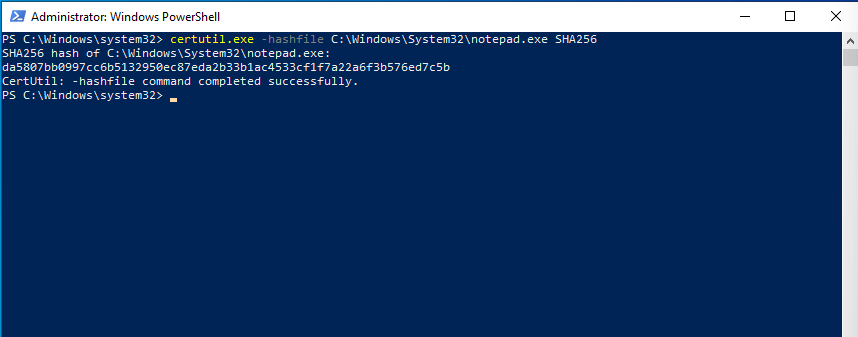

# Case 06 - LOLBins Abuse

## 📌 Objective

Detect and investigate the abuse of a Windows Living Off The Land Binary (LOLBin) using Sysmon and the Elastic Stack.

---

## 💻 Lab Environment

| Machine | Role | IP Address |
| :--- | :--- | :--- |
| **Windows 10** | Victim (Target Endpoint) | `192.168.56.103` |
| **Host Laptop** | Elastic + Kibana (SIEM) | `192.168.56.1` |

---

## ⚔️ Attack Scenario & Commands Used

The built-in Windows utility **`certutil.exe`** was executed to calculate the SHA-256 hash of a system binary. Although this example performs a legitimate hashing operation, adversaries frequently abuse **LOLBins (Living Off The Land Binaries)** such as `certutil.exe` to download malicious payloads, encode or decode files, and evade traditional signature-based security controls.

```cmd
certutil.exe -hashfile C:\Windows\System32\notepad.exe SHA256
```

The screenshot below shows the successful execution of the `certutil.exe` command on the Windows endpoint.



---

## 🔍 Detection & Key Findings

- **Detection Method:** Sysmon Event ID 1 (Process Creation) forwarded via Winlogbeat
- **Process Name:** `certutil.exe`
- **Parent Process:** `cmd.exe`
- **User Account:** `vboxuser`
- **Target Hostname:** `WINDOWS10`
- **Severity:** 🟡 Medium
- **MITRE ATT&CK Mapping:**
  - `T1218` – System Binary Proxy Execution

---

## 📖 Case Documentation & References

For a detailed analysis of the process execution, investigation workflow, and MITRE ATT&CK mapping, refer to the supporting documentation below:

- 🕵️ **Investigation Report:** [investigation.md](investigation.md)
- 🛡️ **MITRE ATT&CK Mapping:** [mitre-mapping.md](mitre-mapping.md)
