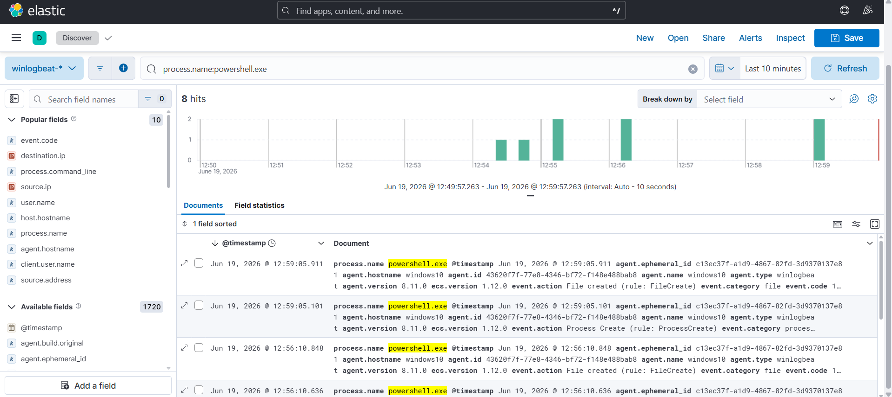
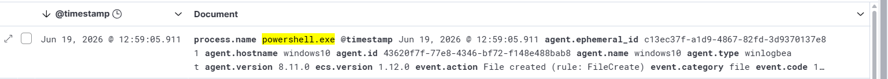
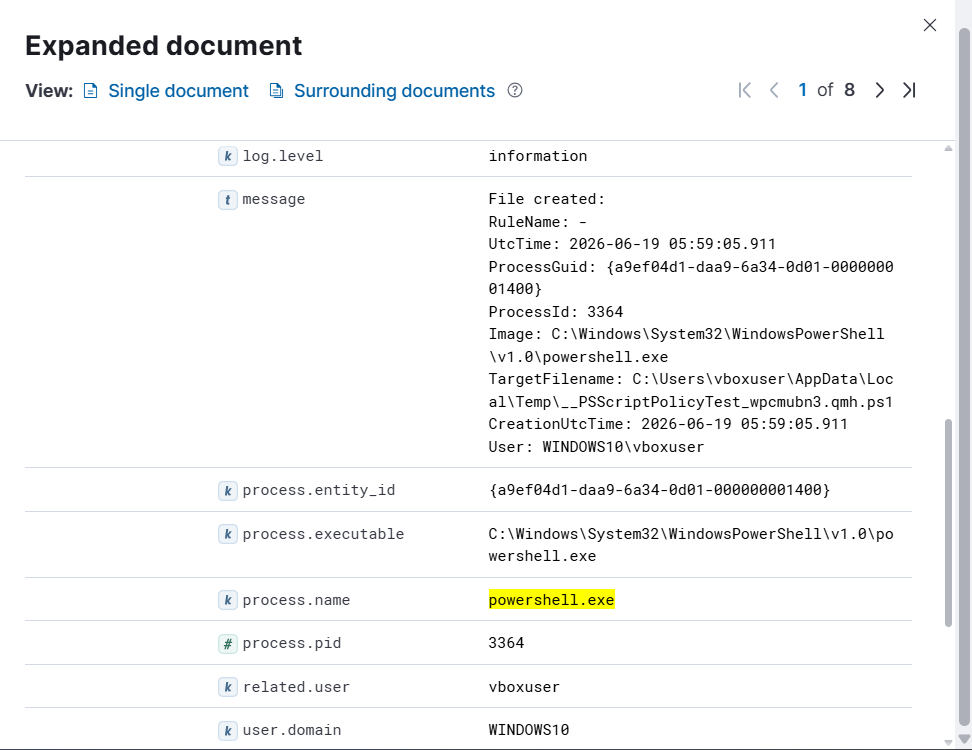

# Investigation Report

## Summary
Encoded PowerShell script execution was detected on the Windows 10 host. Sysmon successfully captured the process creation event, granting clear audit capabilities over the obfuscated runtime command-line strings and operational host contexts.

## Timeline & Ingestion Analysis
1. **SIEM Log Discovery:** Running custom string match filters inside Kibana Discover isolates the corresponding telemetry trace logs associated with the shell activity.
   

2. **Telemetry Log Timeline:** Visualizing the log stream across the analytical timeline graphs isolates the exact minute the execution commands hit the endpoint target.
   

## Endpoint Indicators

| Indicator Type | Value |
| :--- | :--- |
| **Target Hostname** | `WINDOWS10` |
| **Executing Username** | `vboxuser` |
| **Target Binary Path** | `powershell.exe` |
| **Observed Flag Input** | `-enc` |

## Evidence & Deep Dive
The investigation relies upon **Sysmon Event ID 1 (Process Creation)** data blocks. Expanding the structured metadata fields records the precise arguments passed to the engine interface:

Reviewing the fields allows an analyst to pull the exact raw string block `RwBlAHQALQBQAHIAbwBjAGUAcwBzAA==` which can then be decoded via utilities like CyberChef to reveal the plaintext commands (`Get-Process`).

## Findings
The telemetry signature patterns represent standard script obfuscation. While the specific sequence carried out in this controlled lab was non-malicious, encoded parameter sequences are extensively utilized by modern malware, ransomware loader stages, and advanced persistent threat groups to slip past initial security perimeter defenses.

## MITRE ATT&CK Mapping
- **Technique:** T1059.001 - PowerShell

## Severity
🟡 **Medium** (Obfuscated PowerShell parameter sequences running inside user context).

## Recommendations
* Maintain active alerting correlation models to instantly flag instances where `powershell.exe` or `pwsh.exe` handles arguments such as `-enc`, `-encodedcommand`, `-e`, or `-ec`.
* Implement script block logging policies (PowerShell Event ID 4104) to force the logging engine to capture the plaintext commands post-decryption in memory.
* Monitor parent-child process relationship genealogy anomalies to look for unusual execution hierarchies.
