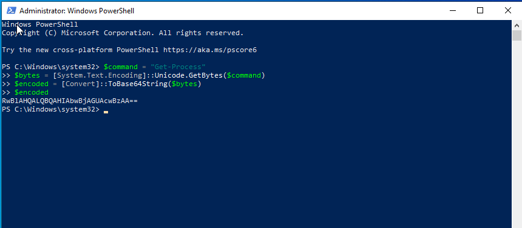
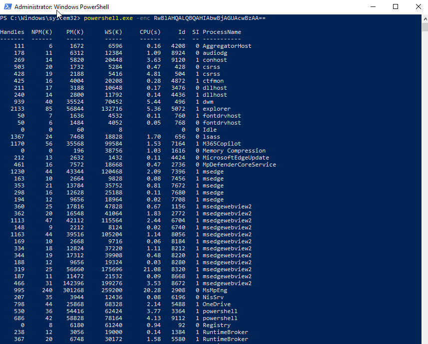

# Case 07 - Encoded PowerShell

## 📌 Objective

Detect and investigate Base64-encoded PowerShell execution activity using Sysmon and the Elastic Stack.

---

## 💻 Lab Environment

| Machine | Role | IP Address |
| :--- | :--- | :--- |
| **Windows 10** | Victim (Target Endpoint) | `192.168.56.103` |
| **Host Laptop** | Elastic + Kibana (SIEM) | `192.168.56.1` |

---

## ⚔️ Attack Scenario & Commands Used

Attackers commonly use the **`-EncodedCommand` (`-enc`)** parameter to execute Base64-encoded PowerShell commands. Encoding the command helps obscure its contents from casual inspection and is frequently observed in malware, offensive frameworks, and post-exploitation activities.

### Step 1: Generate the Base64-Encoded Command

The PowerShell command below converts the string `Get-Process` into a Unicode Base64-encoded value.

```powershell
$command = "Get-Process"
$bytes = [System.Text.Encoding]::Unicode.GetBytes($command)
$encoded = [Convert]::ToBase64String($bytes)
$encoded
```

The screenshot below shows the generated Base64-encoded command.



### Step 2: Execute the Encoded Command

The generated Base64 string was executed using the **`-enc`** parameter.

```powershell
powershell.exe -enc RwBlAHQALQBQAHIAbwBjAGUAcwBzAA==
```

The screenshot below shows the successful execution of the encoded PowerShell command.



---

## 🔍 Detection & Key Findings

- **Detection Method:** Sysmon Event ID 1 (Process Creation) forwarded via Winlogbeat
- **Process Name:** `powershell.exe`
- **Command Argument:** `-enc` (EncodedCommand indicator)
- **User Account:** `vboxuser`
- **Target Hostname:** `WINDOWS10`
- **Severity:** 🟡 Medium
- **MITRE ATT&CK Mapping:**
  - `T1059.001` – PowerShell

---

## 📖 Case Documentation & References

For a detailed analysis of the process execution, investigation workflow, and MITRE ATT&CK mapping, refer to the supporting documentation below:

- 🕵️ **Investigation Report:** [investigation.md](investigation.md)
- 🛡️ **MITRE ATT&CK Mapping:** [mitre-mapping.md](mitre-mapping.md)
