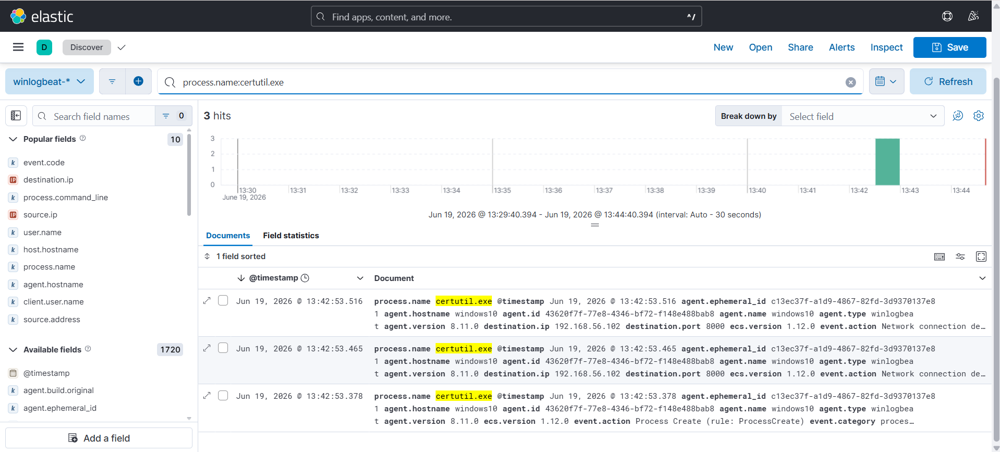
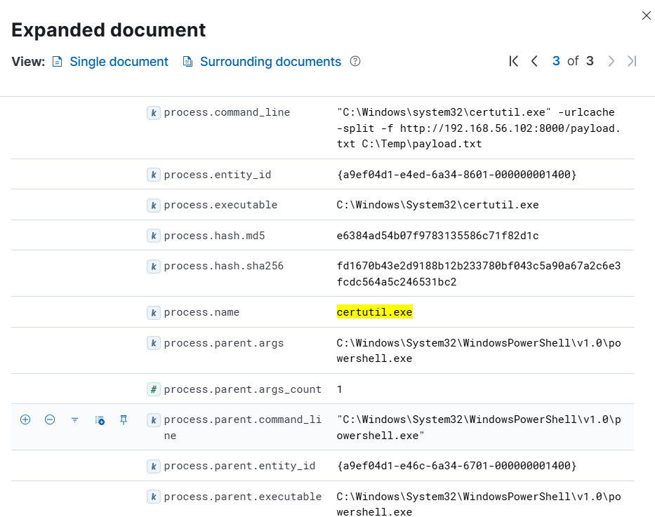
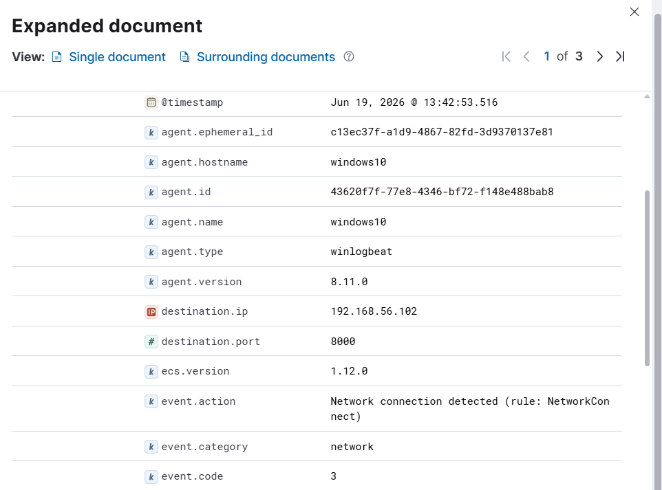

# Investigation Report

## Summary
File download activity abusing the trusted native utility `certutil.exe` was identified on the Windows 10 host. The endpoint successfully spawned a network socket connection to the remote server architecture (`192.168.56.102`), retrieving a staged text asset file.

## Timeline & Log Analysis
1. **SIEM Log Discovery:** Querying the log infrastructure inside Kibana Discover flags the telemetry fields associated with the administrative utility operation.
   

2. **Process Audit Details (Event ID 1):** Looking closer into the generated process creation event exposes the un-obfuscated command line syntax string, tracking target parameters like `-urlcache`.
   

3. **Network Ingress Tracking (Event ID 3):** To support the endpoint file action, Sysmon records a network traffic event, tying the native binary back to port 8000 of the staging server.
   

## Indicator Checklist

| Indicator Type | Value |
| :--- | :--- |
| **Source Victim IP** | `192.168.56.103` |
| **Destination Remote IP** | `192.168.56.102` |
| **Active Port Channel** | `8000` |
| **Executing Process Binary** | `certutil.exe` |
| **Dropped Asset Destination** | `C:\Temp\payload.txt` |

## Findings
The forensic log fields match. Threat actors and automated malware loaders heavily rely on proxying network requests through trusted system tools like `certutil.exe` to bypass explicit boundary restrictions that prevent common shells from executing direct web requests.

## MITRE ATT&CK Mapping
* T1218 - System Binary Proxy Execution
* T1105 - Ingress Tool Transfer

## Severity
🟡 **Medium** (Remote asset ingress file delivery executed through native system tools).

## Recommendations
* Build behavioral detection logic inside Elastic Security monitoring for system binaries (`certutil.exe`, `bitsadmin.exe`, `extrac32.exe`) making external connections.
* Implement custom alerts to capture specific argument string sets within process telemetry, notably tracking options like `-urlcache` or `-split`.
* Restrict local network routing capabilities, cutting standard workstations off from reaching untrusted internal or external repository server configurations.
