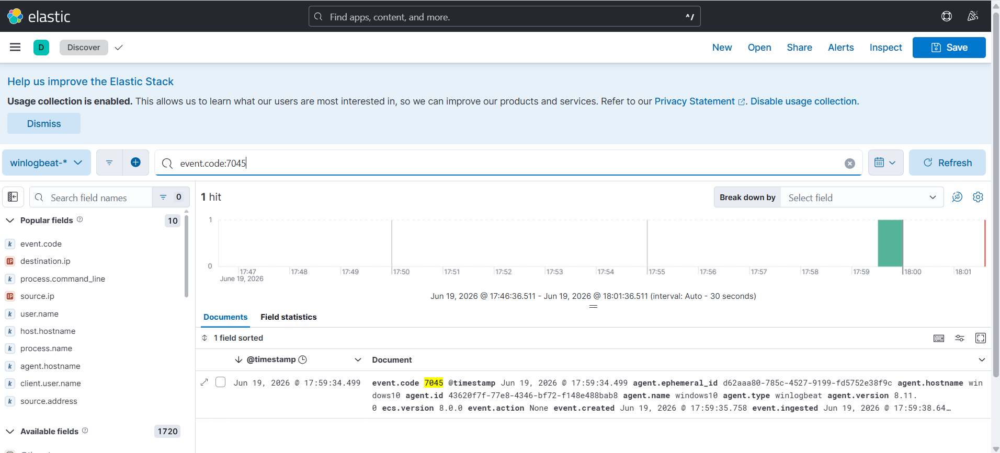
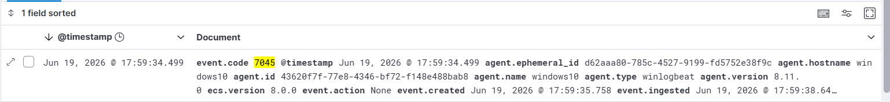
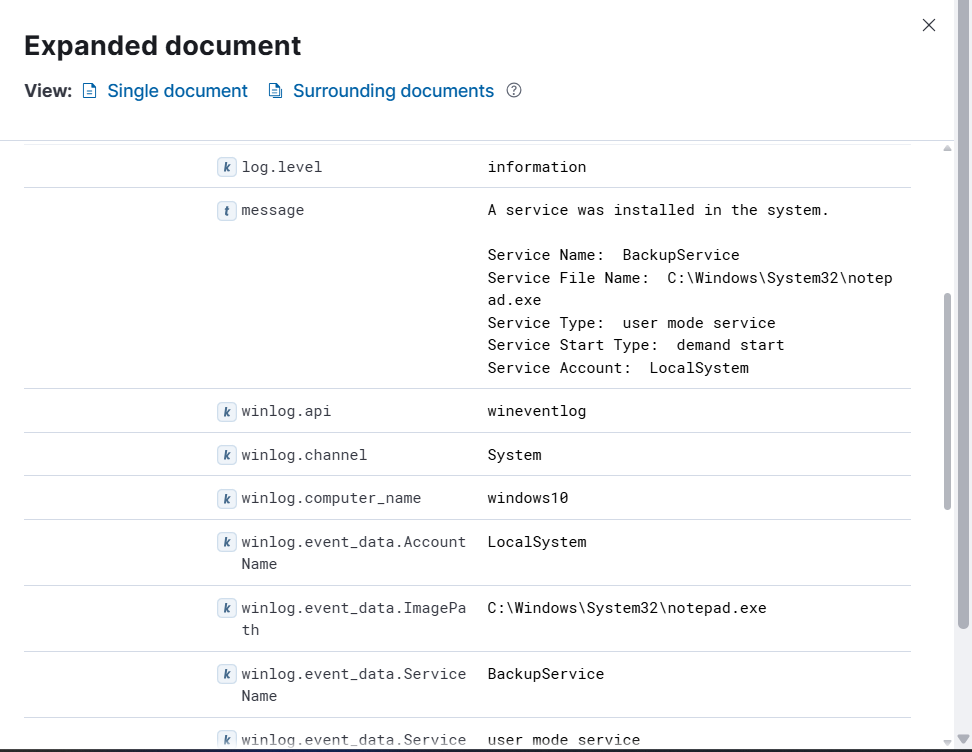

# Investigation Report

## Summary
Windows service creation activity was detected on the Windows 10 host. A new service named `BackupService` was installed and configured to execute an arbitrary system binary (`notepad.exe`). Unscheduled service installation tracking is vital as it represents a core technique utilized by malware families to survive system reboots.

## Timeline & Ingestion Analysis
1. **SIEM Log Discovery:** Running automated queries for system modifications inside Kibana Discover successfully isolated the service installation telemetry metadata records.
   

2. **Activity Event Distribution:** Reviewing the timestamp chart visualizes the exact spike interval where the background integration modifications occurred.
   

## Endpoint Indicators

| Indicator Type | Value |
| :--- | :--- |
| **Target Hostname** | `WINDOWS10` |
| **Registered Service Name** | `BackupService` |
| **Service Image Binary** | `C:\Windows\System32\notepad.exe` |
| **Startup Configuration** | Demand Start / Manual |

## Evidence & Deep Dive
The core forensic verification for this incident relies on **Windows System Event ID 7045 (A service was installed in the system)**. Parsing the expanded field objects maps out the precise parameters used during setup:

By inspecting the configuration block details, security analysts can cross-reference the `Service Account` and the explicit binary paths to evaluate whether the entry presents a threat vector.

## Findings
The captured properties align with persistence behavior. In normal corporate networks, unexpected service setups running standard non-service binaries (such as `notepad.exe` or files executing directly out of user profile directories like `\AppData\`) provide an immediate indicator of compromise (IoC) pointing to persistence or privilege escalation attempts.

## MITRE ATT&CK Mapping
- **Technique:** T1543.003 - Create or Modify System Process: Windows Service

## Severity
🟠 **High** (Rogue background service installation detected on the endpoint host).

## Recommendations
* Configure high-priority real-time correlation alerts inside Elastic SIEM targeting any instance of Windows System Event ID 7045 or Security Event ID 4697.
* Monitor command-line execution parameters involving `sc.exe` or PowerShell `New-Service` commands, specifically alerting on non-standard binary execution spaces (e.g., `C:\Users\*`, `C:\ProgramData\*`, or `C:\Temp\*`).
* Implement application whitelisting controls to restrict binary execution capabilities for unsigned background tasks.
