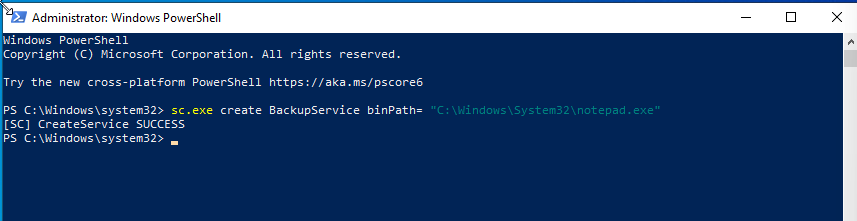
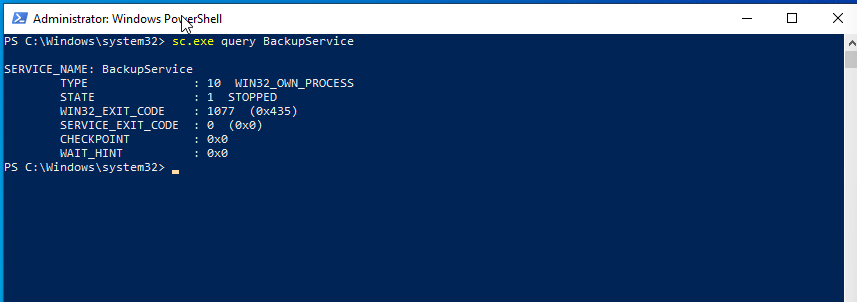

# Case 09 - Windows Service Creation

## 📌 Objective

Detect and investigate Windows service creation activity using the Elastic Stack and Windows System Event Logs to uncover persistence techniques.

---

## 💻 Lab Environment

| Machine | Role | IP Address |
| :--- | :--- | :--- |
| **Windows 10** | Victim (Target Endpoint) | `192.168.56.103` |
| **Host Laptop** | Elastic + Kibana (SIEM) | `192.168.56.1` |

---

## ⚔️ Attack Scenario & Commands Used

Windows services are commonly abused by attackers to establish **persistence**, allowing malicious programs to execute automatically whenever the system starts. In this scenario, the built-in Windows utility **`sc.exe`** was used to create a new service named **`BackupService`**, configured to execute `notepad.exe`.

### Step 1: Create a New Windows Service

The following command creates a new Windows service.

```cmd
sc.exe create BackupService binPath= "C:\Windows\System32\notepad.exe"
```

The screenshot below shows the successful creation of the new Windows service.



---

### Step 2: Verify the Service Configuration

The newly created service was queried to verify that it had been successfully registered by the Windows Service Control Manager.

```cmd
sc.exe qc BackupService
```

The screenshot below displays the configuration details of the newly created service.



---

## 🔍 Detection & Key Findings

- **Detection Method:** Windows System Event ID 7045 (A service was installed in the system) collected via Winlogbeat
- **Service Name:** `BackupService`
- **Service Binary Path:** `C:\Windows\System32\notepad.exe`
- **Target Hostname:** `WINDOWS10`
- **Severity:** 🟠 High
- **MITRE ATT&CK Mapping:**
  - `T1543.003` – Create or Modify System Process: Windows Service

---

## 📖 Case Documentation & References

For a detailed analysis of the Windows service creation event, investigation workflow, and MITRE ATT&CK mapping, refer to the supporting documentation below:

- 🕵️ **Investigation Report:** [investigation.md](investigation.md)
- 🛡️ **MITRE ATT&CK Mapping:** [mitre-mapping.md](mitre-mapping.md)
