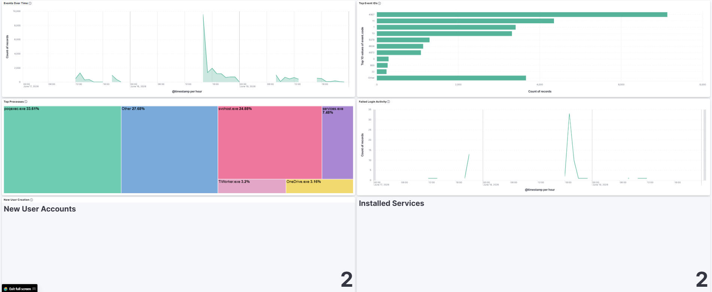
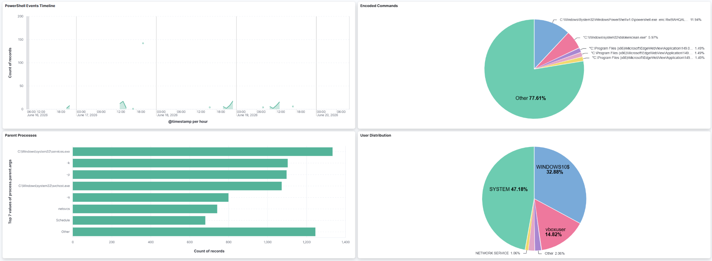
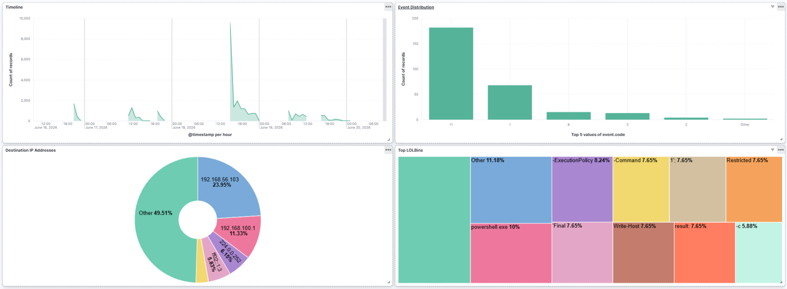
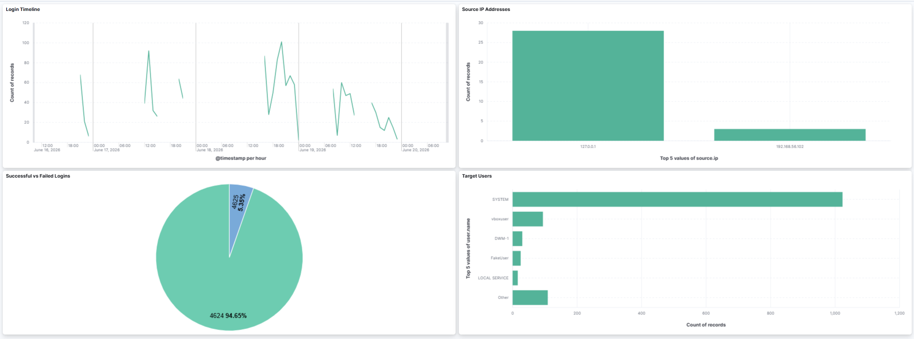
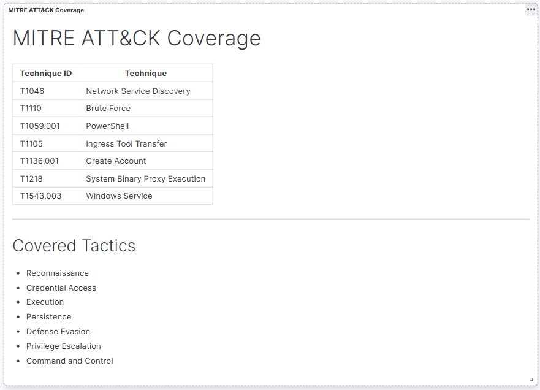

# SIEM Threat Detection and Monitoring Lab

## 📌 Project Overview
This project demonstrates the end-to-end implementation of an enterprise-grade Security Information and Event Management (SIEM) telemetry system built using the **Elastic Stack**, **Sysmon**, and **Winlogbeat**. 

The primary objective of this project is to model real-world adversary tactics, log ingestion behavior, engineering detection alerts, mapping activities to the **MITRE ATT&CK® framework**, and compiling deep-dive incident response investigation reports.

---

## 🏗️ Lab Architecture & Components

* 💻 **Host Machine / Analytics Center**
  * Elastic ElasticSearch (Central Log Ingestion Eng)
  * Kibana SIEM (Visualization & Incident Hunting Interface)
* 🛡️ **Windows 10 Enterprise (Victim Endpoint VM)**
  * System Monitor (Sysmon) Engine — Advanced Endpoint Telemetry
  * Winlogbeat Shipper Agent — Event Log Pipeline Data Transfer
* ⚔️ **Kali Linux (Attacker VM)**
  * Metasploit, Nmap, Python Staging Servers, & Custom Scripts for Threat Simulation

---

## 🛠️ Technologies & Ecosystem Used
* **Elastic Stack** (Elasticsearch & Kibana Analytics)
* **Sysmon** (Advanced Windows Logging Tool)
* **Winlogbeat** (Log Ingestion Pipeline)
* **VirtualBox** (Hypervisor Host Network Isolation Deployment)
* **Kali Linux** & **Windows 10 Environment**

---

## ⚔️ Simulated Attack Scenarios & Lab Workspaces

| Case | Attack Scenario | Technique | MITRE ATT&CK | Documentation |
| :---: | :--- | :--- | :---: | :---: |
| **01** | Nmap Network Discovery | Network Reconnaissance | `T1046` | 📁 [Case 01](./Case-01-Nmap-Detection/) |
| **02** | SSH Brute Force | Credential Access | `T1110` | 📁 [Case 02](./Case-02-SSH-Brute-Force/) |
| **03** | PowerShell Execution | PowerShell | `T1059.001` | 📁 [Case 03](./Case-03-PowerShell-Execution/) |
| **04** | PowerShell Download Cradle | Ingress Tool Transfer | `T1059.001`, `T1105` | 📁 [Case 04](./Case-04-PowerShell-Download-Cradle/) |
| **05** | New Local User Creation | Account Persistence | `T1136.001` | 📁 [Case 05](./Case-05-New-User-Creation/) |
| **06** | LOLBins Abuse (Certutil) | Living Off the Land | `T1218` | 📁 [Case 06](./Case-06-LOLBins-Abuse/) |
| **07** | Encoded PowerShell | Obfuscated PowerShell | `T1059.001` | 📁 [Case 07](./Case-07-Encoded-PowerShell/) |
| **08** | Certutil Payload Download | LOLBin Download | `T1218`, `T1105` | 📁 [Case 08](./Case-08-Certutil-Payload-Download/) |
| **09** | Windows Service Creation | Persistence | `T1543.003` | 📁 [Case 09](./Case-09-Windows-Service-Creation/) |

---

## 📊 Security Operations Center (SOC) Dashboards

### 1. SOC Overview Dashboard
Provides a holistic, high-level structural overview of global endpoint security metrics, malicious threat levels, system processes anomalies, authentication log monitoring configurations, and matrix alert coverages.

### 2. PowerShell Threat Hunting Dashboard
Engineered explicitly to analyze deep-level script parameters, isolating runtime `-enc` or obfuscated Unicode command strings, alongside anomalous sub-process execution trees.

### 3. LOLBins Monitoring Dashboard
Monitors and traces unauthorized arguments passed down onto default system binary proxy applications such as `certutil.exe`, `sc.exe`, or administrative command environments.

### 4. Brute Force Investigation Dashboard
Gathers remote connection behaviors, tracking systemic validation failures, authentication spikes, target administrative names, and geological source attacker IP endpoints.

### 5. MITRE ATT&CK Matrix Coverage Dashboard
Maps overall environmental log ingestions against active coverage blocks inside the matrix taxonomy to support ongoing detection engineering gaps identification.

---

## 🎯 Tactical MITRE ATT&CK® Matrix Framework Coverage

### 🔍 Reconnaissance
* **T1046 - Network Service Discovery:** Port scanning audits and remote service mapping.

### 🔑 Credential Access
* **T1110 - Brute Force:** Automated authentication attempts targeting protocol pathways.

### ⚙️ Execution
* **T1059.001 - PowerShell:** Interactive administrative command shell payload execution.

### 📌 Persistence & Privilege Escalation
* **T1136.001 - Create Account (Local Account):** Rogue administrative backup credential creation.
* **T1543.003 - Create or Modify System Process (Windows Service):** Persistent system services registration.

### 🛡️ Defense Evasion
* **T1218 - System Binary Proxy Execution:** Proxying execution using legitimate native operating system processes (LOLBins).

### 📡 Command and Control
* **T1105 - Ingress Tool Transfer:** Retrieving supporting tooling vectors from remote adversary repositories.

---

## 🏆 Cyber Security Core Competencies Demonstrated
* **SIEM Architecture Management** (Elasticsearch Cluster Optimization & Kibana Dashboard Engineering)
* **Advanced Telemetry Ingestion Engineering** (Sysmon Rules Custom Tuning, Winlogbeat Shipping)
* **Live Forensics & Enterprise Incident Analysis** (Windows Event Logs & Audit Parsing)
* **Adversary Emulation & Simulation** (Replicating TTPs in Sandboxed Contexts)
* **Defensive Mapping** (MITRE ATT&CK Framework Modeling & Rule Hardening Alignment)

---

## 👤 Author & Cybersecurity Portfolio
* **Focus Profile:** Blue Team Operations, SOC Analysis, Log Analysis, & Enterprise Threat Hunting.
* *Developed as a practical demonstration of advanced detection engineering methodologies utilizing decentralized logging environments.*
