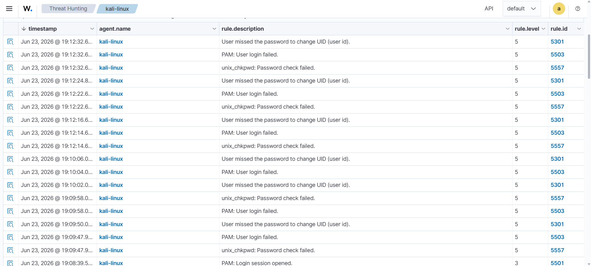
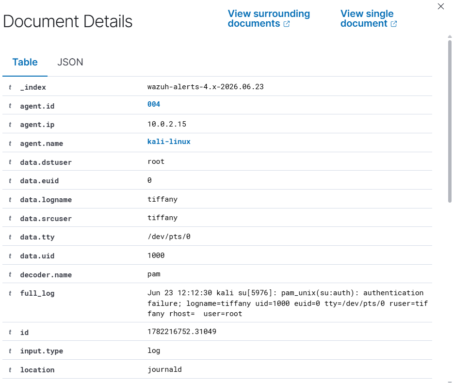

# Investigation Report

## Alert Summary
The centralized Wazuh rule engine triggered security alerts flagging multiple sequential authentication failures on the monitored Linux host endpoint. 

---

## 🕵️‍♂️ Step-by-Step Incident Investigation

### Step 1: Alert Detection & Ingestion Review
Analysts checked the primary security monitoring streams to verify the event generation flags. Wazuh effectively parsed the host log structure and surfaced a dedicated rule alert pointing to the authentication subsystem failure.

### Step 2: Target Account Verification & Metadata Triage
Expanding the structured event logs exposes critical contextual metadata properties. Triaging the log contents allows security teams to verify the target user, hostname, and precise generation timelines:

* **Target Account:** `root`
* **Endpoint Hostname:** `kali`
* **Trigger Component:** PAM Authentication Layer

### Step 3: Event Frequency & Blast Radius Evaluation
A high volume of failed logins occurring within a tight time delta typically implies an automated dictionary/brute-force attempt. While this simulation remains isolated, it demonstrates why real-time tracking is critical before actors secure a successful entry vector.

### Step 4: Impact Assessment & Classification
Reviewing subsequent session logs confirmed that **no successful logins** occurred following the anomaly block. The activity is classified as **Suspicious (Mitigated)** since it was blocked at the perimeter and did not culminate in unauthorized privilege compromise.

---

## 🛑 Structural Classification
* **Incident Status:** Suspicious (Failed Attempt)
* **Threat Classification Tactic:** Credential Access
* **Severity Matrix:** 🟡 Medium

---

## 💡 Remediations & Engineering Recommendations
* **Enforce Rate Limiting:** Implement local defenses like `Fail2ban` to automatically drop connection vectors displaying repeated auth errors.
* **Harden Access Control:** Restrict direct interactive root access (`su root` or SSH root login permissions) across critical system boundaries.
* **Audit Correlation Rules:** Configure high-priority alerting models inside the SIEM architecture for whenever a failed login sequence is immediately followed by a successful session creation block.
