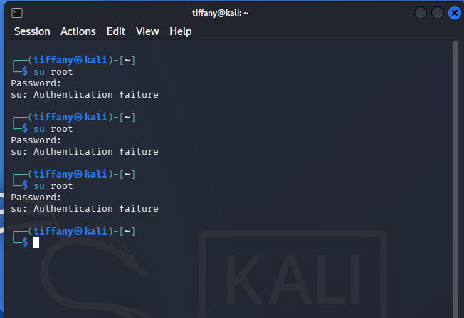

# Case 01 - Authentication Failures Detection

## 📌 Objective

Demonstrate how the Wazuh platform detects and alerts on failed authentication attempts on a Linux endpoint to identify potential brute-force or credential abuse activity.

---

## ⚔️ Attack Scenario & Commands Used

Multiple failed authentication attempts were intentionally generated on the monitored Kali Linux endpoint. Repeated authentication failures are common indicators of brute-force attacks or unauthorized access attempts.

The simulation was performed by attempting to switch to the **root** account using an incorrect password.

```bash
su root
```

The screenshot below shows the failed authentication attempts on the Kali Linux terminal.



---

## 🔍 Detection & Key Findings

- **Detection Method:** Authentication logs collected and analyzed by Wazuh
- **Monitored Log Sources:**
  - `/var/log/auth.log`
  - PAM (Pluggable Authentication Modules)
- **Observed Target Account:** `root`
- **Monitored Endpoint:** `Kali Linux`
- **Classification:** Suspicious Activity
- **Severity:** 🟡 Medium
- **MITRE ATT&CK Mapping:**
  - `T1110` – Brute Force

---

## 📖 Case Documentation & References

For a detailed analysis of the authentication events, investigation workflow, and MITRE ATT&CK mapping, refer to the supporting documentation below:

- 🕵️ **Investigation Report:** [Investigation.md](Investigation.md)
- 🛡️ **MITRE ATT&CK Mapping:** [MITRE-Mapping.md](MITRE-Mapping.md)
