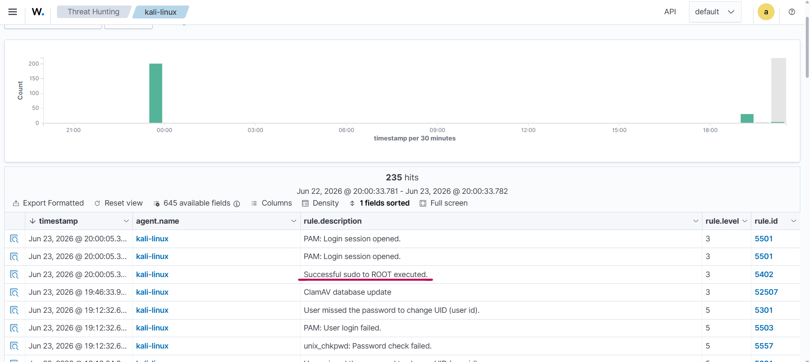
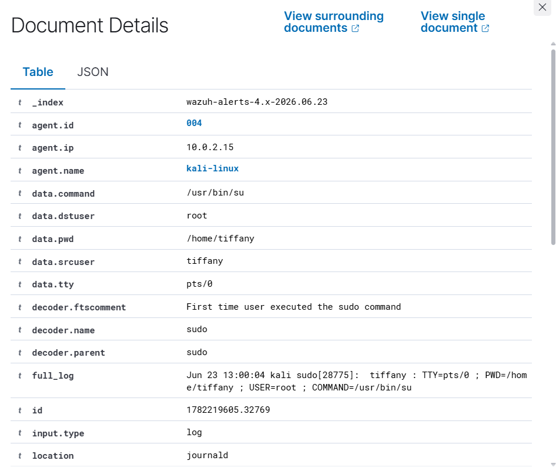

# Investigation Report

## Alert Summary
The central Wazuh engine intercepted system logging outputs from the Linux host endpoint, identifying an interactive administrative shell generation sequence (`sudo su`) and triggering a high-priority alert.

---

## 🕵️‍♂️ Step-by-Step Incident Investigation

### Step 1: Real-Time Alert Triage
Analysts checked the primary security event console streams to verify alert generation. Wazuh processed the raw host log block and generated a high-severity alert indicating an administrative privilege utility call.

### Step 2: User Identification & Account Context Triage
Expanding the structured event log inside the SIEM discover interface exposes the contextual properties of the session. Inspecting this metadata allows security operations teams to verify the executing user account and execution timeline parameters:

* **Executing Account:** `kali` (transitioning to context `root`)
* **Target Endpoint Host:** `kali`
* **Captured Argument:** `sudo su`

### Step 3: Command Argument & Behavioral Analysis
Reviewing the precise command string (`sudo su`) confirms an attempt to launch an unrestricted root shell environment. In a standard corporate ecosystem, non-whitelisted users spawning root shells outside of standard maintenance windows provides an immediate Indicator of Compromise (IoC).

### Step 4: Impact Assessment
The privilege escalation action completed successfully in a controlled test environment. While safe in this lab context, the telemetry confirms that if an external threat actor obtained the user credentials or accessed an unlocked terminal session, they would achieve full system compromise.

---

## 🛑 Structural Classification
* **Incident Status:** Suspicious (Successful Elevation)
* **Threat Tactic Class:** Privilege Escalation
* **Severity Matrix:** 🟠 High

---

## 💡 Remediations & Engineering Recommendations
* **Enforce Principle of Least Privilege:** Audit the local `/etc/sudoers` configuration file to ensure only explicit, authorized administrative users possess execution privileges.
* **Implement Command Whitelisting:** Restrict generic wildcard capabilities (`ALL=(ALL:ALL) ALL`) and restrict sudo usage to specific binaries or scripts required for core operational duties.
* **Harden Session Security:** Reduce the default `timestamp_timeout` value inside the sudo configuration to minimize the exposure window for session reuse or caching abuse attacks.
