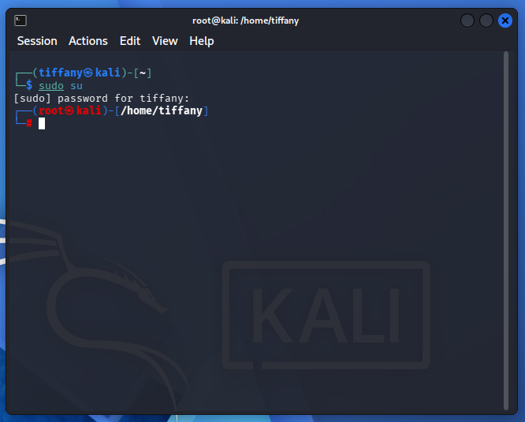

# Case 02 - Suspicious Sudo Activity

## 📌 Objective

Demonstrate how the Wazuh platform detects and alerts on privilege escalation attempts performed through the Linux `sudo` utility.

---

## ⚔️ Attack Scenario & Commands Used

The `sudo` command is commonly targeted by attackers during post-compromise activities to elevate privileges and gain administrative access. Monitoring `sudo` executions helps identify potentially unauthorized privilege escalation attempts.

The following command was executed on the monitored Kali Linux endpoint to simulate a privilege escalation event.

```bash
sudo su
```

The screenshot below shows the successful execution of the `sudo` command on the Kali Linux terminal.



---

## 🔍 Detection & Key Findings

- **Detection Method:** Linux authentication and privilege escalation events collected and analyzed by Wazuh
- **Monitored Log Sources:**
  - `/var/log/auth.log`
  - `sudo` logs
  - PAM (Pluggable Authentication Modules)
- **Executed Command:** `sudo su`
- **Monitored Endpoint:** `Kali Linux`
- **Classification:** Suspicious Activity
- **Severity:** 🟠 High
- **MITRE ATT&CK Mapping:**
  - `T1548.003` – Abuse Elevation Control Mechanism: Sudo and Sudo Caching

---

## 📖 Case Documentation & References

For a detailed analysis of the privilege escalation event, investigation workflow, and MITRE ATT&CK mapping, refer to the supporting documentation below:

- 🕵️ **Investigation Report:** [Investigation.md](Investigation.md)
- 🛡️ **MITRE ATT&CK Mapping:** [MITRE-Mapping.md](MITRE-Mapping.md)
