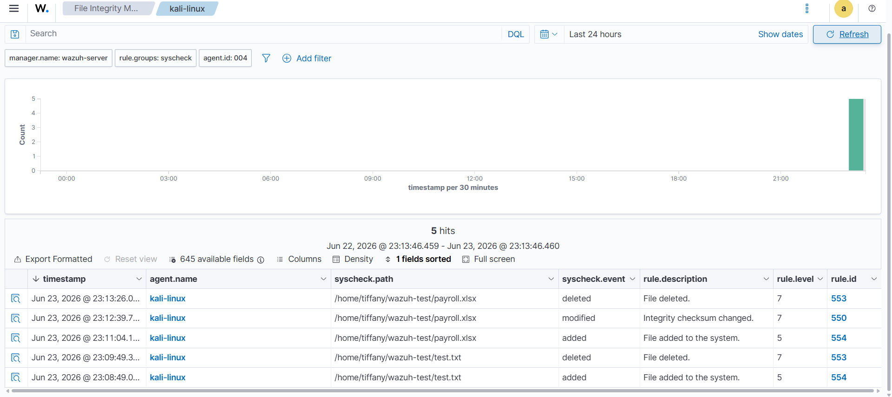
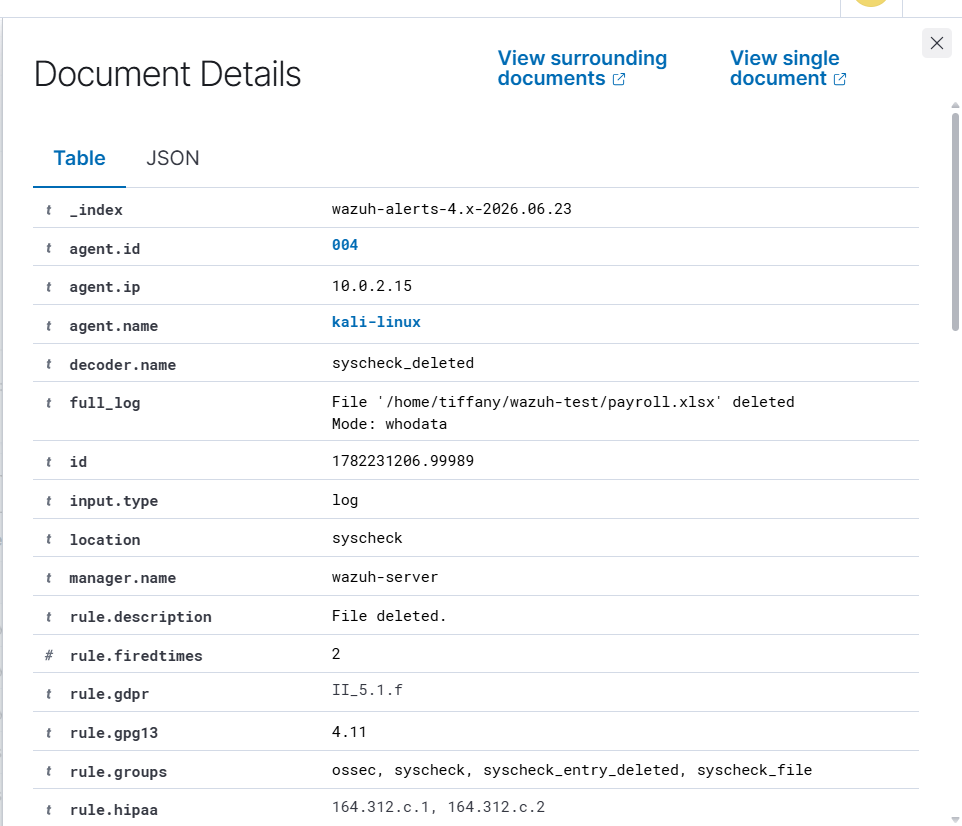
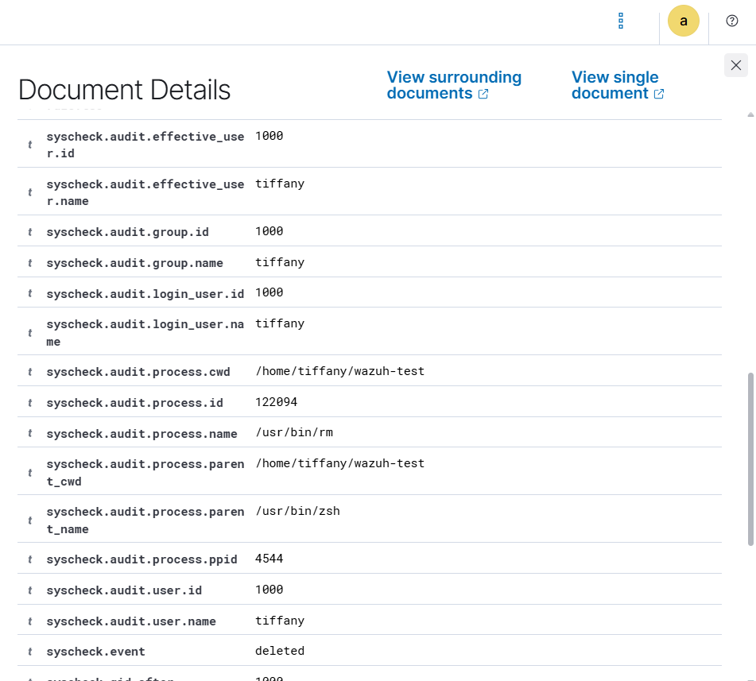

# Investigation Report

## Alert Summary
The centralized Wazuh monitoring core successfully captured real-time file system alterations within the designated path domain, triggering FIM alarms for creation, inline write operations, and file elimination.

---

## 🕵️‍♂️ Step-by-Step Incident Investigation

### Step 1: Broad-Spectrum FIM Console Review
Analysts reviewed the primary File Integrity Monitoring control center to trace environmental updates. Wazuh recorded distinct state changes matching the modification schedule across the targeted directory path.

### Step 2: Metadata Property Ingestion Triage
Expanding individual alert events surfaces structural telemetry parameters. Triage blocks map key attributes including path locations, modified validation hashes, and systemic event timestamps:

### Step 3: Whodata Identity and Actor Identification
By utilizing the active **Whodata** plugin sub-layer, analysts can bypass simple generic path change parameters to pin down the exact operating system user identity and binary application responsible for making the modification:

* **Responsible Local Identity Account:** `kali`
* **Operational Actions Verified:** File Creation (`added`), Modification (`modified`), and Deletion (`deleted`)
* **Core Forensic Target Path:** `/home/kali/wazuh-test/payroll.xlsx`

### Step 4: Security Threat Classification
The execution sequence matches anti-forensic cleanup routines often run after data staging phases. The events are classified as **Suspicious (Validated Audit Activity)**, confirming that any anomalous target creation and rapid purging can be successfully audited down to an individual local user account.

---

## 🛑 Incident Matrix Properties
* **Incident Status:** Suspicious (Validated Modification Tree)
* **Threat Class Tactics:** Defense Evasion / Impact
* **Severity Vector:** 🟡 Medium

---

## 💡 Remediations & Engineering Recommendations
* **Enable Whodata Across Critical Paths:** Enforce FIM Whodata monitoring properties across sensitive operational folders like `/etc/`, `/bin/`, `/sbin/`, or systemic application data directories.
* **Configure Immutable Audit Rules:** Apply write-protection rules to the engine configuration profiles to prevent local actors from disabling or altering active telemetry streams.
* **Establish High-Priority Triggers:** Build elevated SIEM alerts for whenever file manipulation tasks occur inside production server database structures outside of scheduled administrative changelogs.
