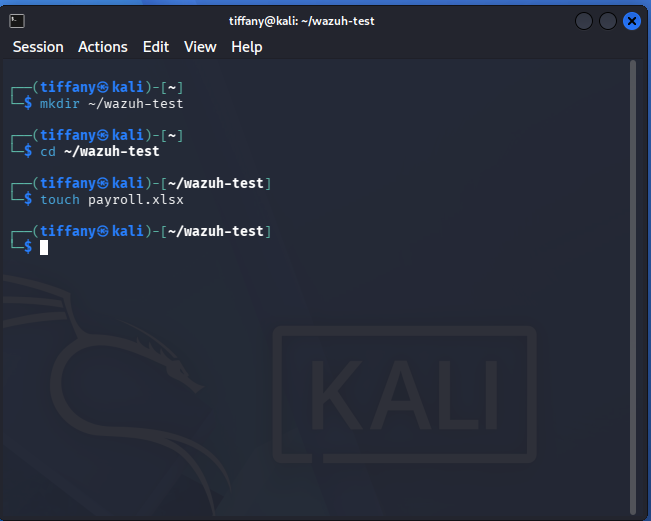
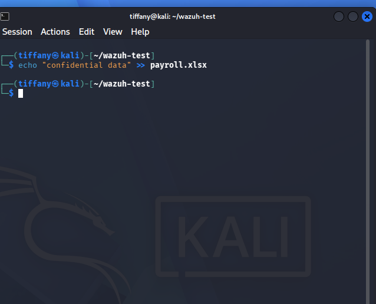
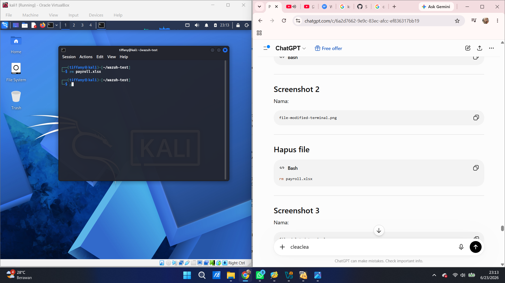

# Case 03 - File Integrity Monitoring (Whodata)

## 📌 Objective

Demonstrate how Wazuh File Integrity Monitoring (FIM) with **Whodata** detects and records file creation, modification, and deletion events on a Linux endpoint.

---

## ⚔️ Attack Scenario & Commands Used

Attackers often manipulate or remove files to alter configurations, modify sensitive data, or erase forensic evidence after compromising a system. To simulate these activities, a test directory and file were created, modified, and deleted on the monitored Kali Linux endpoint.

### Step 1: Create the Test Directory and File

The following commands create a test directory and an empty file named `payroll.xlsx`.

```bash
mkdir ~/wazuh-test
cd ~/wazuh-test
touch payroll.xlsx
```

The screenshot below shows the successful creation of the test file.



---

### Step 2: Modify the File

The following command appends sample content to the file, simulating a file modification event.

```bash
echo "confidential data" >> payroll.xlsx
```

The screenshot below shows the modification of the monitored file.



---

### Step 3: Delete the File

The following command removes the file from the monitored directory.

```bash
rm payroll.xlsx
```

The screenshot below shows the successful deletion of the monitored file.



---

## 🔍 Detection & Key Findings

- **Detection Method:** Wazuh File Integrity Monitoring (FIM) with Whodata
- **Monitored Directory:** `~/wazuh-test/`
- **Monitored File:** `payroll.xlsx`
- **Observed Activities:**
  - File Creation
  - File Modification
  - File Deletion
- **Whodata Information:** User attribution, process information, and event timestamps
- **Monitored Endpoint:** `Kali Linux`
- **Severity:** 🟡 Medium
- **MITRE ATT&CK Mapping:**
  - `T1565.001` – Stored Data Manipulation
  - `T1070.004` – File Deletion

---

## 📖 Case Documentation & References

For a detailed analysis of the File Integrity Monitoring events, investigation workflow, and MITRE ATT&CK mapping, refer to the supporting documentation below:

- 🕵️ **Investigation Report:** [Investigation.md](Investigation.md)
- 🛡️ **MITRE ATT&CK Mapping:** [MITRE-Mapping.md](MITRE-Mapping.md)
