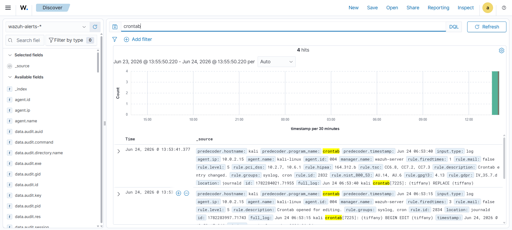
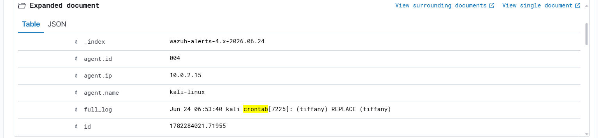

# Investigation Report

## Alert Summary
The central Wazuh analytical monitoring stack detected real-time file system write integrity alterations targeting user cron storage locations on the Linux client node, triggering security alerts for persistent configuration tampering.

---

## 🕵️‍♂️ Step-by-Step Incident Investigation

### Step 1: Centralized Alert Stream Review
Security operators triaged the master Wazuh incident console stream to pinpoint the alert. The rule engine parsed the local file modification and successfully dropped an indicator highlighting cron task alteration:

### Step 2: Contextual Property & Metadata Expansion
Opening the expanded event log block inside the SIEM discover interface surfaces structured internal attributes. Reviewing these fields enables security personnel to confirm the affected files, temporal stamps, and modification scopes:

* **Altered Target Spool File:** `/var/spool/cron/crontabs/kali`
* **Triggering User Account:** `kali`
* **Verified Command Sub-string:** `echo "Persistence Test" >> /tmp/persistence.log`

### Step 3: Persistence Scope & Impact Verification
The execution of the `crontab -e` sequence was validated. In enterprise threat hunting, any untracked or non-whitelisted user modifying scheduling frameworks represents an immediate high-risk threat vector capable of concealing active backdoor payloads or staging logic scripts.

### Step 4: Incident Scope Assessment
The evaluation confirmed that the activity was simulated inside a controlled sandboxed testing workspace. While neutralized here, the log structures prove that any unauthorized attempt by an external actor to install persistence models can be instantly traced to an individual local system profile.

---

## 🛑 Incident Matrix Properties
* **Incident Status:** Suspicious (Task Persistence Confirmed)
* **Threat Class Tactic:** Persistence
* **Severity Vector:** 🟠 High

---

## 💡 Remediations & Engineering Recommendations
* **Enforce Strict Scheduler Access Rules:** Lock down cron configuration binary capabilities by utilizing `/etc/cron.allow` and `/etc/cron.deny` system safety maps.
* **Deploy Behavioral Integrity Triggers:** Build elevated SIEM rules to watch out for cron update events where the payload targets untrusted system spaces (e.g., `/tmp/*`, `/dev/shm/*`, or user hidden profiles).
* **Automate State Consistency Scans:** Implement periodic configuration comparisons against certified golden image state sheets to rapidly detect and prune legacy or un-audited cron scripts.
