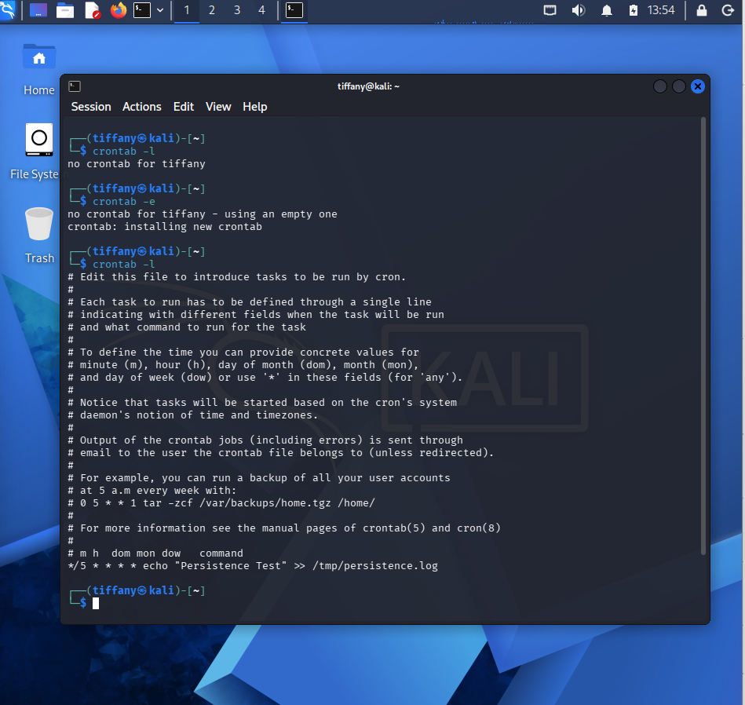
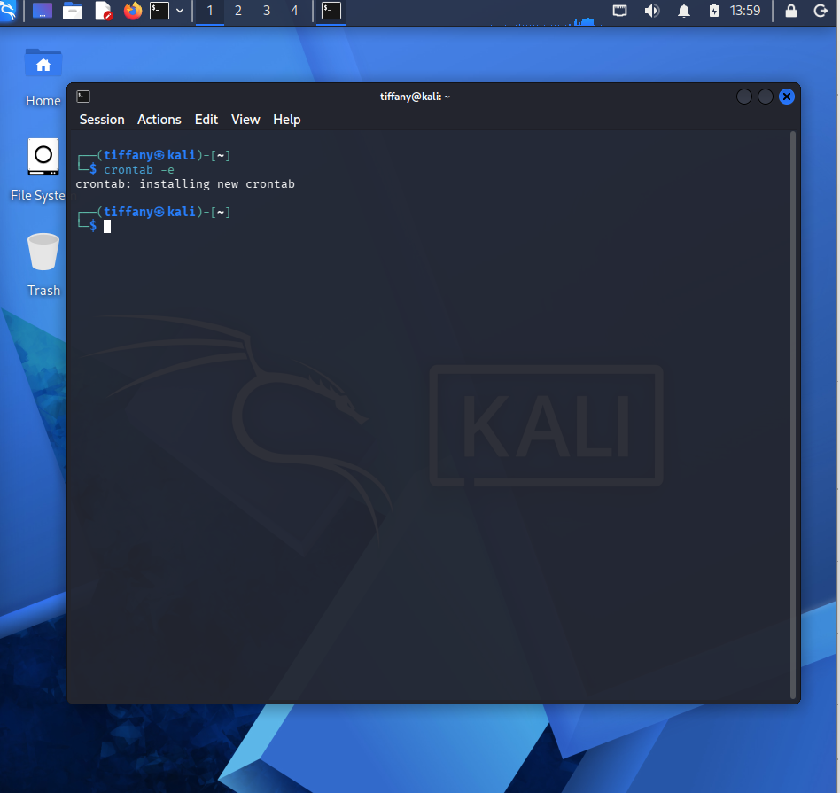

# Case 04 - Persistence via Cronjob

## 📌 Objective

Demonstrate how the Wazuh platform detects and monitors unauthorized cron job creation and modification as a persistence mechanism on a Linux endpoint.

---

## ⚔️ Attack Scenario & Commands Used

Attackers often abuse the Linux **cron** scheduler to establish persistence by executing malicious commands or scripts at scheduled intervals. In this simulation, a cron job was created to periodically write data to a log file and later removed to restore the system.

### Step 1: Create a Cron Job

A new cron job was added using the following command.

```bash
crontab -e
```

The following cron entry was inserted into the user's crontab.

```text
*/5 * * * * echo "Persistence Test" >> /tmp/persistence.log
```

The screenshot below shows the successful creation of the cron job.



---

### Step 2: Remove the Cron Job

After validating the detection, the persistence entry was removed from the cron schedule.

```bash
crontab -e
```

The screenshot below shows the removal of the cron job from the monitored endpoint.



---

## 🔍 Detection & Key Findings

- **Detection Method:** Wazuh File Integrity Monitoring (FIM) with Whodata
- **Monitored Files:**
  - `/var/spool/cron/crontabs/`
  - `/etc/crontab`
  - `/etc/cron.*/`
- **Executed Command:** `crontab -e`
- **Persistence Technique:** Scheduled Cron Job
- **Monitored Endpoint:** `Kali Linux`
- **Severity:** 🟠 High
- **MITRE ATT&CK Mapping:**
  - `T1053.003` – Scheduled Task/Job: Cron

---

## 📖 Case Documentation & References

For a detailed analysis of the cron job modification events, investigation workflow, and MITRE ATT&CK mapping, refer to the supporting documentation below:

- 🕵️ **Investigation Report:** [Investigation.md](Investigation.md)
- 🛡️ **MITRE ATT&CK Mapping:** [MITRE-Mapping.md](MITRE-Mapping.md)
