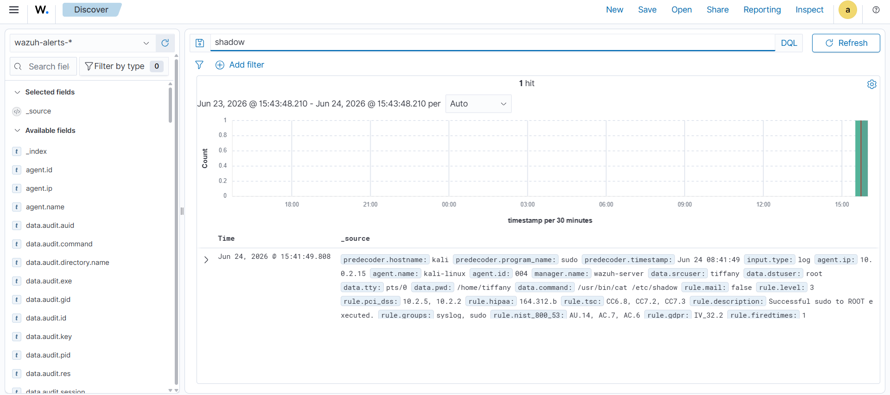
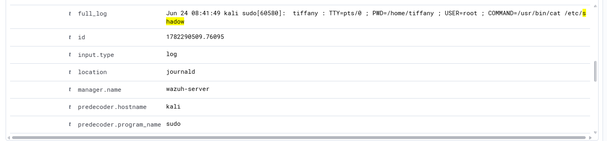

# Investigation Report

## Alert Summary
The central Wazuh analytical rule engine triggered a critical priority security alert after capturing unexpected file read operations hitting core local operating system credential storage repositories.

---

## 🕵️‍♂️ Step-by-Step Incident Investigation

### Step 1: High-Priority Alert Triage
Analysts monitored the primary Wazuh security events dashboard to triage the incoming incident stream. The SIEM successfully generated an alert identifying anomalous read operations on system verification stores:

### Step 2: Metadata Property & Executing Actor Identification
Expanding the ingestion packet inside the discover console surfaces structured operational properties. Reviewing these telemetry blocks allows the SOC team to isolate the execution context and verify the target assets:

* **Accessed Targets:** `/etc/passwd` and `/etc/shadow`
* **Responsible Local Account Identity:** `kali` (Elevated context via sudo)
* **Monitored Endpoint Host:** `kali`

### Step 3: Intent & Behavioral Analysis
The execution of `cat /etc/shadow` confirms an active attempt to read raw cryptographic password hashes. Outside of verified maintenance windows or authorized compliance audits, any attempt by a standard user context to dump hash repositories indicates active credential harvesting or preparation for local privilege escalation.

### Step 4: Impact & Exposure Assessment
The simulation successfully read the contents of the local credential files. While safe inside this isolated lab workspace, an identical attack in production means the attacker has obtained the system's password hashes, enabling them to run offline cracking tools (e.g., John the Ripper or Hashcat) to compromise local passwords.

---

## 🛑 Structural Classification
* **Incident Status:** Suspicious (Credential Dumping Confirmed)
* **Threat Tactic Class:** Credential Access
* **Severity Matrix:** 🔴 Critical

---

## 💡 Remediations & Engineering Recommendations
* **Restrict Access to System Binaries:** Limit the ability of general system users to run tools that can read sensitive configurations, and ensure strict file permissions on `/etc/shadow` (`chmod 600` or `000` depending on OS defaults).
* **Implement Centralized Identity Management:** Transition corporate endpoints from local password configurations to centralized authorization hubs like LDAP, Active Directory, or Okta to minimize the value of local host hash stores.
* **Deploy Behavioral Whitelisting:** Set up advanced SIEM alarms to immediately flag whenever any non-whitelisted binary or non-administrative user context requests an I/O read operation on standard system credential paths.
