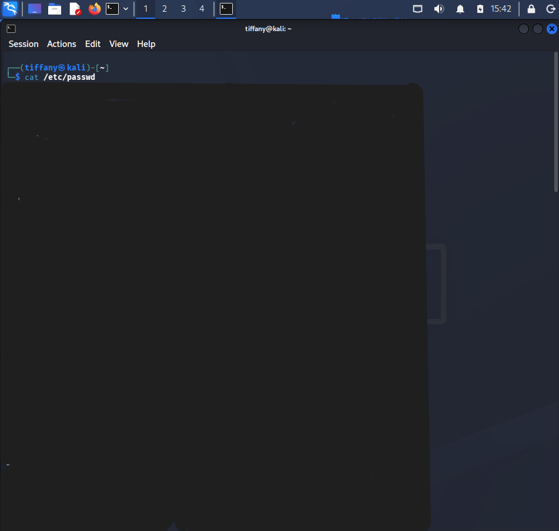
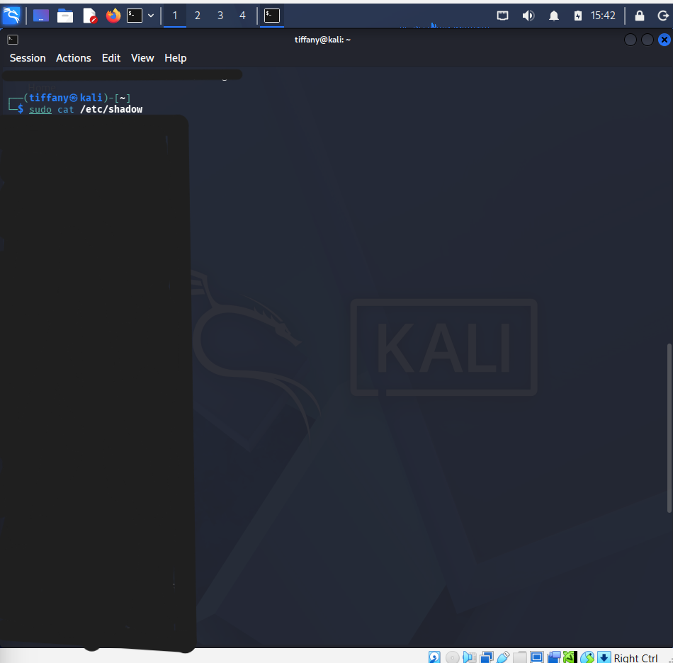

# Case 05 - Sensitive File Access

## 📌 Objective

Demonstrate how the Wazuh platform detects and alerts on access to sensitive Linux credential files such as `/etc/passwd` and `/etc/shadow`.

---

## ⚔️ Attack Scenario & Commands Used

Attackers commonly access Linux credential files during the post-exploitation phase to enumerate user accounts and obtain password hashes for offline password cracking or privilege escalation.

The following commands were executed on the monitored Kali Linux endpoint to simulate credential harvesting activity.

### Step 1: Access `/etc/passwd`

The following command displays the system's user account information.

```bash
cat /etc/passwd
```

The screenshot below shows the contents of `/etc/passwd` being accessed.



---

### Step 2: Access `/etc/shadow`

The following command reads the protected password hash file using elevated privileges.

```bash
sudo cat /etc/shadow
```

The screenshot below shows the successful access to `/etc/shadow`.



---

## 🔍 Detection & Key Findings

- **Detection Method:** Wazuh File Integrity Monitoring (FIM) and Linux audit events
- **Monitored Files:**
  - `/etc/passwd`
  - `/etc/shadow`
- **Observed Activities:**
  - File Access
  - Privileged File Read
- **Monitored Endpoint:** `Kali Linux`
- **Classification:** Suspicious Activity (Credential Access)
- **Severity:** 🔴 Critical
- **MITRE ATT&CK Mapping:**
  - `T1003.008` – OS Credential Dumping: `/etc/passwd` and `/etc/shadow`

---

## 📖 Case Documentation & References

For a detailed analysis of the sensitive file access events, investigation workflow, and MITRE ATT&CK mapping, refer to the supporting documentation below:

- 🕵️ **Investigation Report:** [Investigation.md](Investigation.md)
- 🛡️ **MITRE ATT&CK Mapping:** [MITRE-Mapping.md](MITRE-Mapping.md)
