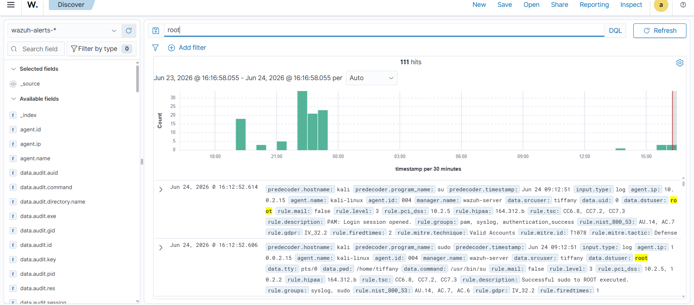
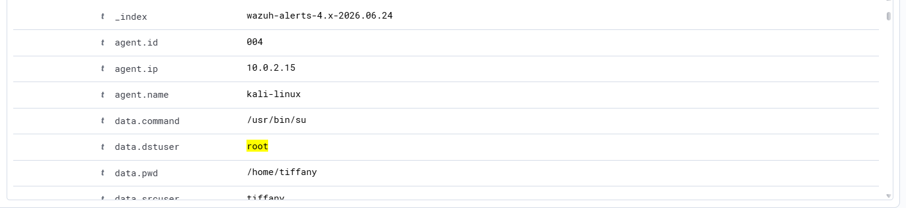

# Investigation Report

## Alert Summary
The central Wazuh analytical security engine generated critical severity notifications indicating that a host session successfully achieved root elevation and performed multiple high-risk system discovery and credential access activities.

---

## 🕵️‍♂️ Step-by-Step Incident Investigation

### Step 1: Real-Time Alert Triage & Interception
Analysts triaged the primary Wazuh security events stream to verify the severity profile. The system flagged the session elevation sequence, confirming that administrative access utilities were active on the host asset:

### Step 2: Contextual Metadata Triage & Command Parsing
Expanding the analytical log indices inside the SIEM discover console exposes the granular operational fields. This metadata breakdown allows responders to map out the entire post-escalation timeline:

* **Initiating Account Context:** `kali` (Elevated to `root` shell via sudo)
* **Target Endpoint Host:** `kali`
* **Captured Execution Sequence:** `id` -> `whoami` -> `cat /etc/shadow`

### Step 3: Behavioral Intent Analysis
The execution order indicates structured tactical intent. The calls to `id` and `whoami` serve to confirm successful elevation, while the subsequent call to read `/etc/shadow` represents a definitive effort to harvest credential hashes. In operational environments, this pattern signals a catastrophic compromise requiring immediate host containment.

### Step 4: Blast Radius & Impact Assessment
The administrative actions were completed successfully within a sandboxed laboratory workspace. While no production systems were endangered during this simulation, the captured telemetry confirms that Wazuh provides the granular tracking data needed to catch unauthorized root operations before data exfiltration or system destruction can occur.

---

## 🛑 Structural Classification
* **Incident Status:** Suspicious (Root Compromise Validated)
* **Threat Class Tactics:** Privilege Escalation / Defense Evasion / Credential Access
* **Severity Matrix:** 🔴 Critical

---

## 💡 Remediations & Engineering Recommendations
* **Enforce Multi-Factor Authentication for Sudo:** Configure PAM system properties to mandate additional verification checkpoints whenever users request a transition to root shells.
* **Implement Strict Command Auditing:** Utilize advanced kernel-level tools like Linux Auditd or Sysmon for Linux to record every individual command run inside a root shell, streaming the results to an off-site repository.
* **Decommission Generic Accounts:** Ensure that system administration tasks are mapped to unique individual user profiles with limited sudo parameters rather than a single shared root session.
