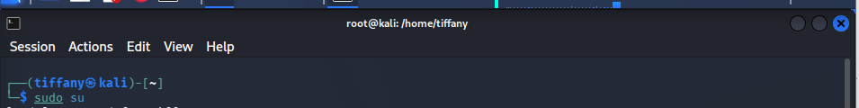
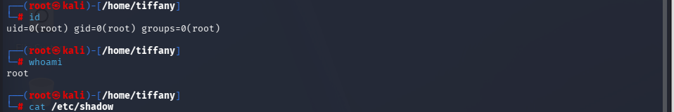

# Case 06 - Root Privilege Activity

## 📌 Objective

Demonstrate how the Wazuh platform detects and monitors privileged user activity performed within a root shell on a Linux endpoint.

---

## ⚔️ Attack Scenario & Commands Used

After obtaining elevated privileges, attackers commonly perform system reconnaissance, verify their permissions, inspect system identities, and access sensitive resources. Monitoring root-level activity helps security analysts identify potentially malicious post-exploitation behavior.

The following commands were executed after switching to a root shell on the monitored Kali Linux endpoint.

### Step 1: Enter the Root Shell

The following command was used to obtain a root shell.

```bash
sudo su
```

The screenshot below shows the successful transition into the root shell.



---

### Step 2: Execute Administrative Commands

Once running as the root user, several administrative commands were executed to simulate common post-exploitation activities.

```bash
id
whoami
cat /etc/shadow
```

The screenshot below shows the execution of privileged commands within the root session.



---

## 🔍 Detection & Key Findings

- **Detection Method:** Linux authentication and privileged command events collected and analyzed by Wazuh
- **Monitored Log Sources:**
  - `/var/log/auth.log`
  - `sudo` logs
  - PAM (Pluggable Authentication Modules)
- **Executed Commands:**
  - `sudo su`
  - `id`
  - `whoami`
  - `cat /etc/shadow`
- **Privilege Level:** `root`
- **Monitored Endpoint:** `Kali Linux`
- **Severity:** 🔴 Critical
- **MITRE ATT&CK Mapping:**
  - `T1078` – Valid Accounts
  - `T1548.003` – Abuse Elevation Control Mechanism: Sudo and Sudo Caching

---

## 📖 Case Documentation & References

For a detailed analysis of the privileged user activity, investigation workflow, and MITRE ATT&CK mapping, refer to the supporting documentation below:

- 🕵️ **Investigation Report:** [Investigation.md](Investigation.md)
- 🛡️ **MITRE ATT&CK Mapping:** [MITRE-Mapping.md](MITRE-Mapping.md)
