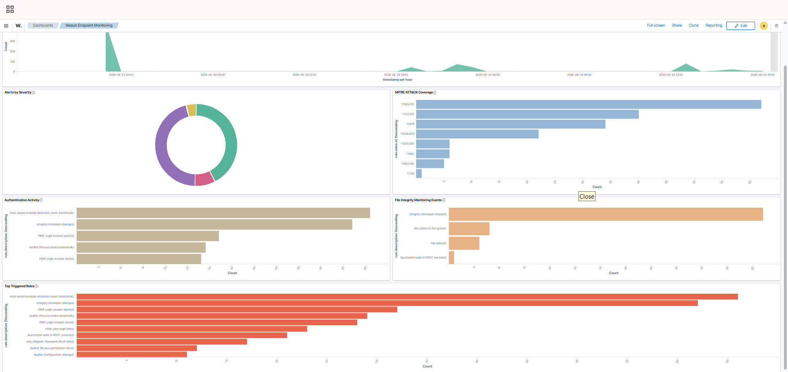

# Wazuh Security Monitoring Dashboard

## 📌 Overview
This repository section showcases the centralized security operations interface built utilizing the **Wazuh Dashboard engine**. 

The integrated analytical platform provides clear security monitoring metrics, cross-framework data correlations, and rapid log-hunting capabilities over the monitored endpoint. The visual control graphs aggregate threat metrics generated across the practical attack simulation exercises, which include authentication abuse, privilege escalation, persistence mechanisms, and advanced file integrity exploitation chains.

---

## 📊 Central Dashboard Operations & Insights
The live management console aggregates distributed agent telemetry pipelines to empower real-time threat hunting procedures:

---

## 🧩 Architectural Dashboard Components

### 📈 Alert Timeline Tracker
* Maps incoming endpoint security alert frequencies chronologically over active time intervals.
* Enables analysts to identify burst anomalies, isolate brute-force generation frames, and perform post-compromise incident sequencing.

### 🔴 Alerts Distribution by Severity Matrix
* Dynamically visualizes security alerts sorted according to the Wazuh engine priority rule system levels.
* Helps triage high-impact events (such as root elevations or credential dumping chains) out of administrative noise blocks.

### 🗺️ Enterprise MITRE ATT&CK Matrix Coverage
* Automatically pairs incoming behavioral alerts with specific global adversarial tactics and technical definitions.
* Surfaces current environmental defenses coverage status to support programmatic detection gap identification.

### 🔑 Authentication Activity Tracking Node
* Aggregates distributed system authentication events, parsing success blocks alongside failed credential identification sequences.
* Highlights potential dictionary attacks, anomalous interactive administrative access attempts, and account switching.

### 📁 File Integrity Monitoring (FIM) Analytics
* Tracks real-time status data changes (`added`, `modified`, or `deleted`) impacting monitored directory paths.
* Leverages integrated kernel-level Whodata subsystems to instantly attribute mutations back to specific user profiles and parent processes.

### 🎯 Top Triggered Analytical Rules
* Isolates and ranks frequently hit host rules to identify top recurring security vectors.
* Supports active deployment tuning initiatives and helps security teams detect recurring misconfigurations or systemic baseline alerts.

---

## 🎯 Project Core Objectives
The central monitoring workspace provides a high-level operational vantage point designed to support a Security Operations Center (SOC) team:
* Reduce Mean Time to Detect (MTTD) by standardizing log visibility inside a unified dashboard.
* Accelerate triage routines through clear, scannable data visualization filters.
* Validate endpoint log ingestions to verify complete, end-to-end security pipeline operability.

---

## 🏆 Cyber Security Competencies Demonstrated
* **Security Event & Alert Analysis Architecture**
* **Distributed Threat Detection Engineering**
* **Cross-Platform Enterprise Endpoint Monitoring**
* **Active MITRE ATT&CK Framework Mapping**
* **Advanced File Integrity Auditing (Whodata Configuration)**
* **Wazuh SIEM/XDR Management & Interface Customization**
