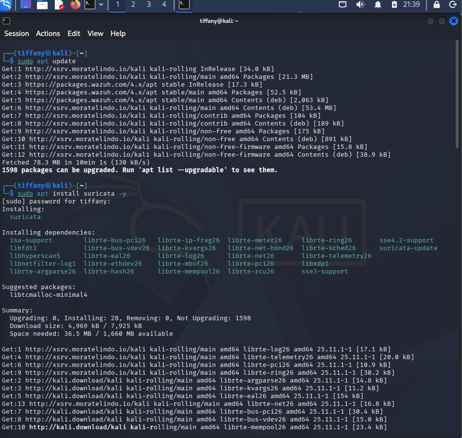
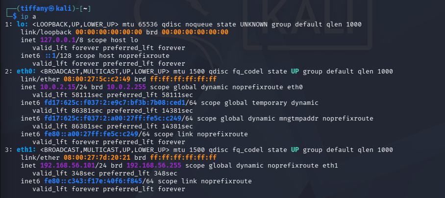
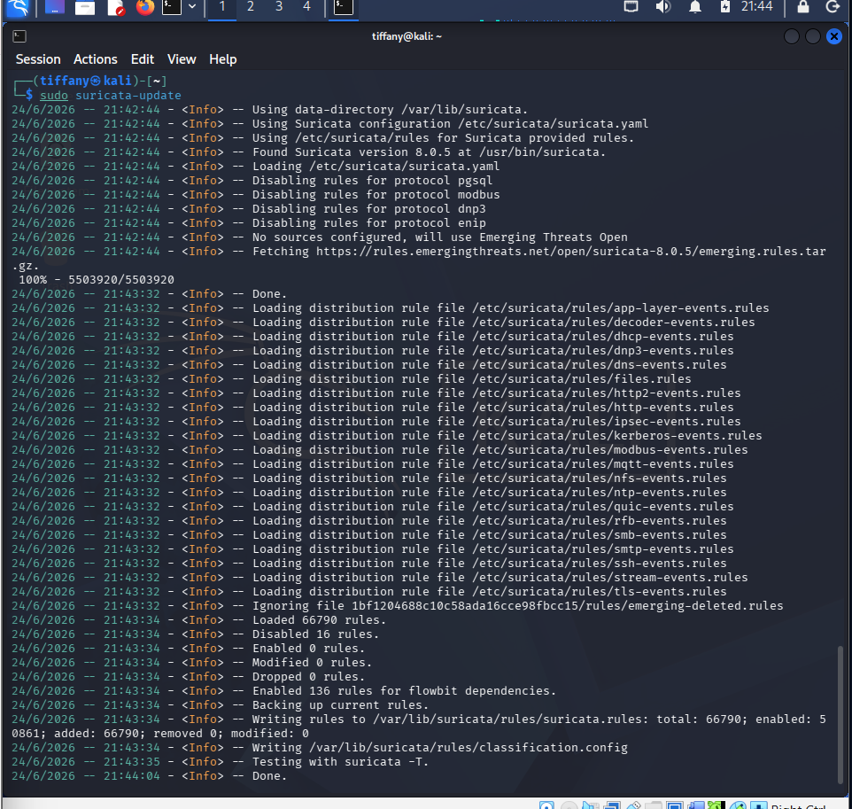
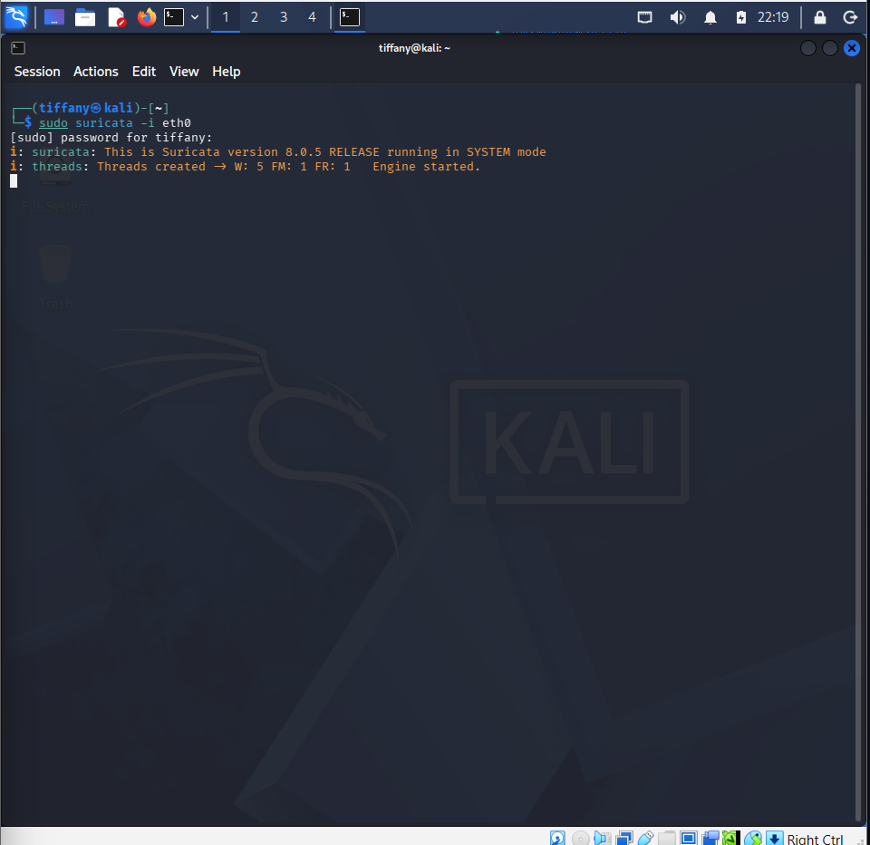
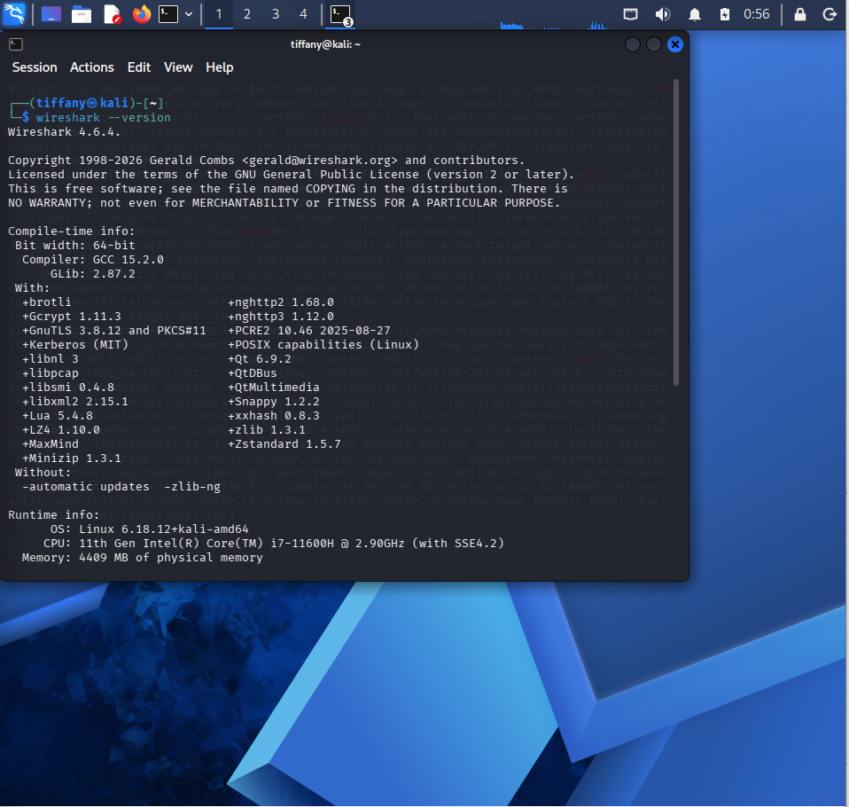

# Network IDS and Packet Analysis Lab Setup

## 📌 Overview

This lab demonstrates the deployment and validation of a **Network Intrusion Detection System (NIDS)** using **Suricata** alongside **Wireshark** for packet capture and network traffic analysis.

The environment is prepared to detect, inspect, and analyze network-based attacks through signature-based detection and packet-level investigation.

---

## 🏗️ Lab Environment

| Component | Role |
| :--- | :--- |
| **Kali Linux** | Attack Simulation & Network Monitoring |
| **Suricata** | Network Intrusion Detection System (NIDS) |
| **Wireshark** | Packet Capture & Protocol Analysis |
| **Suricata Ruleset** | Signature-based Threat Detection |

---

## 🛠️ Installation & Verification

### Step 1: Verify Suricata Installation

Verify that Suricata has been successfully installed.

```bash
suricata --build-info
```

The screenshot below confirms the installed Suricata version and build information.



---

### Step 2: Identify the Active Network Interface

Identify the network interface that will be monitored by Suricata.

```bash
ip a
```

The screenshot below shows the available network interfaces on the Kali Linux machine.



---

### Step 3: Update Suricata Rules

Update the latest Suricata detection rules.

```bash
sudo suricata-update
```

The screenshot below shows the successful update of the Suricata ruleset.



---

### Step 4: Start the Suricata Engine

Launch Suricata and bind it to the selected network interface.

```bash
sudo suricata -i <interface>
```

Replace `<interface>` with your active network interface (for example, `eth0`).

The screenshot below shows Suricata successfully running and monitoring network traffic.



---

### Step 5: Verify Wireshark Installation

Verify that Wireshark is installed correctly.

```bash
wireshark --version
```

The screenshot below confirms the installed Wireshark version.



---

## ✅ Deployment Validation

The lab deployment was verified using the following validation steps:

- ✅ Suricata successfully installed
- ✅ Active network interface identified
- ✅ Suricata rules updated successfully
- ✅ Suricata engine running and monitoring traffic
- ✅ Wireshark installed and ready for packet analysis

---

## 🛠️ Skills Demonstrated

- Network Intrusion Detection System (NIDS)
- Suricata Installation & Configuration
- Signature-Based Detection
- Network Interface Monitoring
- Suricata Rule Management
- Packet Capture
- Network Protocol Analysis
- Wireshark
- Threat Detection
- Network Traffic Analysis

---

## 🚀 Next Steps

With the monitoring environment successfully deployed, the lab is ready for simulated attack scenarios, including:

- Nmap Network Scanning Detection
- SSH Brute Force Detection
- DNS Traffic Analysis
- HTTP Traffic Analysis
- Malicious File Download Detection
- Command and Control (C2) Traffic Analysis
