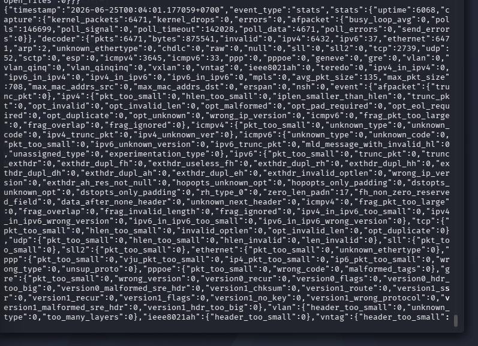
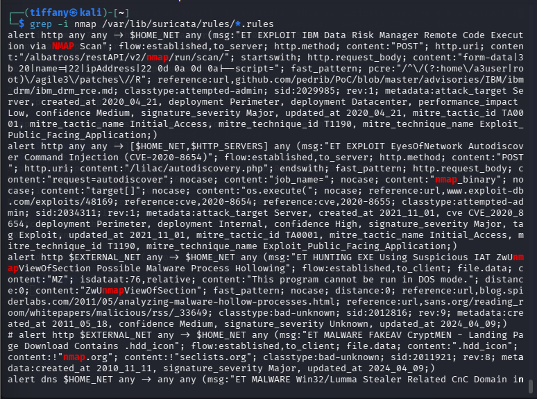
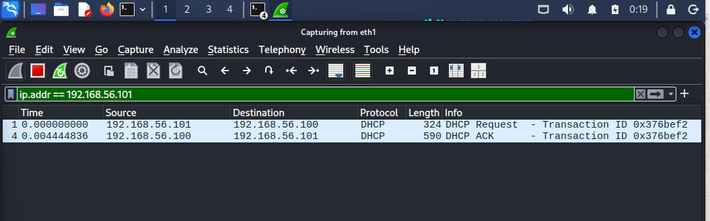
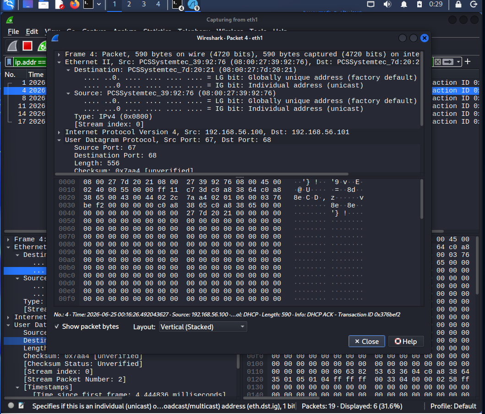

# Investigation Report

## Alert Summary
The Suricata Network Intrusion Detection System generated high-frequency alerts signaling an incoming network discovery event. The signature signatures indicated systematic, automated port probing targeting host parameters.

---

## 🕵️‍♂️ Step-by-Step Incident Investigation

### Step 1: Automated IDS Alert Interception
Analysts triaged the central Suricata engine event logs to capture the initial indicators of compromise. The network engine flagged an influx of active scanning patterns originating from an external network host:

### Step 2: Extracting Log Metadata Properties
Expanding the detection envelope inside the log manager surfaces structured contextual properties. This metadata allows the security team to extract core tactical telemetry fields:

* **Threat Signature Identification:** TCP Scan Pattern Match
* **Source Attacking Machine IP:** Identified via Ingestion Log
* **Destination Target Machine IP:** Monitored Interface Host
* **Captured Footprint Timestamp:** Verified via Logging Core

### Step 3: Wireshark Packet Ingestion & Capture Validation
To eliminate potential false positives, the corresponding raw network capture trace was isolated and investigated using Wireshark. The global packet flow layout displays an immediate, high-density stream of chronological transport frames:

### Step 4: Transport Layer Byte-Level Dissection
Filtering down on individual packet headers confirms the explicit use of the half-open scanning method. The analysis validates that sequential port numbers are being hit with solitary `SYN` control bits, followed by immediate `RST` teardowns or unanswered requests without an established connection:

* **Observed Traffic Behavior:** Repetitive connection requests targeting sequential port arrays.
* **Flag Metrics:** `SYN` packet transmission followed by rapid termination patterns.
* **Exploitation Assessment:** No active post-scan payload delivery or subsequent application exploits were tracked inside this capture window.

---

## 🛑 Incident Classification
* **Triage Analysis Result:** Suspicious Activity Confirmed (True Positive Reconnaissance)
* **Threat Tactic Context:** Tactical Network Discovery
* **Risk Matrix Status:** 🟡 Medium

---

## 💡 Remediations & Engineering Recommendations
* **Enforce Rate-Limiting Protocols:** Configure border firewall policies or internal access routers to automatically drop source IPs generating anomalous thresholds of connection requests within short time frames.
* **Deploy Adaptive Host Drop Filters:** Integrate tools like Fail2ban or specific adaptive host software wrappers to temporarily block addresses that drop consecutive connection tracking requests.
* **Obfuscate Service Banners:** Enforce defensive hardening guidelines across active local daemons to disable explicit software string leakage in response to raw scanning sweeps.
