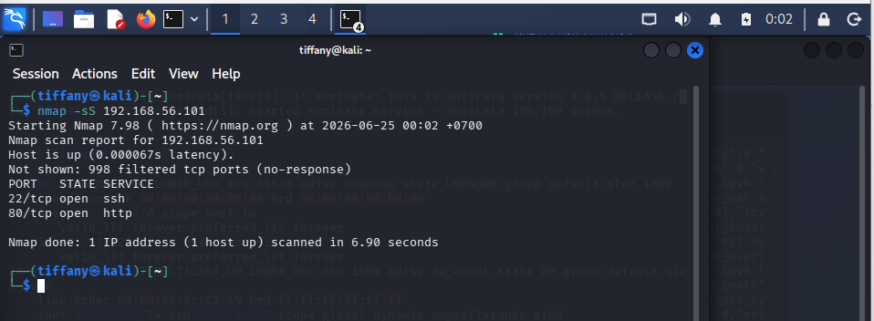

# Case 01 - Nmap Scan Detection

## 📌 Overview

This case file demonstrates how the **Suricata NIDS engine** and **Wireshark packet analyzer** operate in tandem to detect, log, and dissect adversarial network reconnaissance behavior.

Network scanning forms the foundational baseline of the tactical discovery phase, allowing threat actors to identify open communication ports, active daemon versions, and target surface areas. The primary objective of this exercise is orchestrating an active network scan, catching the footprint through signature-matching rulesets, and validating the packet structure at the transport layer.

---

## ⚔️ Attack Simulation & Scenario

An Nmap TCP SYN Stealth Scan was executed against a designated host on the network monitoring boundary. This methodology leaves ports in a half-open state by avoiding the complete 3-way handshake process, aiming to map out listening nodes while bypassing standard primitive system logs.

To generate the reconnaissance telemetry stream, the following command was executed:

```bash
nmap -sS <target-ip>
```

The initial terminal interaction shows the orchestration of the automated scanning command:



---

## 🔍 Detection Method Architecture

The evaluation framework deploys a dual-layer verification pipeline to capture and dissect the incoming scan vectors.

### 👁️ Suricata IDS Pipeline

The passive network interface configuration continuously mirrors raw packet streams, matching packet payloads and header flags against operational signature bases to generate real-time reconnaissance alerts.


### 🦈 Wireshark Deep Packet Inspection

Raw packet capture repositories (`.pcap`) are ingested into Wireshark to isolate individual packet properties, track TCP window flags, and verify the structural intent of the signature triggers.


---

## 🛡️ Case Profile Summary

- **Simulated Threat:** TCP SYN Network Scanning & Reconnaissance
- **Target Environment Monitored:** Linux Interface Link
- **MITRE ATT&CK Mapping:** `T1046` – Network Service Discovery
- **Classification Status:** Suspicious Activity (Discovery Phase)
- **Severity Evaluation:** 🟡 Medium

---

## 📖 Case Documentation & References

To review detailed triage steps, raw packet dissections, or behavioral mapping frameworks, navigate through the target case documents below:

- 🕵️ **Investigation Report:** [Investigation.md](Investigation.md)
- 🛡️ **MITRE ATT&CK Mapping:** [MITTRE-Mapping.md](MITTRE-Mapping.md)
