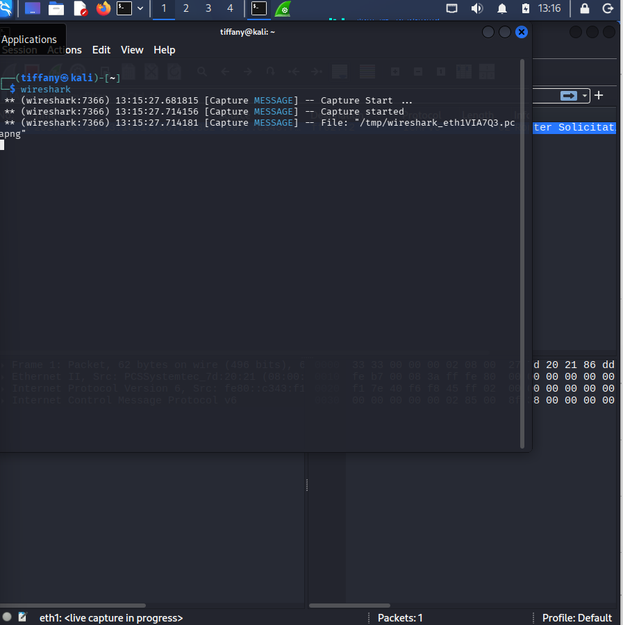
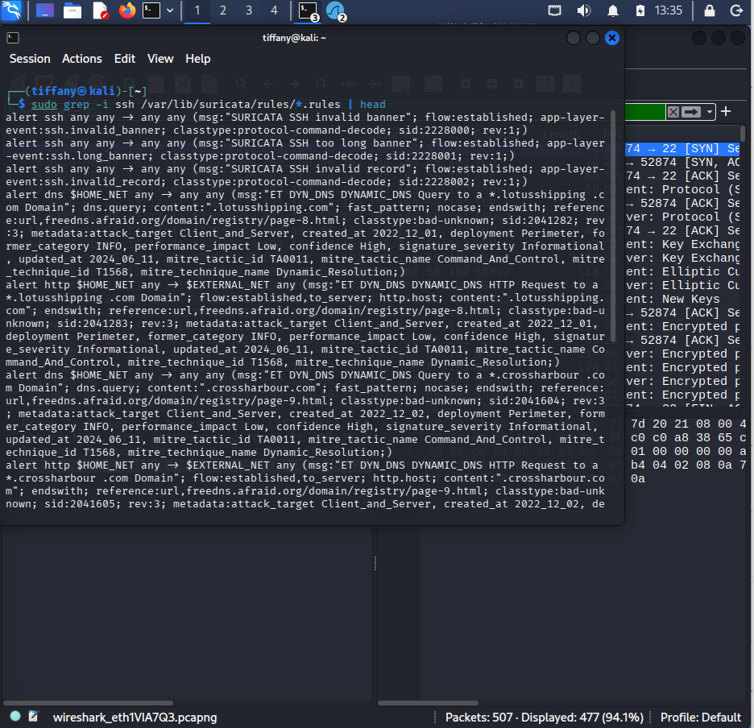
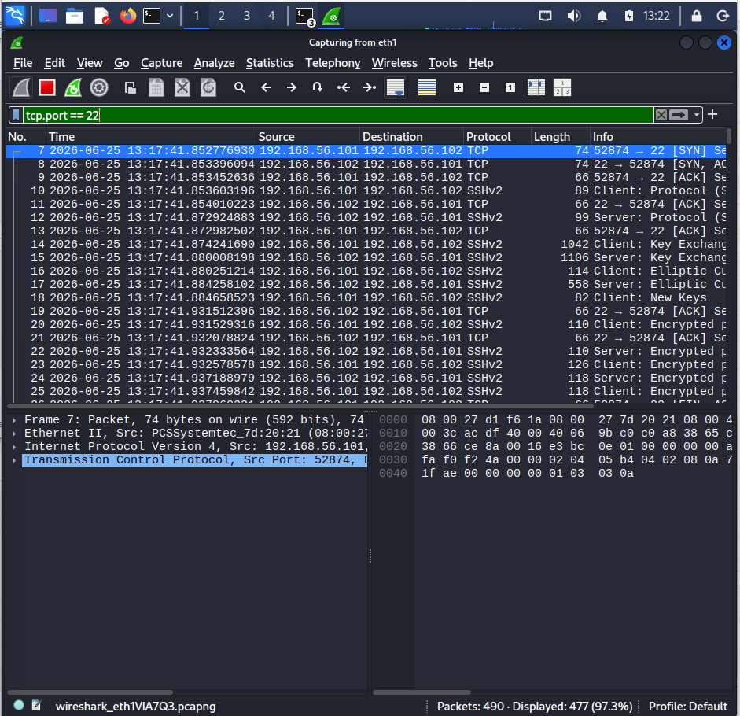
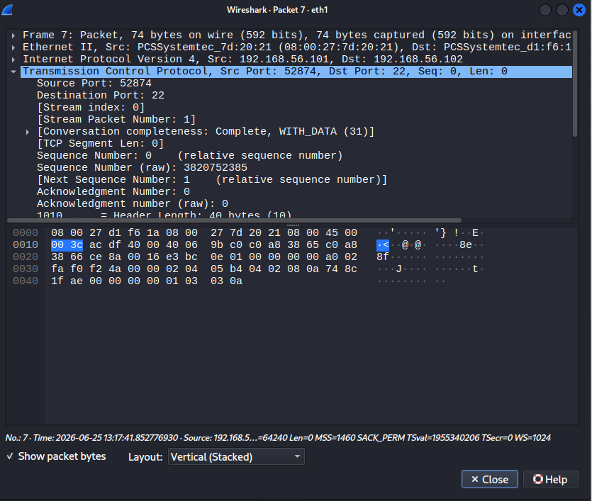
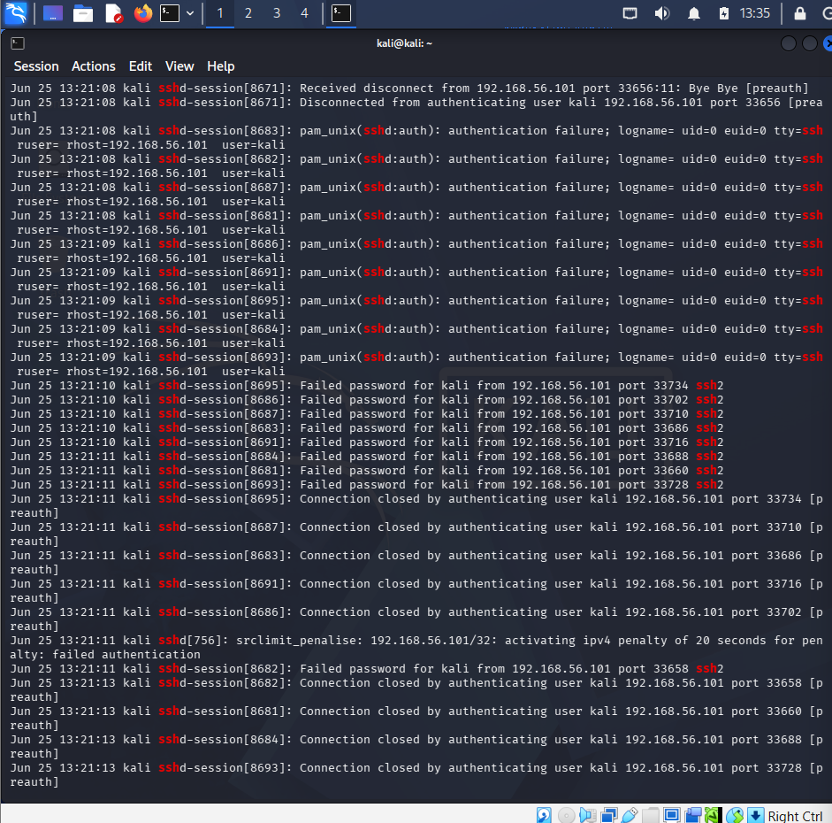

# Investigation Report

## Alert Summary
The monitoring pipeline generated high-severity security alerts triggered by abnormal authentication request volumes. A singular remote network address initiated dense, automated login sequences targeting the SSH subsystem.

---

## 🕵️‍♂️ Step-by-Step Incident Investigation

### Step 1: Real-Time Network Packet Capture Ingestion
During the active attack window, network interfaces were put into an active ingestion mode using Wireshark to establish a raw transport-layer file baseline (`.pcap`):

### Step 2: Suricata NIDS Alert Triage
Analysts verified the alert queues inside the SIEM dashboard. The central Suricata engine successfully triggered signatures identifying an ongoing SSH brute-force signature pattern, capturing the timestamp metrics and the responsible source IP address:

### Step 3: Wireshark Traffic Stream Analysis
Ingesting the captured trace files into Wireshark validates the alert context. Filtering for `tcp.port == 22` exposes a high-density cluster of connection attempts, with packet timestamps tracking arrivals millisecond apart:

### Step 4: Transport Layer Stream Dissection
Expanding the individual protocol layers confirms the malicious behavioral signature. The dissection window tracks constant TCP 3-way handshakes immediately followed by encrypted SSH protocol initiation requests, which are rapidly torn down as the authentication fails:

### Step 5: Endpoint Host Log Verification
To confirm whether the password guessing attempts hit the host system successfully or breached authentication boundaries, the analyst audited the target system's local authentication logs (`/var/log/auth.log`):

* **Host-Based Findings:** Hundreds of consecutive records labeled `Failed password for kali from <attacker-ip> port <source-port> ssh2`.
* **Impact Verification:** The log streams validate a high-volume brute-force sweep. No successful session establishment anomalies were recorded inside the attack window.

---

## 🛑 Incident Classification
* **Triage Analysis Result:** Malicious Activity Confirmed (True Positive Brute Force)
* **Threat Tactic Context:** Credential Access
* **Risk Matrix Status:** 🔴 Critical

---

## 💡 Remediations & Engineering Recommendations
* **Enforce Key-Based Authentication:** Disable standard password-based login parameters within `/etc/ssh/sshd_config` by setting `PasswordAuthentication no`, mandating the use of secure cryptographic SSH key pairs.
* **Deploy Automated Connection Throttling:** Provision network-layer defense utilities like `Fail2ban` to actively track local authentication states and dynamically inject iptables drop commands against source IPs that fail multiple consecutive login challenges.
* **Alter Default Daemon Ports:** Migrate the SSH listening binding from standard TCP Port 22 to a non-standard high port to mitigate automated, opportunistic scanning sweeps.
