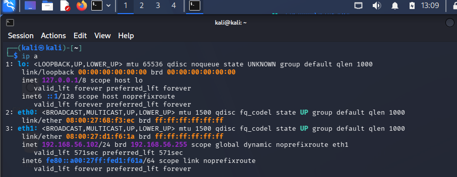
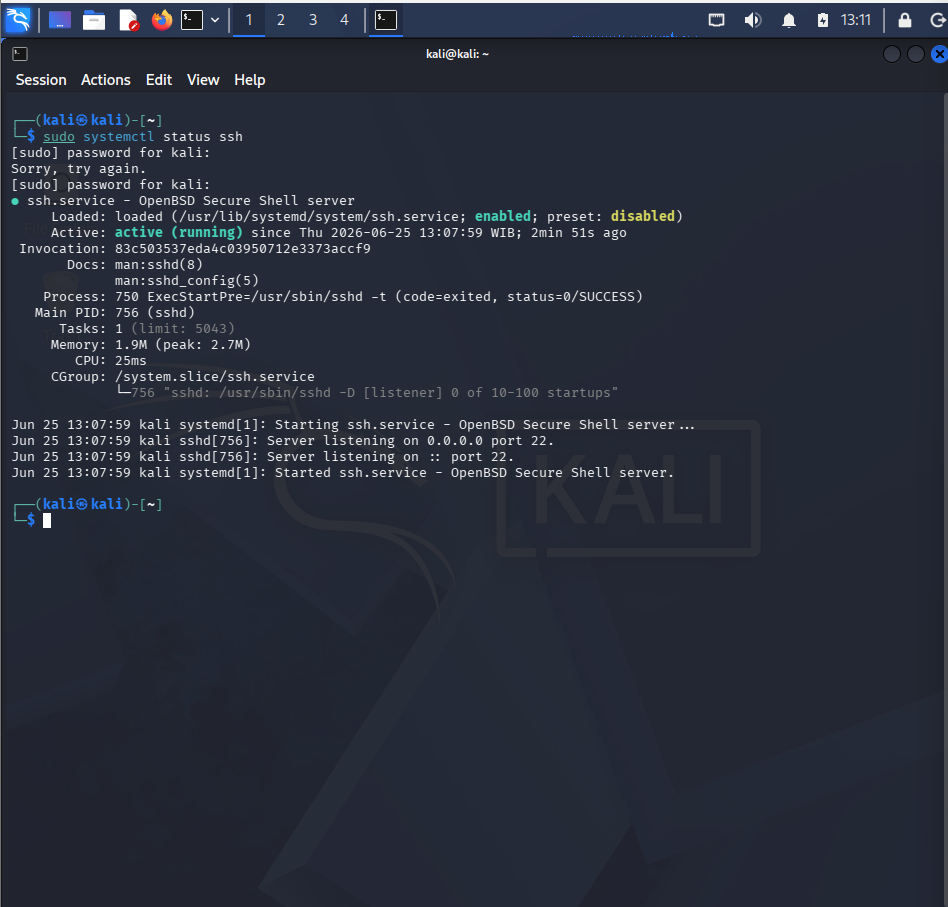
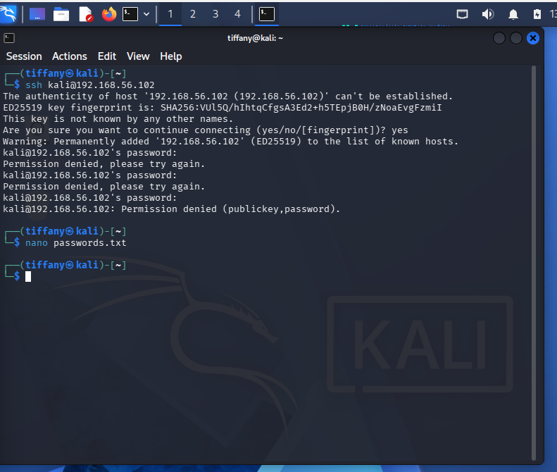
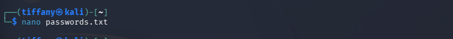
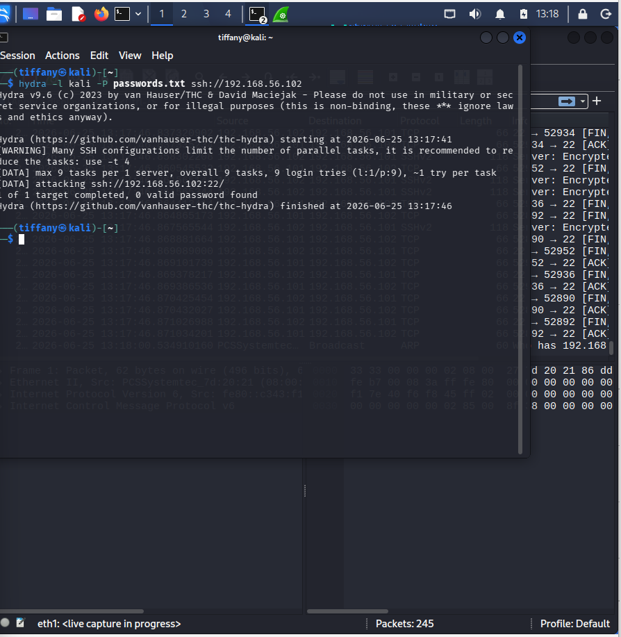

# Case 02 - SSH Brute Force Detection

## 📌 Overview

This case file demonstrates the operational engineering workflow required to detect, validate, and investigate a high-volume **SSH Brute Force Attack**. Brute forcing remains a primary methodology employed by adversaries during credential access phases to systematically guess valid account passwords against exposed remote administration endpoints.

The lab exercises deploy an integrated detection architecture combining the **Suricata NIDS engine** for real-time network alert generation, **Wireshark** for granular packet flow telemetry analysis, and native **Linux Authentication Logs (`auth.log`)** for endpoint-level confirmation.

---

## 🏗️ Lab Topology & Environment Baseline

The simulation environment is structured across an isolated server-agent boundary mapping out specific offensive and defensive controls:

- ⚔️ **Attacker Node (Kali Linux):** Armed with `Hydra` for automated authentication spray orchestration, `Suricata` for perimeter visibility validation, and `Wireshark` for transport-layer inspection.
- 🛡️ **Target Node (Kali Linux Host):** Exposed enterprise endpoint running an active `OpenSSH Server` daemon on standard TCP Port 22.

---

## ⚔️ Attack Simulation & Pre-Requisites

### Phase 1: Environment Discovery & Baseline Validation

Before launching the automated spray campaign, the attacker verifies network line-of-sight and target service readiness. The local testing pipeline confirms the explicit destination IP address and authenticates that the remote SSH service daemon is actively listening for incoming connections.





A quick network handshake and connectivity test are performed to check route metrics and confirm the port boundary is open before initializing brute-force threads.



---

### Phase 2: Automated Spray Campaign Execution

The attack relies on a comprehensive, custom dictionary file containing thousands of pre-compiled common credentials and administrative combinations.



To automate the authentication attempts against the targeted local account, the attacker launches `Hydra` with multi-threaded parameters:

```bash
hydra -l kali -P passwords.txt ssh://<target-ip>
```

The terminal output captures the aggressive generation of repetitive connection requests over the wire.



---

## 🛡️ Case Profile Summary

- **Simulated Threat:** Automated Password Guessing / SSH Dictionary Spraying
- **Target Service Exploited:** OpenSSH Daemon (TCP Port 22)
- **MITRE ATT&CK Mapping:** `T1110` – Brute Force
- **Classification Status:** Suspicious (Active Credential Access)
- **Severity Evaluation:** 🔴 Critical

---

## 📖 Case Documentation & References

To evaluate detailed analyst triage logs, packet dissections, or behavioral mapping frameworks, navigate through the target case files below:

- 🕵️ **Investigation Report:** [Investigation.md](Investigation.md)
- 🛡️ **MITRE ATT&CK Mapping:** [MITTRE-Mapping.md](MITTRE-Mapping.md)
