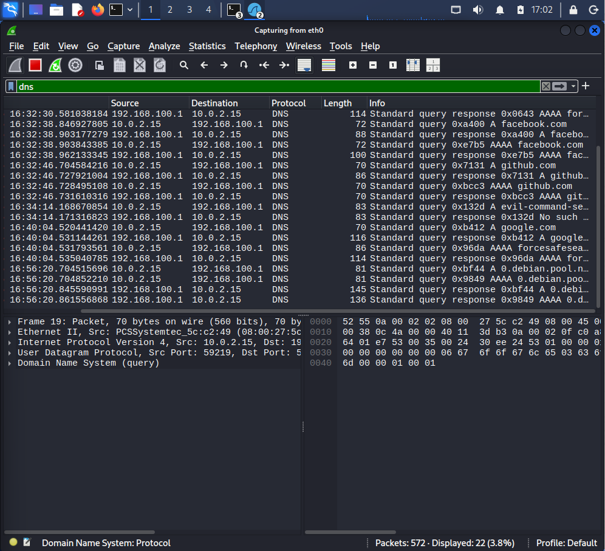
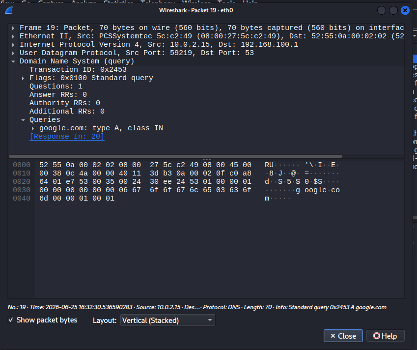
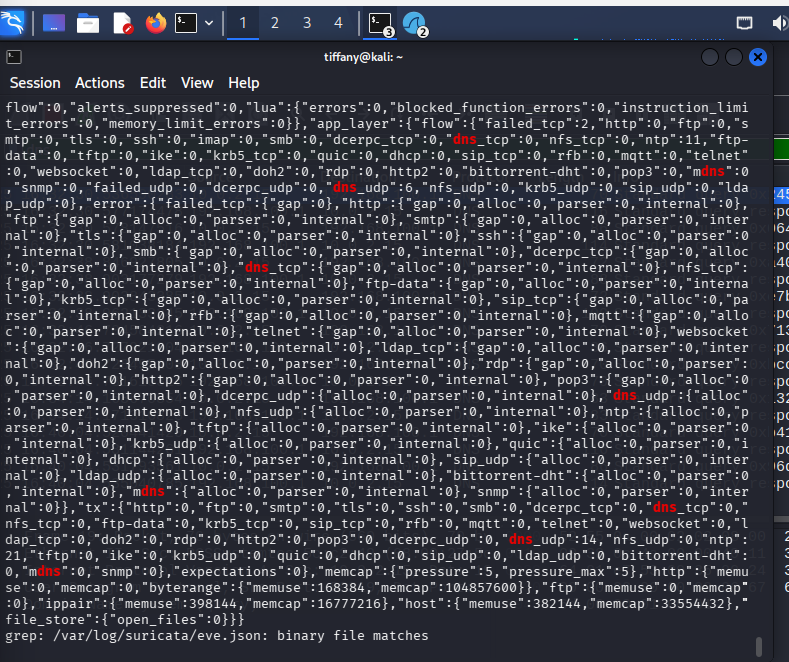

# Investigation Report

## Alert Summary
The application monitoring infrastructure captured an unusual series of domain lookup anomalies query patterns. The flow profile contained both valid operational lookups and anomalous destination domains yielding non-standard response parameters over the local recursive resolvers.

---

## 🕵️‍♂️ Step-by-Step Incident Investigation

### Step 1: Wireshark Protocol Flow Ingestion
Analysts filtered the global `.pcap` capture stream using `dns` display directives. The network layer distribution grid exposes the sequential transaction tracking of queries and server responses, isolating the specific source interface matching the resolution logs:

### Step 2: Packet Layer Dissection & Flag Auditing
Expanding the structural layer details of the specific DNS packet frames reveals the exact query metadata metrics. The analyst verified the Transaction ID properties, query name strings, and the explicit response code structures returned by the upstream nameservers (including NXDOMAIN records for invalid zones):

### Step 3: Suricata Application Event Validation
To correlate the packet analysis findings against automated signature monitoring engines, the analyst extracted the Suricata telemetry logs. The NIDS engine's application logging module tracked the explicit lookup names, transaction timestamps, and protocol properties without false-positive drop exceptions:

---

## 🛑 Incident Classification
* **Triage Analysis Result:** Informational Context Validated (True Positive Resolution Tracking)
* **Threat Tactic Context:** Application Layer Command and Control Channels
* **Risk Matrix Status:** 🟢 Low (No active post-resolution payload downloads or functional C2 beacons detected)

---

## 💡 Remediations & Engineering Recommendations
* **Enforce DNS over HTTPS/TLS (DoH/DoT):** Cryptographically secure all local host lookup operations to block threat actors from intercepting or manipulating plaintext transport streams.
* **Implement Protective DNS (PDNS) Gateways:** Direct corporate lookup routing through security-hardened recursive engines that dynamically drop resolutions for domains classified as recently registered or associated with known indicators of compromise.
* **Log and Alert on NXDOMAIN Spikes:** Build specific threshold rules inside the central SIEM to alert on sudden, high-frequency spikes of `NXDOMAIN` status codes, which typically indicate the activity of Domain Generation Algorithms (DGA) or active malware beaconing phases.
