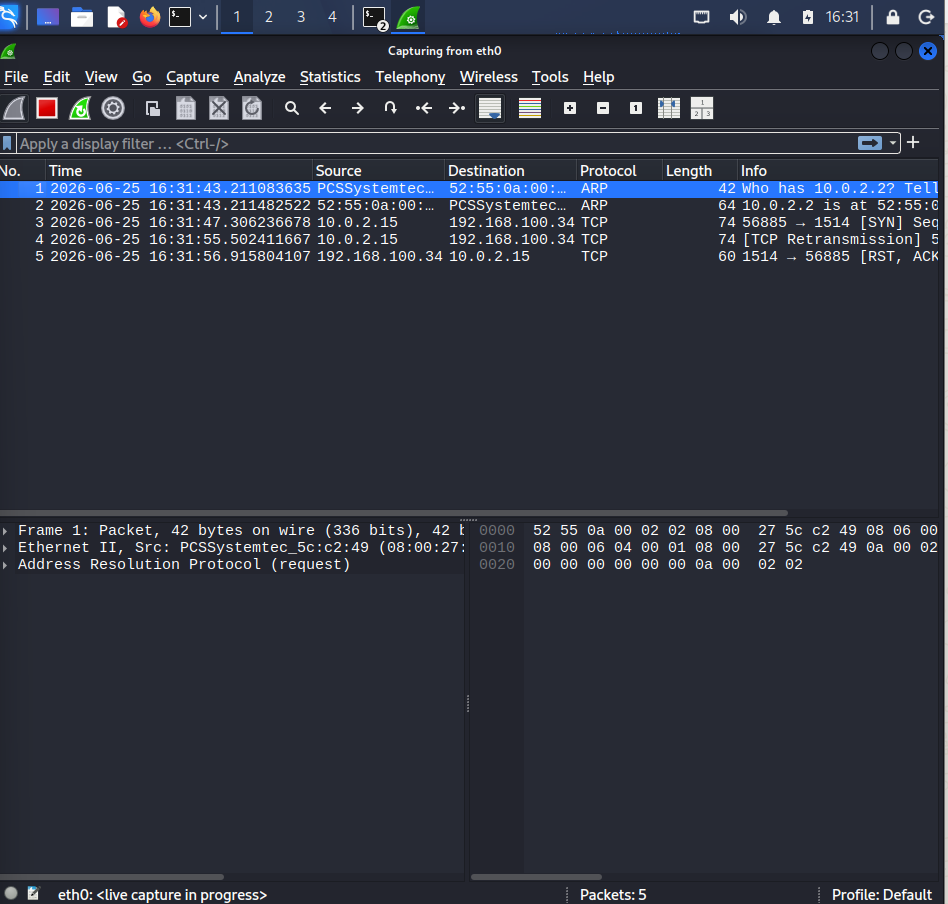

# Case 03 - Suspicious DNS Requests Analysis

## 📌 Overview

This case file demonstrates the operational engineering methodology used to monitor, intercept, and dissect Domain Name System (DNS) network infrastructure anomalies. DNS is heavily targeted and abused by advanced adversaries as a primary channel for Command and Control (C2) beaconing, Domain Generation Algorithms (DGA), dynamic malware payload updates, and stealth data exfiltration.

The objective of this lab module is to simulate a mixture of legitimate baseline user resolutions alongside high-risk domain lookups, capturing the raw frames using **Wireshark** for deep packet inspection and cross-validating the telemetry events through the **Suricata NIDS application layer logs**.

---

## ⚔️ Attack Simulation & Host Activity

### Phase 1: Ingestion Initialization

To ensure full forensic visibility of the generated protocol interaction, the network sniffing boundary was initialized inside Wireshark to record the raw interface interactions into a standardized runtime repository.



---

### Phase 2: Domain Enumeration Commands

A cluster of administrative lookup utilities (`nslookup`) was executed to construct a baseline network profile:

```bash
nslookup google.com
nslookup facebook.com
nslookup github.com
```

The terminal interaction documents the routine lookup actions alongside the generation of a highly suspicious non-standard domain sweep designed to trigger anomalous alert metrics.

To isolate the explicit threat vector footprint, the tactical lookup parameters targeting the unvalidated zone files are documented below:

```bash
nslookup <suspicious-domain>
```

---

## 🛡️ Case Profile Summary

- **Simulated Threat:** Suspicious Application Layer Domain Resolution / Potential C2 Indicators
- **Target Protocol Inspected:** DNS (UDP/TCP Port 53)
- **MITRE ATT&CK Mapping:** `T1071.004` – Application Layer Protocol: DNS
- **Classification Status:** Informational / Baseline Anomalies Verified
- **Severity Evaluation:** 🟢 Low / Informational

---

## 📖 Case Documentation & References

To evaluate detailed analyst triage logs, packet dissections, or behavioral mapping frameworks, navigate through the target case files below:

- 🕵️ **Investigation Report:** [Investigation.md](Investigation.md)
- 🛡️ **MITRE ATT&CK Mapping:** [MITTRE-Mapping.md](MITTRE-Mapping.md)
