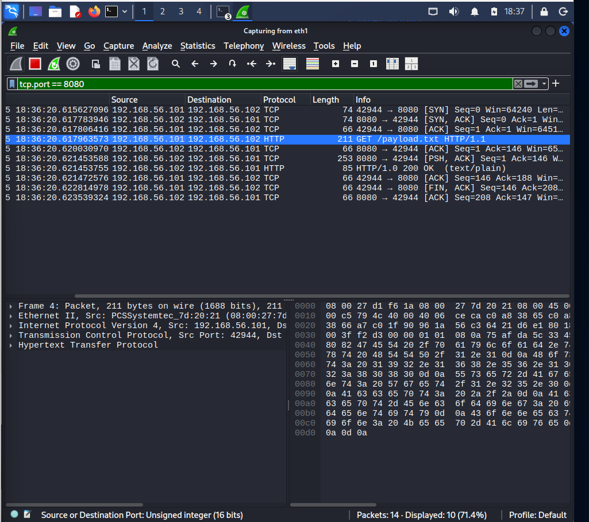
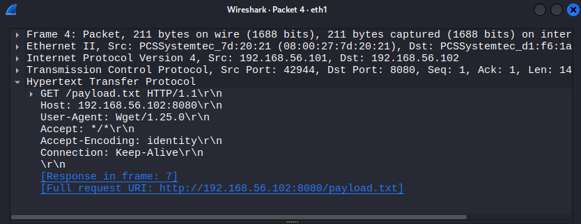
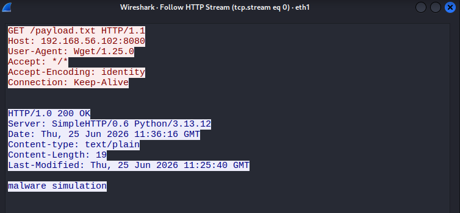
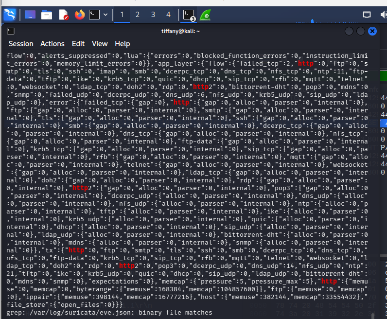

# Investigation Report

## Alert Summary
The monitoring mesh isolated an incoming application-layer transmission file transfer across a non-standard HTTP port layout. The connection profile parameters mapped directly to signature vectors generated during a targeted tool ingestion phase.

---

## 🕵️‍♂️ Step-by-Step Incident Investigation

### Step 1: Isolating HTTP Method Queries
Analysts filtered the raw `.pcap` packet trace within Wireshark targeting explicit web transmission methods (`http.request.method == "GET"`). The operational tracking window immediately exposes the inbound transfer trace, pinpointing the file name and host properties:

### Step 2: Protocol Struct Dissection
Expanding the structural frame configurations reveals explicit details concerning the client-server interaction. The transport and application layers confirm the accurate source/destination socket addresses, user-agent profiles, and server response properties:

### Step 3: Raw TCP Stream Follow Reconstruction
To parse the literal payload data without relying on terminal extraction, the analyst performed a **Follow TCP Stream** operation. Reassembling the sequential transport data blocks reveals the exact contents of the delivered file directly inside the session conversation window:

### Step 4: Suricata HTTP Event Correlation
The analyst cross-referenced these packet details with the Suricata NIDS event logs. Suricata’s application-layer parsing module successfully recorded the exact request string, requested file path URI, and transport codes, validating network visibility across the infrastructure boundary:

---

## 🛑 Incident Classification
* **Triage Analysis Result:** Informational (True Positive File Download Action Verified)
* **Threat Tactic Context:** Ingress Tool Transfer Configuration
* **Risk Matrix Status:** 🟢 Low (The captured payload data confirms a benign, synthetic verification string)

---

## 💡 Remediations & Engineering Recommendations
* **Enforce Strict Proxy Categorization:** Route all outbound transit requests through unified secure web gateway proxies that block direct IP navigation and enforce blocklists on untrusted or newly registered file-hosting endpoints.
* **Inspect Encrypted Traffic (SSL/TLS Decryption):** Implement centralized inline security inspection on corporate boundaries to decrypt and look inside web traffic, ensuring malicious payload staging can be caught even when hidden behind HTTPS.
* **Audit and Log Command-Line Downloads:** Set up host-based monitoring policies to track and flag usage of native terminal file download utilities (such as `wget`, `curl`, or PowerShell `Invoke-WebRequest`) when executed by unprivileged or anomalous user accounts.
