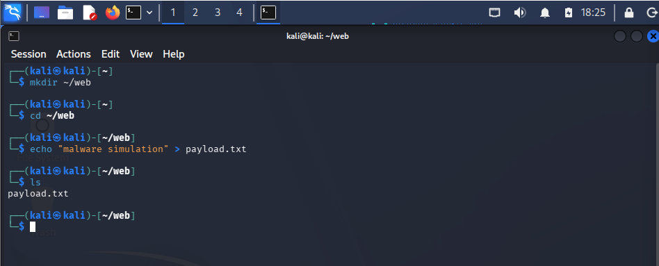
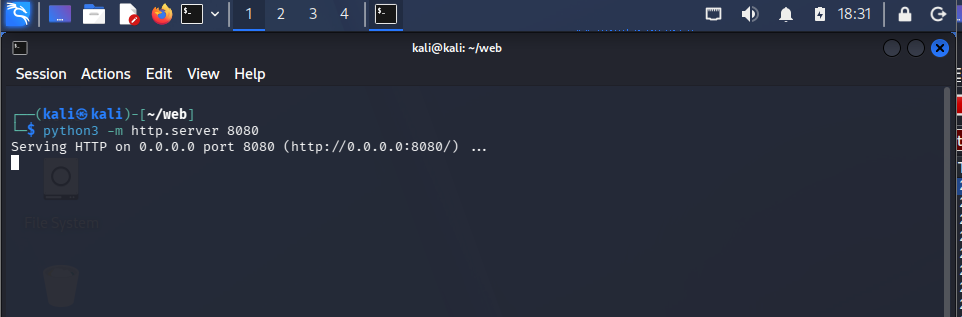
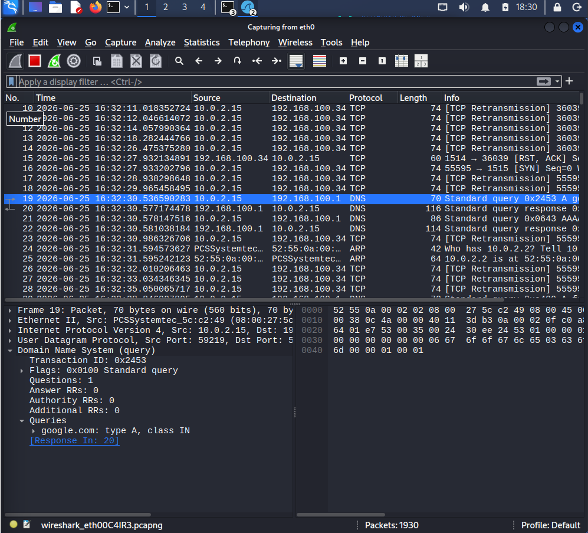
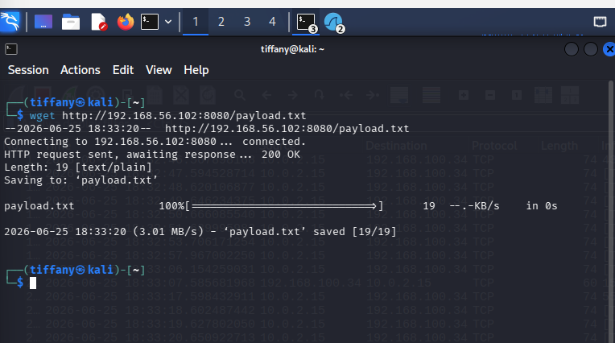
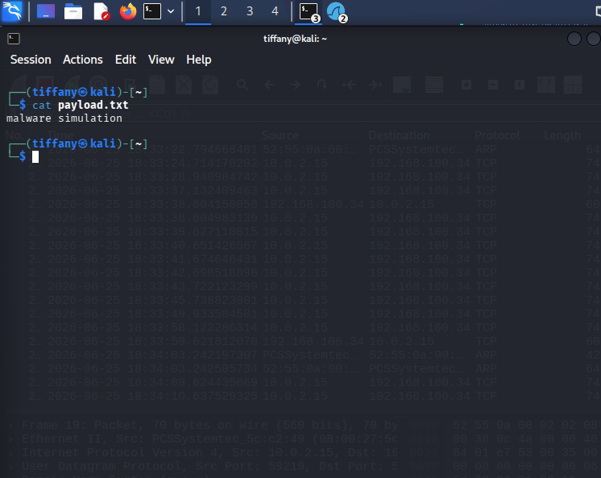

# Case 04 - Suspicious File Download Detection

## 📌 Overview

This case file demonstrates how security operations engineering practices track, detect, and isolate suspicious file transmissions over unencrypted application-layer protocols. Adversaries rely heavily on ingress file transfers during nearly every stage of an operation to introduce tactical staging tools, malicious scripts, secondary exploit components, or persistent command-and-control beacons into a compromised environment.

The objective of this module is to replicate an interactive file staging pipeline utilizing a Python-based endpoint, monitor the transmission vectors using the **Suricata NIDS telemetry stream**, and dissect the byte-level attributes through **Wireshark packet reconstruction**.

---

## ⚔️ Attack Simulation & Infrastructure Setup

### Phase 1: Payload Creation & Server Ingestion

To simulate the baseline mechanics of tool deployment, an analytical test file is constructed on the target host to mirror a benign malware simulation container:

```bash
echo "malware simulation" > payload.txt
```

The screenshot below shows the creation of the sample payload file.



An impromptu web delivery engine is launched locally using Python's native HTTP server routine to host the resource across a non-standard port interface:

```bash
python3 -m http.server 8080
```

The screenshot below shows the HTTP server running and hosting the payload.



---

### Phase 2: Interception & File Extraction

Before triggering the file transfer, the active monitoring interface bounds a tracking stream inside Wireshark to establish a persistent network capture reference point.



From the secondary monitoring station, an automated retrieval utility (`wget`) requests the remote payload file from the staging server address:

```bash
wget http://<target-ip>:8080/payload.txt
```

The screenshot below shows the execution of the file download.



The host local terminal confirms receipt, disk extraction, and validation of the downloaded stream profile.



---

## 🛡️ Case Profile Summary

- **Simulated Threat:** Ingress Tool Transfer / Malicious Payload Staging
- **Target Protocol Inspected:** HTTP (TCP Port 8080)
- **MITRE ATT&CK Mapping:** `T1105` – Ingress Tool Transfer
- **Classification Status:** Informational / Verified Staging Footprint
- **Severity Evaluation:** 🟢 Low / Informational Baseline

---

## 📖 Case Documentation & References

To review detailed triage steps, raw stream decodes, or defensive mappings, navigate through the target files below:

- 🕵️ **Investigation Report:** [Investigation.md](Investigation.md)
- 🛡️ **MITRE ATT&CK Mapping:** [MITTRE-Mapping.md](MITTRE-Mapping.md)
