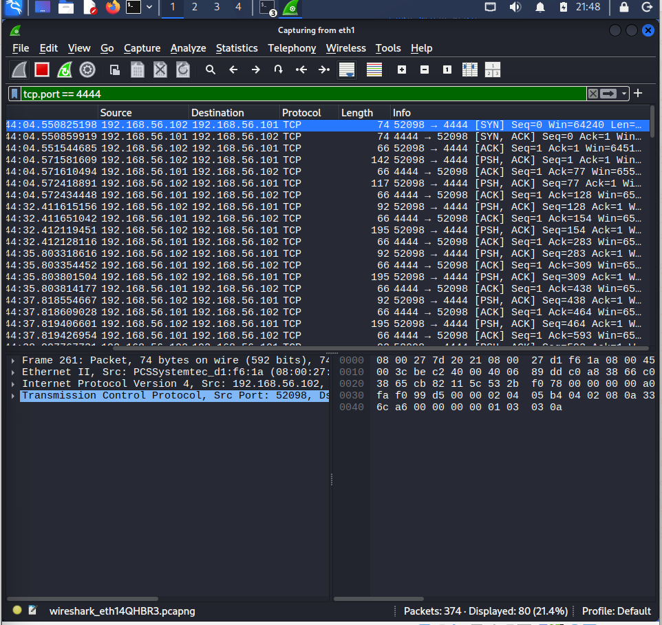
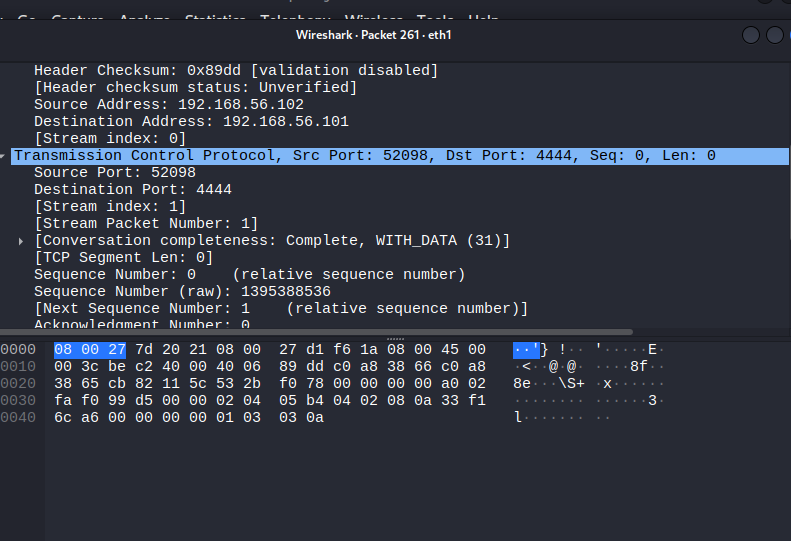
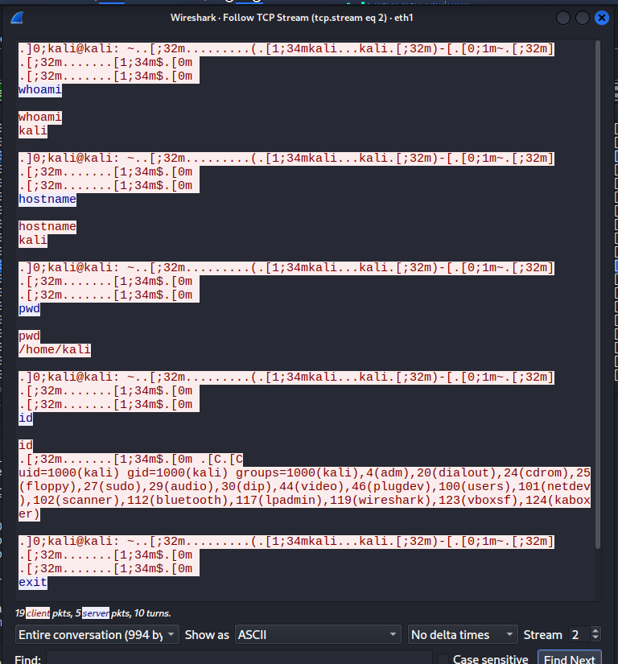
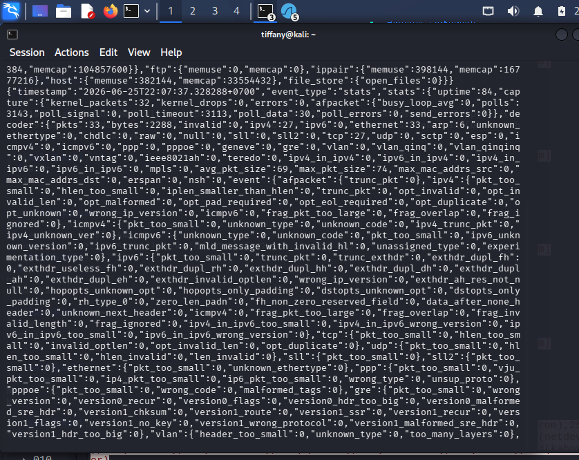

# Investigation Report

## Alert Summary
The internal perimeter monitoring framework intercepted an unauthorized outbound TCP raw transport stream. The communication pattern matches signatures generated when a system terminal environment redirects local control loops to an external remote address over a non-standard port interface.

---

## 🕵️‍♂️ Step-by-Step Incident Investigation

### Step 1: Isolating Transport Layer Flow Networks
Analysts filtered the global `.pcap` capture stream inside Wireshark using targeted network port filters (`tcp.port == 4444`). The interface communication window isolates a long-duration, highly structured TCP connection loop connecting the target endpoint and the remote address:

### Step 2: Extracting Byte-Level Transmission Headers
Reviewing the raw header properties across the isolated packet index verifies a completed standard TCP 3-way handshake (`SYN`, `SYN-ACK`, `ACK`). The continuous flow structure confirms the establishment of a persistent, active state connection across the network boundary:

### Step 3: Reconstruction via Follow TCP Stream
To extract cleartext operational command-line strings from the transport segments, the analyst executed a **Follow TCP Stream** command. Reassembling the raw conversational buffer uncovers the literal execution strings along with the corresponding target terminal feedback:

* **Discovered Text Strings:** Interactive terminal parameters containing explicit host queries (`whoami`, `id`, `hostname`, `pwd`).
* **Session Impact Assessment:** The transcript provides definitive proof of a successful system compromise. The attacker achieved remote execution capabilities across the user privilege boundary.

### Step 4: Suricata NIDS Event Correlation
The analyst cross-referenced these packet artifacts against the central Suricata alert logs. The NIDS engine successfully captured the outbound socket flow, logging the corresponding timestamps, protocol parameters, and flow volumes across its network logging modules:

---

## 🛑 Incident Classification
* **Triage Analysis Result:** Malicious Activity Confirmed (True Positive Reverse Shell Execution)
* **Threat Tactic Context:** Post-Exploitation Execution / Outbound Command and Control
* **Risk Matrix Status:** 🔴 Critical

---

## 💡 Remediations & Engineering Recommendations
* **Restrict Outbound Network Rules:** Implement strict egress filtering on network firewalls by adopting a "Default Deny" posture, explicitly blocking traffic from internal endpoints over non-standard or unmapped ports (like Port 4444).
* **Monitor for Anomalous Shell Spawns:** Deploy Endpoint Detection and Response (EDR) utilities to detect and alert on native command interpreters (such as `bash`, `sh`, or `powershell`) when spawned by network-facing application processes or executing uncharacteristic network sockets.
* **Enforce Strict Application Allowlisting:** Restrict network administration utilities like Netcat (`nc`) on production nodes through execution control policies to prevent their use in unauthorized outbound redirection attempts.
