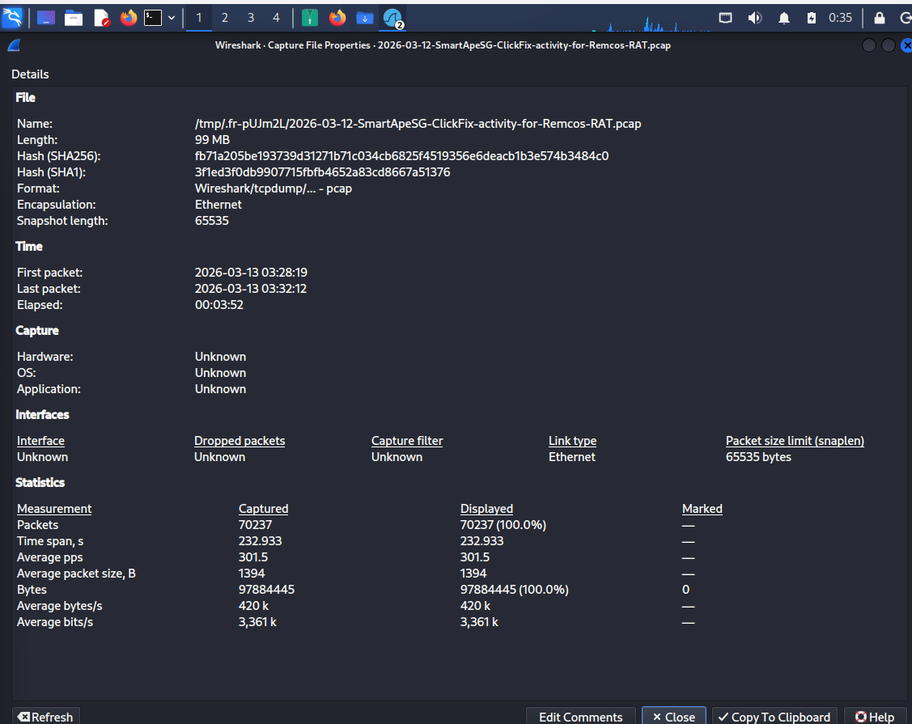
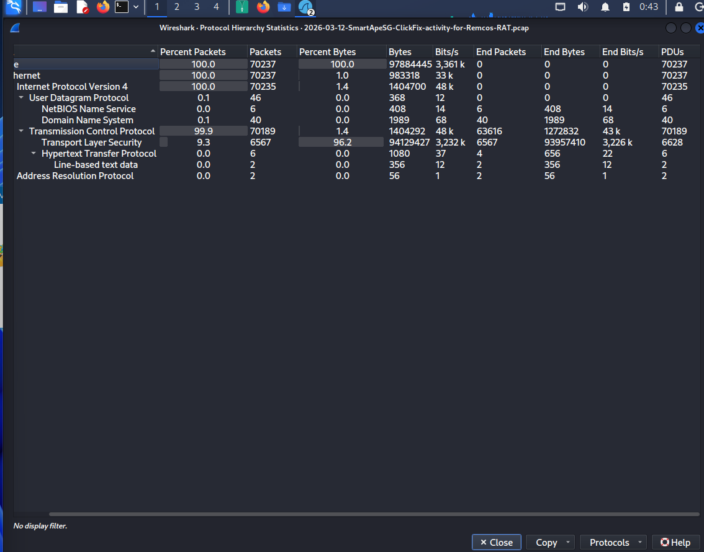
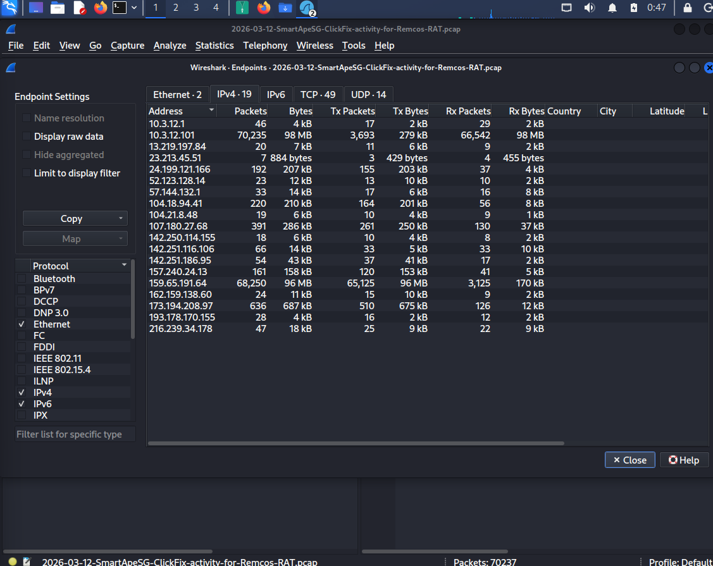
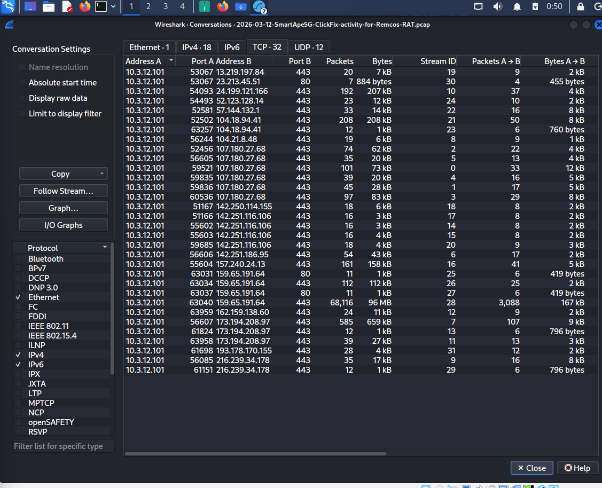
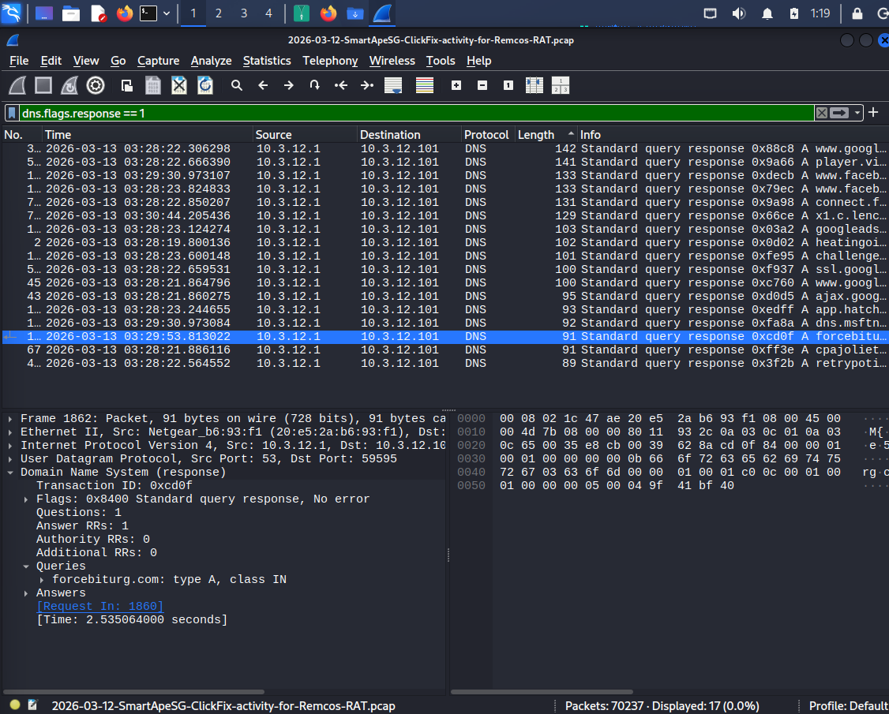
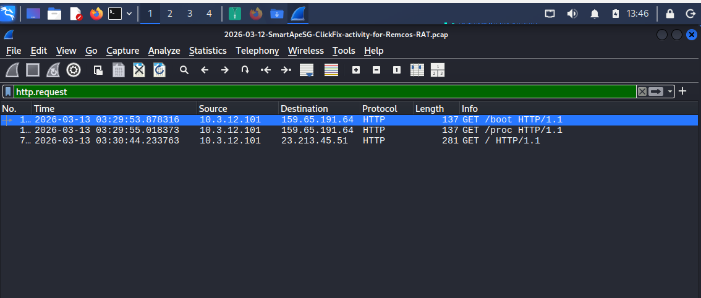

# Investigation Report

## 📋 Case Information

| Item | Value |
| :--- | :--- |
| **Case ID** | Case-06 |
| **Investigation Title** | SmartApeSG ClickFix Campaign – Remcos RAT Investigation |
| **Analyst** | Lativa Yulia Taviani |
| **Tool** | Wireshark |
| **Dataset** | 2026-03-12 SmartApeSG ClickFix Activity for Remcos RAT |
| **Investigation Type** | Network Forensics |
| **Status** | Completed |

---

## 📌 Investigation Objective & Scope

The objective of this investigation was to analyze a real-world packet capture associated with a **SmartApeSG ClickFix** campaign delivering **Remcos RAT**. The scope included identifying the victim system, attacker infrastructure, attack sequence, and validating Indicators of Compromise (IOCs) through Threat Intelligence sources.

---

## 🔍 Phase 1 — Initial Observations & Capture Properties

The packet capture properties were reviewed to establish the metadata and overall network activity.



### Capture Statistics

- **Total Packets:** 70,237
- **Capture Duration:** 232 seconds
- **File Size:** 99 MB

Protocol hierarchy analysis showed that **TCP** accounted for the majority of observed traffic, while only a small portion remained in clear-text HTTP before transitioning into encrypted TLS communications.



---

## 🌐 Phase 2 — Endpoint & Conversation Identification

IPv4 Endpoint statistics identified a single internal workstation responsible for generating most of the observed network traffic.



TCP Conversation statistics confirmed that the internal host (`10.3.12.101`) established repeated communications with multiple external IP addresses.



---

## 🌍 Phase 3 — DNS Investigation

DNS traffic was analyzed to identify the external domains contacted by the victim host.



| Domain | Resolved IP |
| :--- | :--- |
| **forcebiturg.com** | `159.65.191.64` |
| **retrypoti.top** | `24.199.121.166` |

---

## 🌐 Phase 4 — HTTP Investigation

HTTP analysis revealed that the victim initiated automated web requests using **cURL**.



Inspection of the HTTP headers confirmed the destination host and User-Agent.

```text
Host: forcebiturg.com
User-Agent: curl/8.18.0
```

---

## 🔀 Phase 5 — HTTP Redirection

The attacker-controlled web server immediately redirected the client from HTTP to HTTPS using a **301 Moved Permanently** response.

```text
HTTP/1.1 301 Moved Permanently
```

This redirect forced subsequent communication into an encrypted TLS channel.

---

## 🔒 Phase 6 — TLS Investigation

Following the HTTP redirect, the victim established an encrypted TLS session with the remote server.

Analysis of the TLS handshake and certificate identified a secondary attacker-controlled domain.

```text
SNI / Certificate Domain:
retrypoti.top
```

Large encrypted TLS Application Data records indicated a sustained encrypted communication channel between the victim and the attacker infrastructure.

---

## 🛡️ Phase 7 — Threat Intelligence Validation

The extracted Indicators of Compromise (IOCs) were validated using external Threat Intelligence services.

### VirusTotal Evaluation

- **forcebiturg.com** was flagged as malicious by multiple security vendors.
- **retrypoti.top** received similar malicious classifications across reputation services.

### WHOIS Registration Analysis

WHOIS records showed that both domains had been registered only shortly before the observed campaign, indicating newly created attacker infrastructure.

---

## ✅ Investigation Conclusion

The investigation successfully reconstructed the attack sequence from the initial DNS resolution through the encrypted TLS communication channel.

### Key Findings

- The victim resolved attacker-controlled infrastructure via DNS.
- HTTP requests were issued using **curl/8.18.0**.
- The attacker redirected the client to HTTPS using **HTTP 301**.
- TLS inspection identified a secondary malicious domain (`retrypoti.top`).
- Threat Intelligence confirmed both domains as malicious and recently registered.

Although the payload contents remained encrypted, the combined evidence from DNS activity, HTTP requests, TLS metadata, and Threat Intelligence provides high confidence that the observed activity is consistent with the **SmartApeSG ClickFix** campaign delivering **Remcos RAT**.
