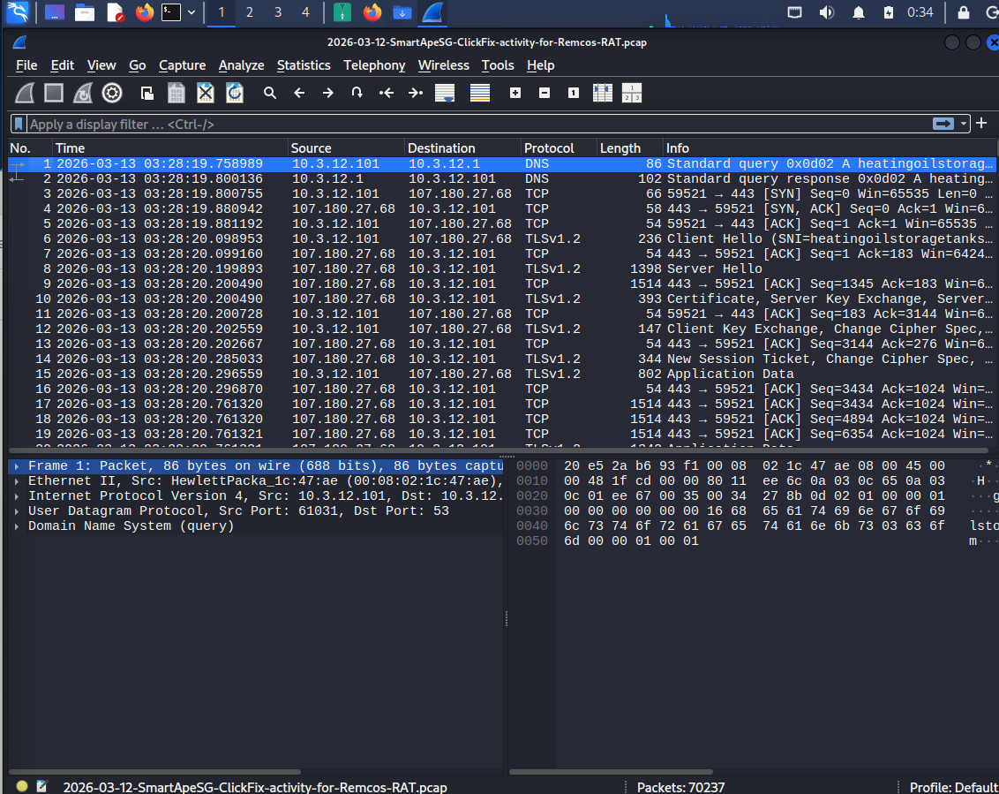

# Case 06 – SmartApeSG ClickFix Campaign (Remcos RAT)

## 📌 Overview

This project documents a comprehensive network forensic investigation of a **SmartApeSG ClickFix campaign** that resulted in a **Remcos RAT** infection.

The investigation was performed entirely through network traffic analysis using **Wireshark** by analyzing a real-world packet capture (PCAP). Evidence from **HTTP, DNS, TLS**, and external **Threat Intelligence** sources was correlated to reconstruct the complete attack chain and extract high-confidence Indicators of Compromise (IOCs).



---

## 🎯 Investigation Objectives

- Identify the victim endpoint.
- Map malicious infrastructure and external staging assets.
- Extract high-confidence Indicators of Compromise (IOCs).
- Reconstruct the complete attack timeline.
- Analyze encrypted network communication.
- Validate attacker infrastructure using Threat Intelligence.
- Map observed behaviors to the MITRE ATT&CK Framework.

---

## 🏗️ Investigation Environment

| Component | Purpose |
| :--- | :--- |
| **Wireshark** | Packet capture analysis, protocol dissection, and TCP stream reconstruction |
| **VirusTotal** | Domain reputation and Threat Intelligence validation |
| **WHOIS** | Domain registration analysis |
| **DNS Analysis** | Infrastructure discovery and domain resolution |

---

# 🕵️ Investigation Walkthrough

## Step 1 — Capture Properties

The investigation begins by reviewing the packet capture metadata to understand the scope of the dataset.


A protocol hierarchy inspection shows that TCP and encrypted TLS traffic account for the majority of network communications.


---

## Step 2 — Endpoint Identification

IPv4 Endpoint statistics identify the internal workstation responsible for generating most of the captured traffic.


TCP Conversation statistics are then used to identify the external systems communicating with the victim.


---

## Step 3 — DNS Investigation

DNS traffic is filtered to identify attacker-controlled infrastructure accessed by the victim.


The investigation identified two malicious domains:

- **forcebiturg.com**
- **retrypoti.top**

---

## Step 4 — HTTP Investigation

HTTP traffic reveals that the victim initiated requests using **curl** instead of a standard web browser.


The packet headers contain:

```text
Host: forcebiturg.com
User-Agent: curl/8.18.0
```

These requests target the following resources:

- `GET /boot`
- `GET /proc`

---

## Step 5 — HTTP Redirection

The web server immediately redirects the client from HTTP to HTTPS.

```text
HTTP/1.1 301 Moved Permanently
```

This behavior indicates the attacker intentionally moved the communication into an encrypted channel.

---

## Step 6 — TLS Investigation

Following the redirect, the client establishes a TLS session with the remote infrastructure.

Although the application payload is encrypted, TLS metadata remains available for analysis.

Inspection of the TLS certificate reveals the secondary malicious domain:

```text
retrypoti.top
```

Large TLS Application Data exchanges indicate encrypted command-and-control or payload delivery activity.

---

## Step 7 — Threat Intelligence Validation

The extracted infrastructure was validated using external Threat Intelligence sources.

### Malicious Domains

- **forcebiturg.com**
- **retrypoti.top**

### Reputation

- Flagged as malicious by multiple security vendors.
- Recently registered before the campaign.
- Consistent with short-lived attacker infrastructure.

---

# 📊 Case Summary

| Item | Value |
| :--- | :--- |
| **Victim Endpoint** | 10.3.12.101 |
| **Malicious Domains** | forcebiturg.com, retrypoti.top |
| **External IP Addresses** | 159.65.191.64, 24.199.121.166 |
| **Initial HTTP Requests** | GET /boot, GET /proc |
| **User-Agent** | curl/8.18.0 |
| **Protocol Flow** | DNS → HTTP → HTTP 301 Redirect → TLS |
| **Malware Family** | Remcos RAT |
| **Campaign** | SmartApeSG ClickFix |

---

# 📂 Documentation

This case also includes supporting documentation:

- 📄 **Executive Summary** — High-level overview of the investigation.
- 📄 **Investigation Report** — Detailed forensic analysis.
- 📄 **Attack Timeline** — Reconstructed attacker sequence.
- 📄 **Detection Engineering** — Detection opportunities and defensive recommendations.

---

# 🛡️ Conclusion

The investigation successfully reconstructed the attack chain from the initial DNS lookup through encrypted TLS communication.

Although the payload itself remained encrypted, the combination of DNS evidence, HTTP requests, TLS metadata, packet analysis, and Threat Intelligence validation provides **high confidence** that the observed activity is consistent with a **SmartApeSG ClickFix campaign delivering Remcos RAT**.

The extracted Indicators of Compromise (IOCs) can be used to develop SIEM detection rules, IDS signatures, and proactive threat hunting queries to identify similar activity in enterprise environments.
