# Attack Timeline

## 📌 Overview

This timeline reconstructs the complete attack chain observed during the network forensic investigation. The reconstruction is based on evidence collected from packet captures, phishing artifacts, FTP sessions, DNS activity, HTTP communications, and external Threat Intelligence sources.

---

## 🕒 Granular Attack Timeline

| Phase | Activity | Evidence | Visual Reference |
| :---: | :--- | :--- | :--- |
| **1** | Phishing email delivered | Shipping-themed phishing email with malicious archive attachment | 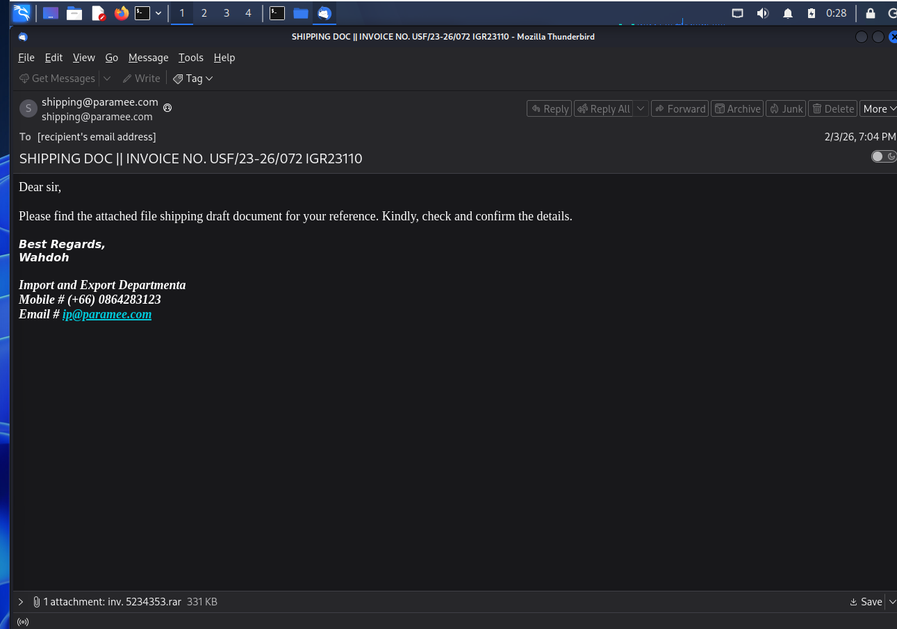 |
| **2** | Victim reviews attachment | `inv.5234353.rar` prepared for execution | 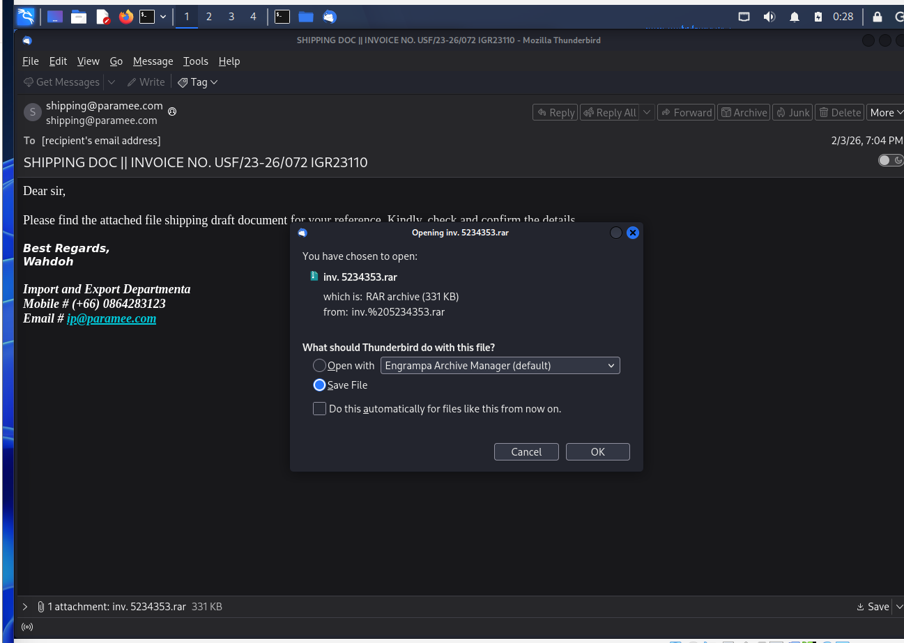 |
| **3** | Victim executes attachment | Archive extracted and executed | 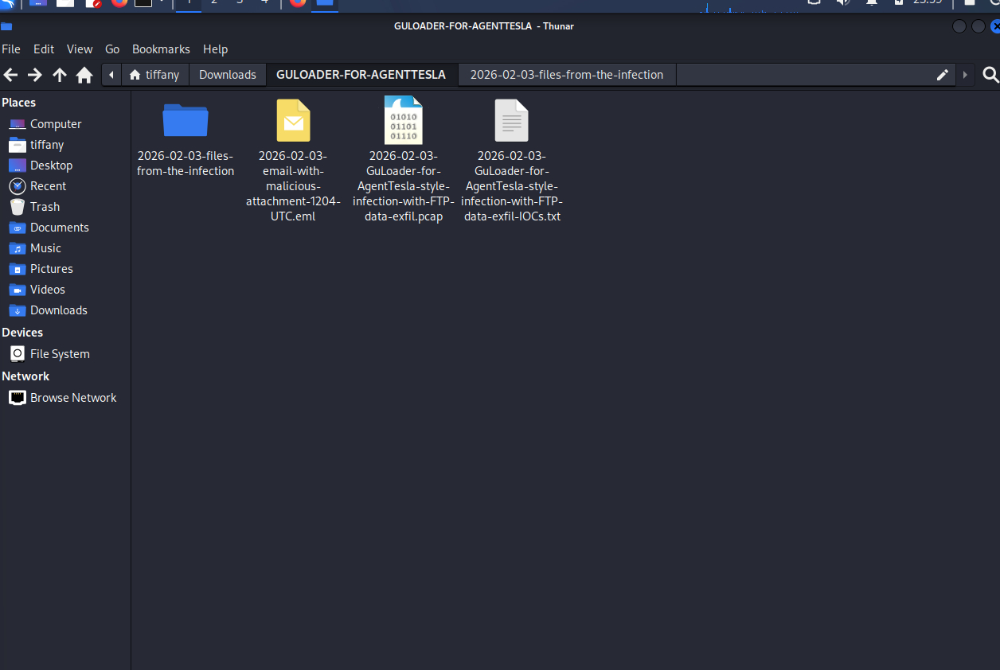 |
| **4** | Packet capture begins | Wireshark starts monitoring outbound network traffic | 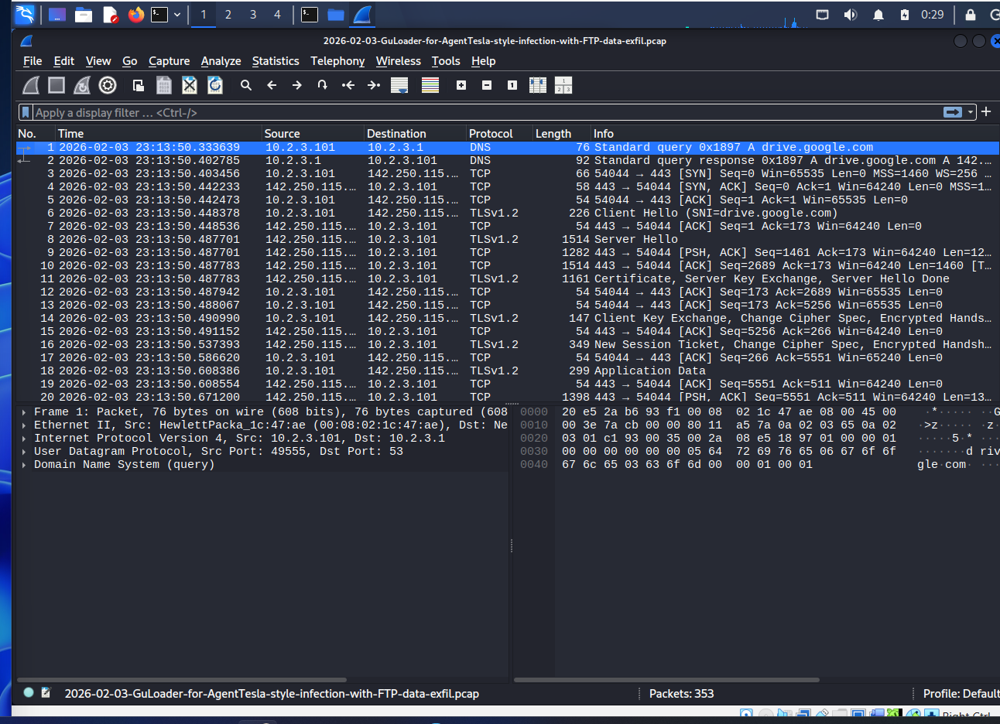 |
| **5** | Capture baseline verified | Packet statistics and capture metadata reviewed | 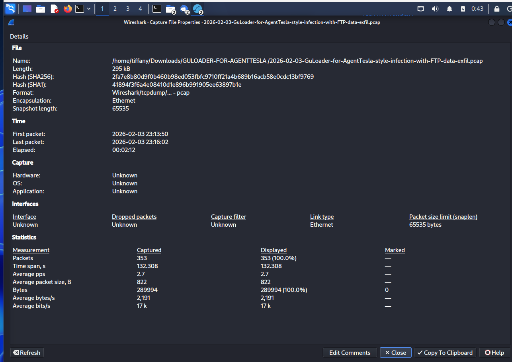 |
| **6** | Protocol distribution analyzed | FTP and DNS traffic identified during protocol hierarchy analysis | 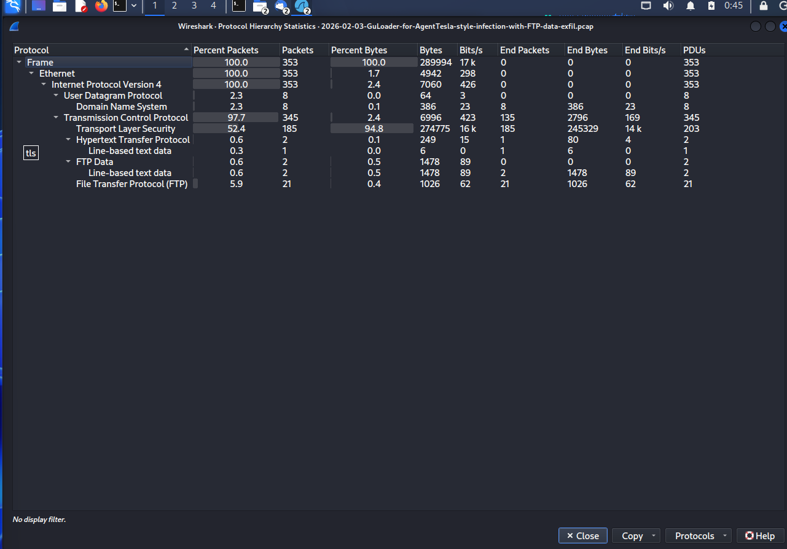 |
| **7** | Victim endpoint identified | Internal host `10.2.3.101` isolated from endpoint statistics | 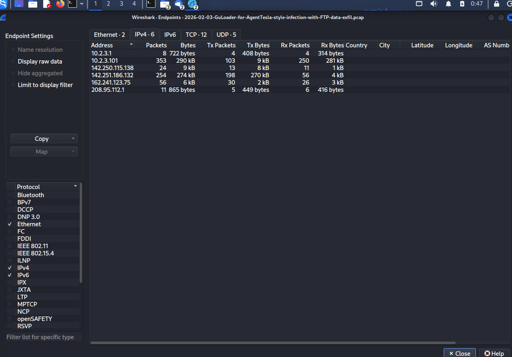 |
| **8** | Network conversations mapped | TCP conversations identify communication with external infrastructure | 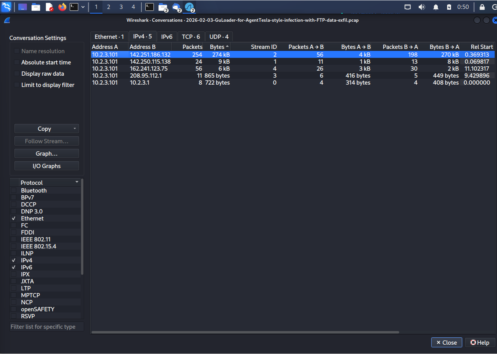 |
| **9** | DNS queries observed | DNS requests for `ftp.corwineagles.com` and `ip-api.com` | 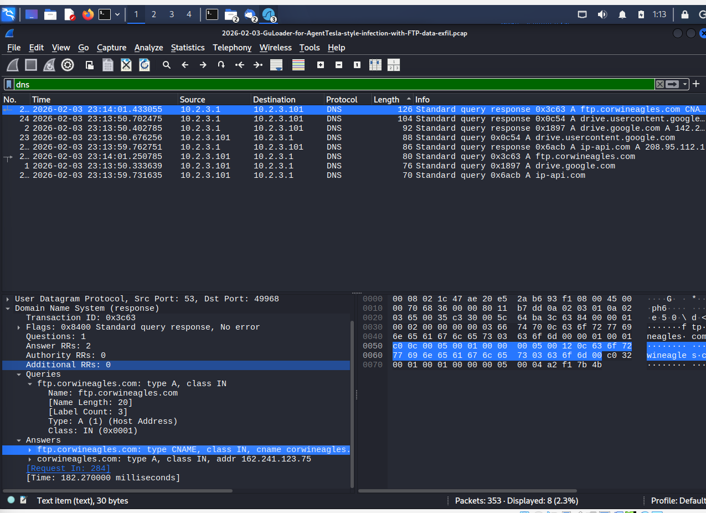 |
| **10** | HTTP requests initiated | Initial HTTP communications performed by the malware | 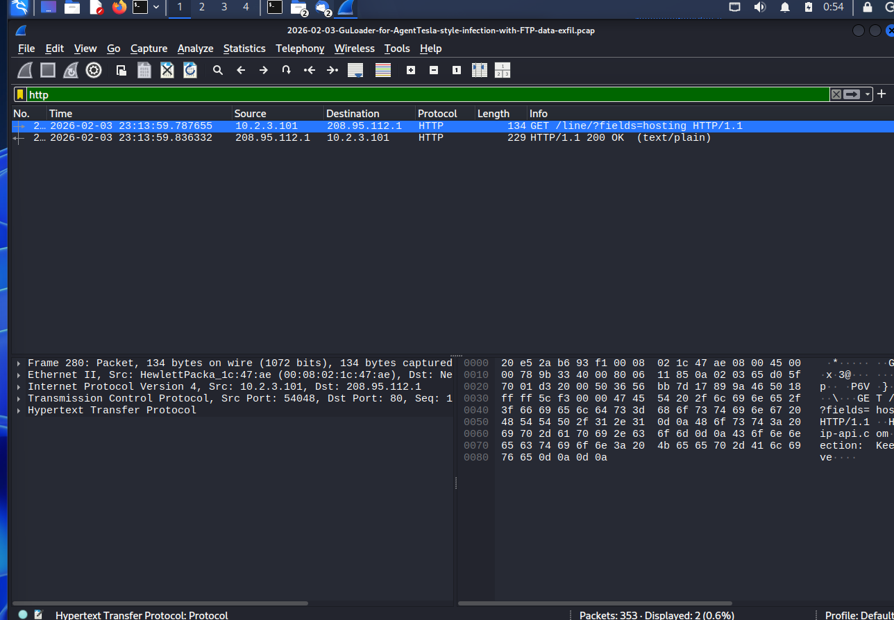 |
| **11** | FTP session established | Malware prepares data exfiltration over FTP | 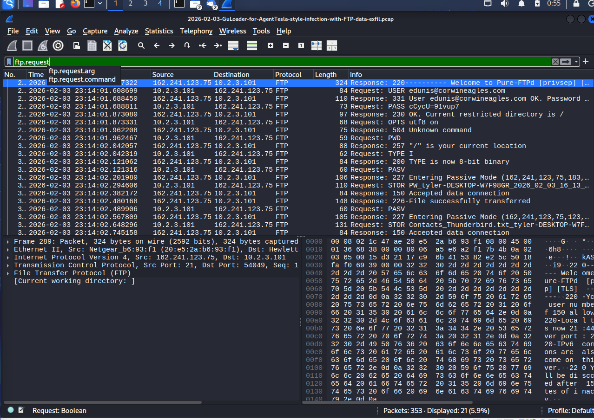 |
| **12** | FTP username transmitted | Plaintext `USER edunis@corwineagles.com` command observed | 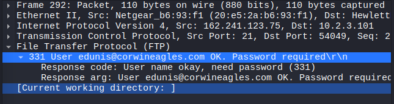 |
| **13** | FTP password transmitted | Plaintext `PASS cCycU=91vup7` command observed | 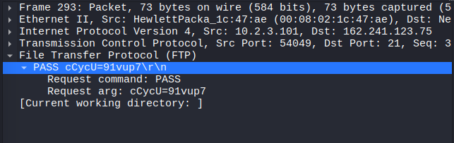 |
| **14** | Browser credentials uploaded | `STOR PW_tyler-DESKTOP-W7F98GR...html` | 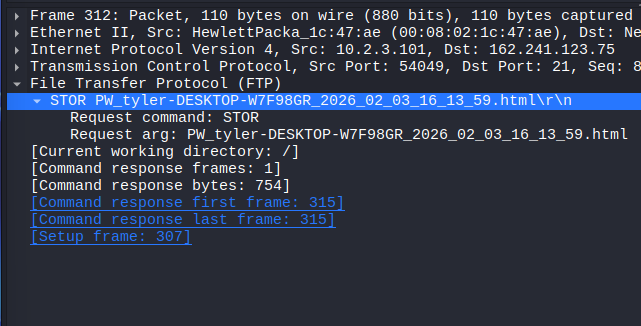 |
| **15** | Thunderbird contacts uploaded | `STOR Contacts_Thunderbird.txt...txt` | 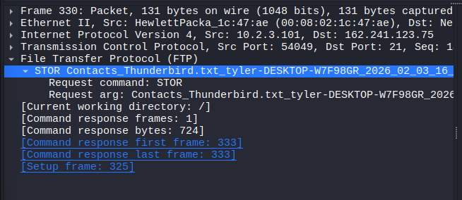 |
| **16** | FTP session reconstructed | Complete conversation reconstructed using Follow TCP Stream | 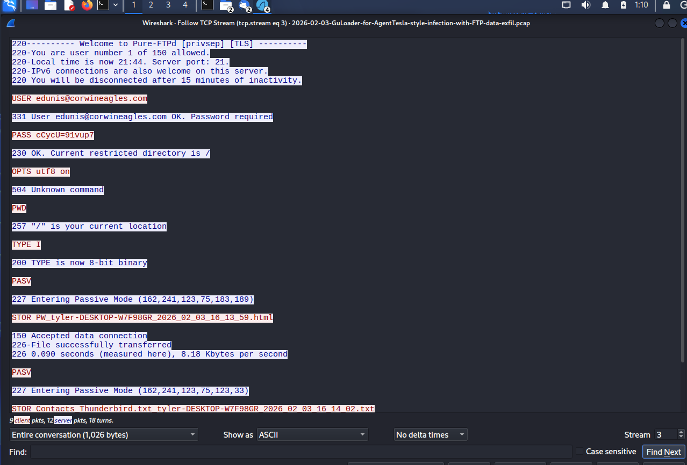 |
| **17** | Domain reputation verified | VirusTotal confirms malicious domain reputation | 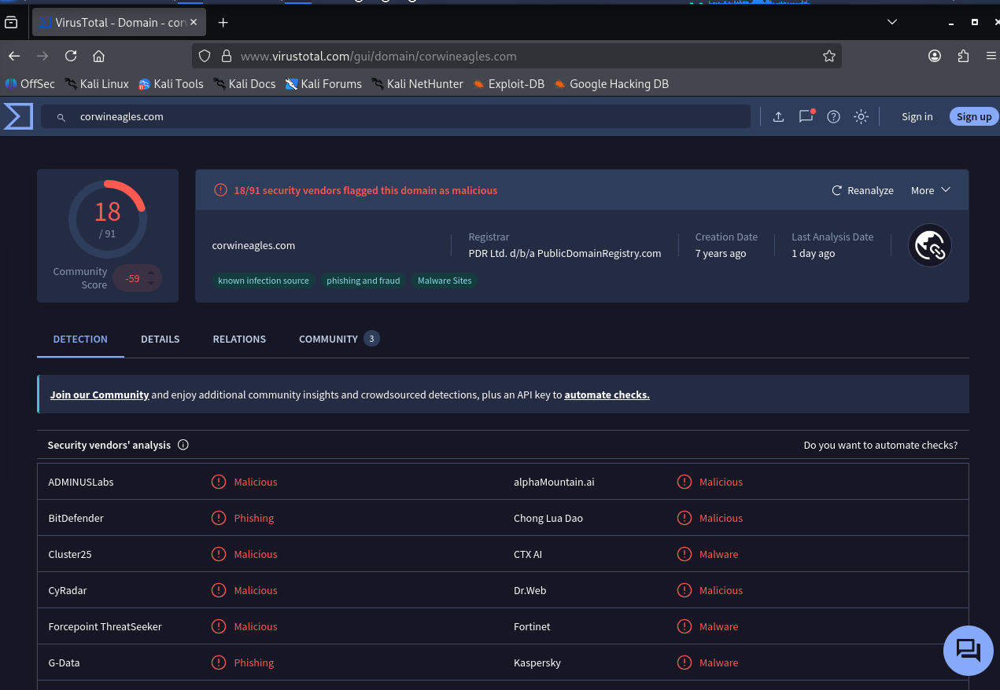 |
| **18** | IP reputation analyzed | External IP reputation validated using VirusTotal | 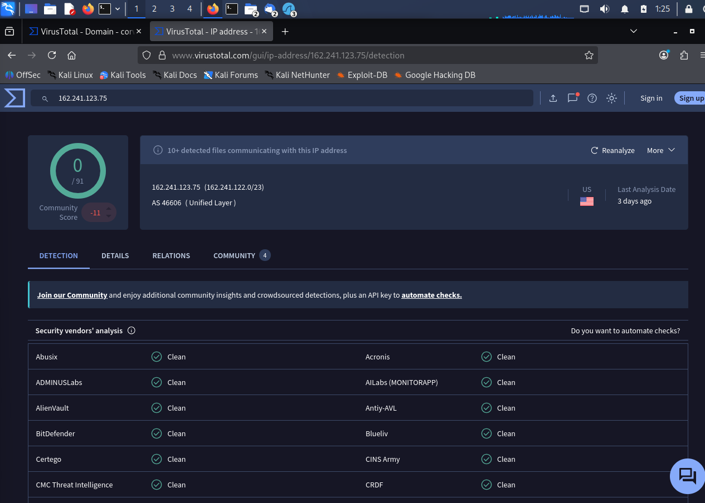 |

---

# Detailed Analysis

## Phase 1 — Initial Access & Malware Execution

The attack began with a phishing email impersonating a shipping notification using the subject:

```text
SHIPPING DOC || INVOICE NO. USF/23-26/072 IGR23110
```

The email contained the malicious archive:

```text
inv.5234353.rar
```

After the victim extracted and executed the archive, **GuLoader** acted as the initial malware loader and subsequently delivered the final payload, **AgentTesla**.

---

## Phase 2 — External Communication & Infrastructure Discovery

Immediately after execution, the malware generated outbound DNS requests for multiple external services, including:

- `drive.google.com`
- `drive.usercontent.google.com`
- `ip-api.com`
- `ftp.corwineagles.com`

Google infrastructure was contacted to retrieve additional payload components, while `ip-api.com` was used to determine the victim's public IP address before continuing the attack.

---

## Phase 3 — Plaintext FTP Authentication

The malware established an unencrypted FTP session to:

```text
ftp.corwineagles.com
162.241.123.75
```

Because FTP transmits credentials in plaintext, the authentication information was fully recoverable from the captured packets.

**Recovered Username**

```text
edunis@corwineagles.com
```

**Recovered Password**

```text
cCycU=91vup7
```

---

## Phase 4 — Credential Theft & Data Exfiltration

The malware initiated multiple `FTP STOR` commands to upload stolen information to the attacker's FTP server.

### Browser Credentials

```text
PW_tyler-DESKTOP-W7F98GR_2026_02_03_16_13_59.html
```

### Thunderbird Contacts

```text
Contacts_Thunderbird.txt_tyler-DESKTOP-W7F98GR_2026_02_03_16_14_02.txt
```

The filenames exposed valuable victim information, including:

- Username: `tyler`
- Hostname: `DESKTOP-W7F98GR`

These artifacts indicate successful credential harvesting followed by outbound data exfiltration.

---

# Attack Chain

```text
Phishing Email (Shipping Notification)
                │
                ▼
RAR Attachment (inv.5234353.rar)
                │
                ▼
Victim Executes Archive
                │
                ▼
GuLoader Loader Execution
                │
                ▼
AgentTesla Payload Activated
                │
                ▼
Google Infrastructure Communication
                │
                ▼
Public IP Lookup (ip-api.com)
                │
                ▼
FTP Authentication
(edunis@corwineagles.com)
                │
                ▼
Browser Credential Theft
(PW_*.html)
                │
                ▼
Thunderbird Contact Theft
(Contacts_*.txt)
                │
                ▼
Successful FTP Data Exfiltration
```

---

# Conclusion

The investigation successfully reconstructed the complete attack lifecycle, beginning with phishing delivery and ending with successful FTP-based data exfiltration.

Network forensic evidence enabled the identification of:

- The phishing delivery mechanism
- Malware execution sequence
- External attacker infrastructure
- Plaintext FTP credentials
- Stolen files uploaded by the malware
- Compromised victim host artifacts

By correlating packet capture evidence with external Threat Intelligence, the investigation provides high confidence that the observed activity represents a **GuLoader** infection delivering **AgentTesla**, followed by credential theft and FTP-based data exfiltration.
