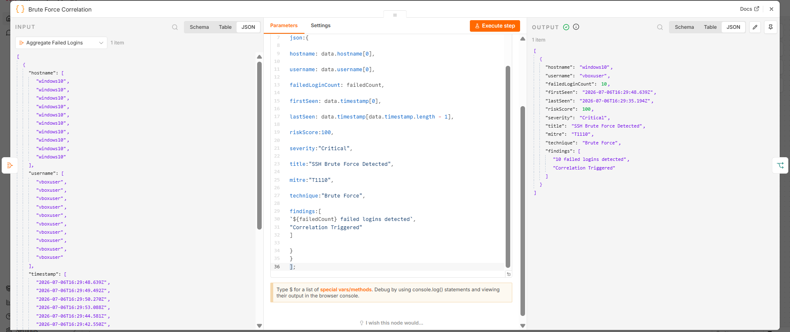
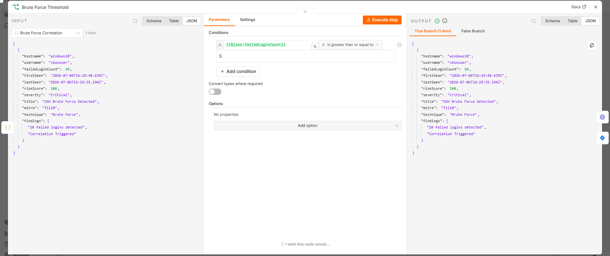

# Detection Rules

## Risk Score Engine
The workflow prioritizes Windows security events using a custom risk score model.

| Event ID | Detection | Risk |
| :--- | :--- | :---: |
| **4625** | Failed Login | 40 |
| **4720** | New User Created | 60 |
| **4104** | Encoded PowerShell | 90 |
| **10 (Sysmon)** | Mimikatz Activity | 100 |

*Risk scores greater than or equal to 60 are treated directly as high-priority security incidents.*

---

## Brute Force Detection
The workflow performs event correlation for Windows Event ID 4625 to flag high-frequency authorization errors.

The flow applies a mathematical threshold count check to track anomalies:

### Detection Rule Parameters
* **Event ID:** 4625
* **Failed Login Count:** $\ge 5$
* **Resulting Action:** Create Jira Security Incident & Execute Automated Response Script.

---

## MITRE ATT&CK Mapping
| Technique | ID |
| :--- | :--- |
| **Brute Force** | T1110 |
| **Create Account** | T1136 |
| **PowerShell** | T1059.001 |
| **Credential Dumping** | T1003 |

---

## Automated Response Summary
The workflow currently supports:
* Disable suspicious local user account via Flask API (PowerShell Proof of Concept).

### Future Implementations
* Automated Firewall IP Address Blocking
* Automated EDR Endpoint Isolation
* Active Directory Domain Account Lockout
* Automated Email Alerts & Slack App Webhook Integration

---

## Limitations
Current implementation is designed as a laboratory proof of concept. Some attack scenarios, such as SSH brute force, may not expose the attacker's source IP address depending on Windows Event Log behavior. In those situations, the workflow demonstrates automated response workflows using the available event metadata parameters.
