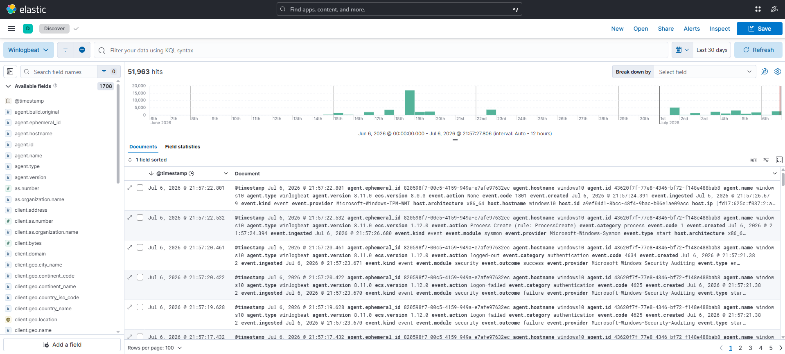
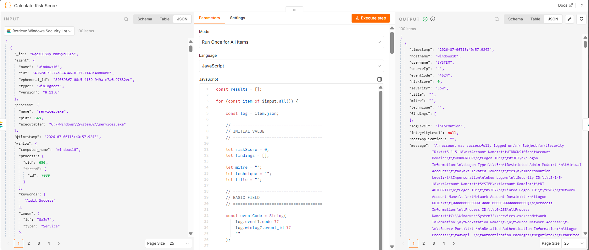
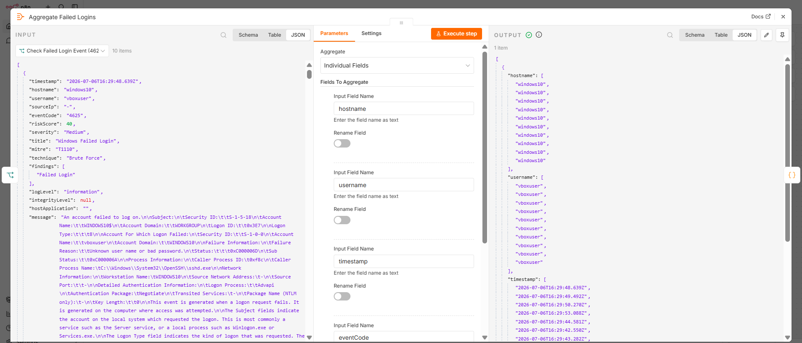
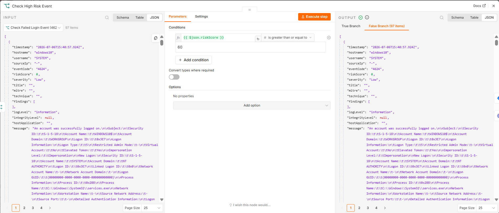
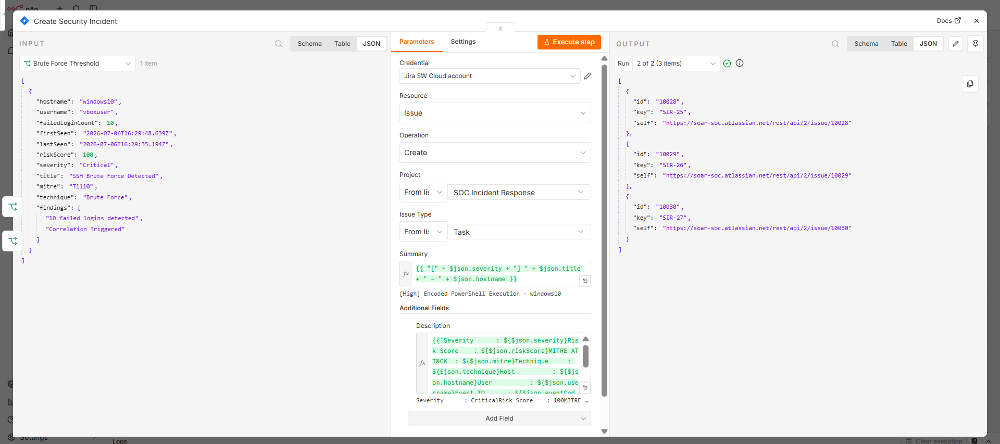
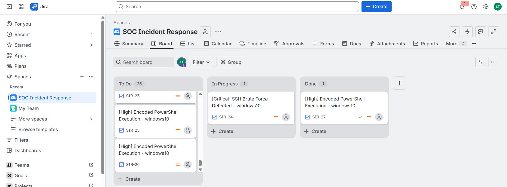
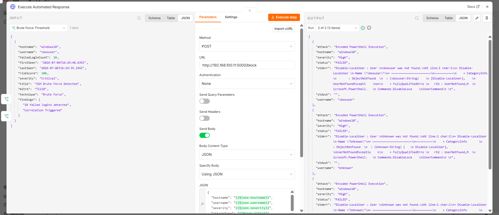
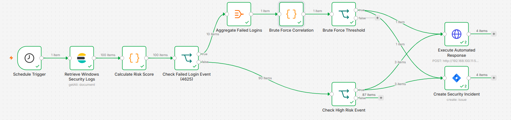

# SOAR Workflow

## Workflow Overview
The SOAR workflow consists of five major stages that process host telemetry into automated infrastructure updates.

---

## 1. Event Collection
Windows Security Events are collected from Elasticsearch using the n8n Elasticsearch node.



Examples tracked:
- Event ID 4625 (Failed Login)
- Event ID 4720 (New User Created)
- Event ID 4104 (Encoded PowerShell)

---

## 2. Risk Score Calculation
Each event is assigned a risk score according to predefined detection rules to establish threat prioritization.



Example parameters applied:

| Event | Risk Score |
| :--- | :---: |
| Failed Login | 40 |
| New User Created | 60 |
| Encoded PowerShell | 90 |
| Mimikatz | 100 |

---

## 3. Event Classification
The workflow separates events into two specialized processing branches depending on metadata structure.

### Branch 1: Failed Login (4625) → Brute Force Correlation
Isolates authentication errors to establish aggregation metrics:



---

### Branch 2: Risk Score → High Risk Detection
Checks incoming records to find events scoring above the response floor:



---

## 4. Incident Creation
When a detection rule is triggered, n8n automatically creates a Jira Security Incident.



Incident information compiled includes:
- Severity
- Hostname
- Username
- MITRE ATT&CK Technique
- Analytical Findings

The resulting structural ticket populates the operational queue inside Jira:



---

## 5. Automated Response
After creating the Jira incident, an HTTP Request node sends the detection information to a local Python Flask API.



The API executes a PowerShell command that performs the configured response action:

* **Current implementation:** Disable Local User Account (Proof of Concept).

Upon full execution, n8n logs a successful cycle output across all steps:



---

## Workflow Summary

```text
Elastic
│
▼
Risk Score
│
▼
Event Classification
│
├───────────────┐
│               │
▼               ▼
Brute Force   High Risk
│               │
└──────┬────────┘
       ▼
Create Jira
       ▼
Automated Response
```
